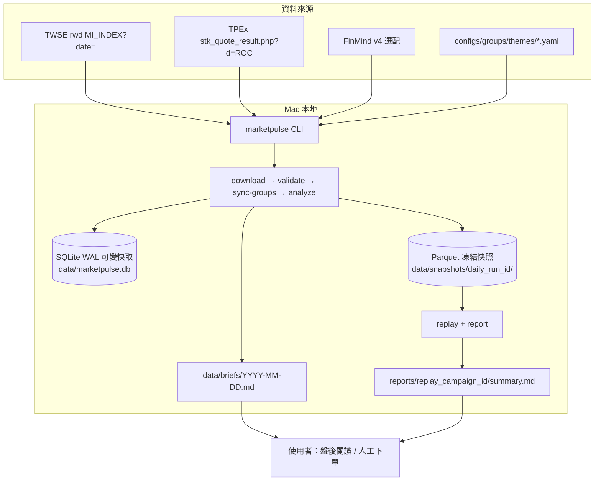

# MarketPulse 設計文件：台股族群趨勢與類股輪動掃描系統

| 欄位 | 內容 |
|------|------|
| 文件標題 | MarketPulse：股癌風格「族群先、輪動次、強勢股最後」之 Mac 本地 MVP |
| 作者 | 待填 |
| 日期 | 2026-08-30 |
| 修訂 | 2026-08-31 r3.32（拒絕再寫 v0.2：RS20-only／等權訊號／PIT membership／`marketpulse daily` 已禁止。只收公開盤後頁 ≠ 資料商店授權商品。另見 `docs/coding-contract.md`。） |
| 狀態 | Design Freeze |
| 產品名稱 | MarketPulse |
| 目標市場 | 台股上市（TWSE）+ 上櫃（TPEx）普通股 |
| 部署形態 | Apple Silicon Mac 單機、單使用者、盤後日頻批次 |
| 工作區 | `/Users/chenyuying/workspace/MarketPulse`（`dev` freeze r3.31；本輪 r3.32 只收資料授權區分，不改數學。規格 `docs/design-v0.1.md`；實作契約 `docs/coding-contract.md`） |

**版本切分（讀文件先看這段）：**

| 版本 | 範圍 | 非範圍 |
|------|------|--------|
| **v0.1（必須先做完）** | 官方日 K、as-of 宇宙、11-theme 主引擎 + 5-theme 對照、lag-1 成交值加權、RS／佔比／輪動、凍結快照、replay、H1–H4 籃子評估、Markdown 日報、Rotation Timeline | Streamlit、leader／watchlist／52w／MA stack（改 Phase 1.5）、15–20 theme、IC 設計／AI 軟體／生技、自動交易、美股、ML |
| **Phase 1.5** | Streamlit、launchd、**H5 leader overlay + watchlist**、FinMind 還原價（需 spike） | 券商 API |

```text
MarketPulse v0.1 has two purposes:

PRIMARY — Rotation Visualization
  Show where each theme sits today and how its relative
  position moves over time, using price / volume / breadth.
  Output: Daily Brief + Rotation Timeline (static PNG).
  rotation_score is an internal ranking tool, not the product.
  Replay = historical visualization with the current YAML.
  Price/volume windows ≤ T. Taxonomy hindsight is allowed
  and must be disclosed (D105).

SECONDARY — Framework Validation
  Test whether those signals contain useful forward information
  through H1–H4, walk-forward, and GO / ITERATE / NO-GO.

The validation layer must not redefine the primary product.
A failed H1 does not make the rotation visualization useless.
Detect / visualize rotation ≠ predict future theme returns.
```

**一句話（凍結，給 coding agent 最高優先）：**

> MarketPulse v0.1 is a daily Taiwan stock theme-rotation radar. Its job is to make relative leadership transitions visible and reproducible from price, trading value, and breadth. Research validation exists only to test whether this reading framework deserves further development.

中文：MarketPulse 是台股盤後族群輪動雷達。第一任務不是預測，而是把「今天哪些族群強、哪些正在轉強、哪些正在退潮，以及相對領先如何隨時間轉移」畫清楚。產品回放是 **historical visualization replay**：用現行分類看歷史輪動能不能被畫清楚，不是模擬「當時的人是否已知這份名單」。H1–H4 只驗證這種閱讀值不值得繼續研究，不是把系統做成量化交易平台。

v0.1 **不是** Quant Research Platform。digest／campaign／H1–H4 是雷達的可重現護欄，不是產品本體。第一個 coding slice 仍然只准 Gate 0 → PR1 → PR2。第一張有用的 Timeline 之前，禁止實作 H3／H4、random_exclusive、economic materiality、classification provenance 狀態機。

兩者都不是交易系統、也不是 GUI。未出產品 MVP（Brief + Timeline）前不排 Streamlit。H1–H4 **不從 v0.1 規格刪除**，但不是產品完成條件，也不得把 MarketPulse 定義成「預測實驗室」。

**產品 MVP 完成（Level 2）當且僅當：** 官方 TWSE+TPEx 看板、11 個凍結 theme（現行 `themes/v1.yaml`）、不可變價量 snapshot、Daily Brief、Rotation Timeline、mutate-future（改 T+1 價量不得改 T）通過，且人能只靠這些輸出回答 JTBD（D103）。產品回放 = 現行分類看歷史。H1–H4／GO = Level 3，PR 7 之後才做，不擋產品 MVP。

---

## Overview

MarketPulse 的**本體**是族群輪動雷達：今天市場在炒什麼、哪些族群變強／退潮、相對領先是不是從 A 轉到 B、目前輪到哪裡。量價為主（RS、成交值 thrust、breadth），不是基本面、不是預測引擎。Timeline 的 A→B 是 **相對領先轉換**，不是「資金真的從 A 流到 B」的因果證明。H1–H4 是附掛的研究實驗室，用來問「這套閱讀值不值得信」，**不是**每天看盤所需要的東西。下單仍由人決定。個股／52w／watchlist = Phase 1.5。

與一份 GPT 產出的 MarketPulse v0.1 實作提示（美股、GICS、Polars/DuckDB、CLI-only）相比： **產品意圖採納本文件的台股＋題材 overlay＋成交值加權**；**工程骨架採納該提示的 as-of replay、凍結不可變快照、前瞻迴歸測試、Provider Protocol、validate、族群籃子評估、H1–H4（H5=Phase 1.5）、GO/ITERATE/NO-GO、run_id／algorithm_version／config_version**。對照表見「對照 GPT v0.1 初稿」。

技術上 v0.1 是一人可在 Mac 跑完「下載 → 驗證 → 分析 → 重播 → 報告」的單機系統：Python 3.12+、uv、Typer、pandas（ingest 邊界）、SQLite（可變工作快取）、**Parquet 凍結快照**、pytest。日資料以 TWSE / TPEx **可帶日期**的官方盤後 JSON 為主。不接券商、不做盤中、不部署雲端、v0.1 不開 GUI。

---

## Background & Motivation

台股實務上多數虧損來自兩件事：在錯誤的族群裡精挑個股，以及在資金已經離開後仍攤平。股癌風格的核心不是「更準的本益比」，而是每天先回答：

1. 大盤是擴張、高檔輪動，還是防禦收斂？
2. 錢在哪個主題／產業？是主流延續、落後補漲，還是題材切換？
3. 該族群的量能（成交值佔比、漲跌家數）有沒有跟上價格？
4. （Phase 1.5）族群內誰是相對強勢、靠近 52 週高、而不是在左側抄底？**v0.1 停在族群層。**

現況痛點：

- 券商 App 與 Yahoo 以個股 K 線為中心，族群視圖通常停在證交所產業別，無法表達「AI 伺服器」「重電」這類題材疊加。
- 人工追蹤族群無法回放「當時熱門的族群」後續表現，無法驗證框架。
- 純量化平台鼓勵從因子海底向上選股，與「族群先於個股」的決策順序相反。
- 若先做漂亮的熱力圖、最後才問「輪動有沒有未來超額」，會做出無法證偽的工具。反過來，若先把整個 v0.1 做成研究框架，每天打開卻看不出錢從哪流向哪，也偏離產品。v0.1 **先做出雷達，再掛實驗室**；GUI 仍在產品 MVP 之後。

MarketPulse 的定位是**盤面閱讀的個人作業系統**，不是自動交易員。

---

## Goals & Non-Goals

### Goals — v0.1 PRIMARY（產品 MVP = 輪動雷達；缺一不可）

1. 本機 TWSE + TPEx **普通股**日 K、成交金額、加權指數；可離線讀既有資料、有網才更新。
2. 手維護主題 YAML。**主引擎 11 個 2026 輪動籃子**（見 Taxonomy）；**另外凍結一份 5-theme baseline** 做對照。Theme =「資金可以獨立進出的交易籃子」，不是證交所產業。禁止 15–20 條線把 Timeline 畫糊。上限就是這 11 條。
3. 族群 lag-1 成交值加權報酬、相對加權指數的 RS（5/20/60）、成交值佔比、value_thrust、breadth、輪動體制標籤（主流延續／剛轉強／落後補漲／過熱轉弱／落後持續）。
4. **人眼輸出：** Daily Brief + Rotation Timeline（靜態 PNG）。主欄 = `relative_position`、RS20、value_thrust、breadth、regime。Brief 另有 Rank Δ5／Δ20（顯示，不是新訊號）。**不是** 0–100 `rotation_score`。Y 軸固定 K=11。
5. CLI：`download` / `validate` / `sync-groups` / `analyze` / `brief` / `chart` / `doctor`。盤後 Markdown 日報。Timeline 只讀凍結快照。
6. pytest：公式、凍結 YAML 成員、validate 不丟列、**Timeline 只讀凍結快照**、mutate-future 價量。
7. **歷史宇宙規則：** 交易日 T 的可交易宇宙 = 該日 dated 全市場看板（套 exclusions 之後），不是今日 `instrument` 快照。流動性 = TV_(T-1)。價與量的視窗 ≤ T。
8. **產品誠實（價量，D105）：** 每日不可變 snapshot + mutate-future。訊號在 T 只能用 ≤T 的價與量。沒有價量 as-of，Timeline 就是把明天的 K 線畫進今天。
   **分類誠實（D105）：** 產品 MVP 用一份凍結的現行 `themes/v1.yaml` 看所有回放日期。這是視覺化，不是「當時已知的族群定義」。report／Brief 必印限制句。禁止把 2026/4–8 的圖解讀成「4 月就預測到光通訊」。PIT taxonomy／valid_from 歷史不是產品 MVP。

### Goals — v0.1 SECONDARY（研究實驗室；要做，但不是產品定義，也不是產品 MVP 完成條件）

9. **戰役級 replay：** 每個合格交易日只讀 `date <= as_of`，寫入 **不可變** snapshot。GO 存在 `campaign_id`。
10. **族群籃子**遠期評估（H1–H4）對 TAIEX／**random_exclusive_theme**／RS-only 等，輸出 `summary.md`，結論 GO / ITERATE / NO-GO 或 APPENDIX。
11. 官方戰役每半段 `n_H1 >= 30` 才能 GO。H1 FAIL **不得**讓 Brief／Timeline 變成「沒用」。
12. **Canonical 時序 API：** `get_signal_context(T)`、`get_entry_date(T)`、`get_forward_horizon(T, N)`。
13. pytest：mutate-future、replay 宇宙不得用「今日仍上市」過濾。

### Goals — Phase 1.5（v0.1 報告產出後）

- Streamlit 五頁：大盤環境、族群熱力、輪動矩陣、族群下鑽、觀察清單。
- launchd 平日排程（replay 曾 GO，或使用者顯式 `--scan-without-eval`）。
- **H5 leader overlay、watchlist、52w、MA stack**（v0.1 不做）。不回頭改輪動權重去「過關」。
- FinMind 還原價：僅在 live spike 證明該帳號可拉 `TaiwanStockPriceAdj` 後才納入；納入時必須 **按 run 凍結**，禁止原地改寫歷史 `adj_close`。

### Non-Goals

- 券商下單、自動交易、券商 API、券商等級交易終端。
- 盤中即時報價、五檔、分 K、Websocket。
- 美股 / ETF 宇宙（資料模型預留 `market` 欄，v0.1 不實作 ingest）。GPT v0.1 的 US-only / SPY / GICS **拒絕**。
- 完整投資組合優化、Kelly、風險平價、多因子 IC、p 值製造。
- Kubernetes、AWS/GCP、Spark、Kafka、微服務、Docker。
- 多使用者、帳號系統、遠端分享。
- v0.1 用 LLM 產生盤勢敘事。
- Telegram／LINE／Email／Push 通知。
- 投資組合、部位、P&L、券商執行。
- 試圖「複製股癌每日清單」。本系統實作可操作的決策順序與可檢驗的量價規則。
- 以 hit_rate ≥ 55% 當通過門檻（已刪除）。
- 互動圖、Plotly dashboard、把 Timeline 做成 Streamlit。v0.1 只有靜態 PNG。
- 在凍結的 11-theme 之外再加主題（IC 設計／AI 軟體／生技／光學／被動當「新主題」）。**v0.1 Timeline default = 11-theme**（`themes/v1.yaml`）。5-theme Timeline **僅** H-tax appendix／對照，禁止 `chart` 默認 `v1-five.yaml`。
- 把 visualization replay 宣稱成「當時已知的族群定義」或「4 月就預測到光通訊」。
- 第一張 Timeline 之前實作 PIT taxonomy／`valid_from` membership 歷史／reconstructed snapshot YAML／H3／H4／random_exclusive。

---

## Key Decisions

| # | 決策 | 選擇 | 理由 |
|---|------|------|------|
| D1 | 產品形態 | 族群優先的盤後掃描器，不是泛用量化平台 | 對齊股癌由上而下流程 |
| D2 | 宇宙 | TWSE+TPEx **普通股**；排除 ETF/ETN/TDR/權證/特別股/興櫃 | 成交值不被 ETF／權證扭曲；興櫃量價定義不同 |
| D3 | 主週期 | 日頻、盤後批次 | 官方免費資料盤後才完整 |
| D4 | 主資料源 | **TWSE/TPEx 可帶日期的官方盤後 JSON** | 一次請求覆蓋全市場、免金鑰；OpenAPI 今日快照不得當歷史 |
| D5 | FinMind | **選配**。v0.1 用 raw 價，RS **不依賴 Adj**。有 token 只拉日曆／Info；Adj 須 live spike 證明免費才進 Phase 1.5 | 2026-08-30 使用者確認；向前還原會改寫歷史 |
| D6 | yfinance | 預設關閉，optional extra | 無成交金額、429、非官方 |
| D7 | 族群主聚合 | **t−1 成交值加權**；等權為次指標與評估籃子 | 「錢在哪」是股癌訊號；市值加權被 2330 吞噬。**不**改成 GPT 的等權主聚合 |
| D8 | 相對強弱視窗 | 5 / 20 / 60 個交易日 | 短線／波段／中期 |
| D9 | 輸出型態 | 排名 + 體制標籤，不是買賣開關 | 人機共作 |
| D10 | 主題定義 | YAML source of truth；**provenance 與 valid_from 分開** | contemporaneous 的 `valid_from` = 首次 sync 日；重建檔才允許 `effective_from` 回溯 |
| D11 | UI | v0.1 = Typer CLI + Markdown + **靜態 Timeline PNG**；**Streamlit = Phase 1.5** | 人要能看見輪動；不要為了看見就開 GUI |
| D12 | 排程 | v0.1 手動／一鍵 CLI；launchd 在 Phase 1.5 | TPEx 日期端點公布時刻未驗證；且不應在 NO-GO 前自動化 |
| D13 | 儲存 | SQLite WAL = **可變工作快取**；**Parquet = 凍結 run 快照** | SQLite 適每日 upsert；凍結訊號禁止 UPDATE |
| D14 | 套件 | `uv` + Python ≥ 3.12；ingest 用 pandas；Polars 可選 | FinMind／官方 JSON → DataFrame 是真實邊界；不為教條引入 Polars |
| D15 | 多主題歸屬 | 成交值在每個所屬主題**全額計入** | 題材疊加；跨主題佔比總和可 > 100% |
| D16 | 強勢股濾網 | 距 52 週高 >25%、低流動性、處置 → 剔除 | 不猜底；**H-leaders 是第二實驗，不是 v0.1 過關條件** |
| D17 | 訊號持久化 | 每個 as_of 凍結新 `daily_run_id`（版本元組相符則重用），快照不可變 | 改未來 bar 不得改歷史訊號；改算法長新 daily 與新 campaign |
| D18 | 評估對象 | **主假設 = as-of 主題籃子（等權）**；leader 為 overlay | 失敗時能分辨「輪動沒用」vs「52 週濾網殺光」 |
| D19 | 成功框架 | **H1–H4** + **GO / ITERATE / NO-GO**；H5 = Phase 1.5；不製造顯著性 | 刪除 55% hit_rate 門檻；hit_rate 只當描述統計 |
| D20 | 價格序列 v0.1 | **全程 raw vs raw**（個股 raw close、TAIEX 價格指數、52w raw high） | 禁止還原股混未還原指數；FinMind 向前還原有前瞻 |
| D21 | 官方產業 | **非 point-in-time**；**排除於 replay eval** | 免費源只有「目前產業別」；日報可顯示但必須註明 |
| D22 | 資料品質 | `validate` 失敗則 `ingest_run.status=partial` 或 abort；**禁止默默丟列** | 重複鍵、OHLC 非法、負量、缺 TAIEX 必須進報告 |
| D23 | Run 識別 | **`daily_run_id`（單日凍結）≠ `campaign_id`（區間評估）** | 快照按 as_of；GO 是一段日期的戰役結果，同一 id 不能身兼兩者 |
| D24 | 官方 GO 窗口 | 僅 **provenance=contemporaneous** 且 `start >= classification_effective_from`（首次 sync 日）。**禁止**把 2026-01-01 當官方戰役 | 八月才寫的名單不是一月當時已知 |
| D25 | 主題座標系 | **v1.yaml = 11-theme（不是 10）**；v1-five = 凍結 baseline | YAML 實際有 11 桶；為湊 10 而砍 optical／被動沒意義 |
| D26 | 訊號／評估同一宇宙 | \(I_T = G_{T-1} \cap\) 流動性\(_{T-1} \cap\) 有效價\(_T \cap\) 宇宙\(_T\) | 禁止用 T 日成交值決定回測能否進籃 |
| D27 | 歷史宇宙 | `universe_member(T)` 來自**當日看板**；`listed_from`/`listed_to` 由看板推導 | 禁止 `WHERE listed_to IS NULL` 當 replay 過濾 |
| D28 | H1 最小樣本 | 每半段 `n_H1 >= 30` 才能 GO；否則 ITERATE | 不要 8 個交易日碰上主流就過關 |
| D29 | 負向對照 | `random_exclusive_theme` = **negative control**，不是 benchmark strategy | 測「選中的 theme 是否比沒被選中的強」，不是 alpha vs 市場 |
| D30 | Gate 0 | PR 2 寫歷史回補前，先 20–30 日 TWSE+TPEx dated spike | 不上五年回補當第一槍 |
| D31 | Rotation Timeline | 靜態 PNG；Y 軸 = **relative_position，K=分類檔主題數（固定）**。**v0.1 default = 11-theme**；5-theme Timeline 僅 H-tax appendix | 非 thin 數變動不得重縮 Y 軸；禁止 chart 默認 v1-five |
| D32 | 時序入口 | 唯一 `get_signal_context` / `get_entry_date` / `get_forward_horizon` | 禁止各評估器自訂日期 |
| D33 | 報告三層 | CORE THEME / REGIME / LEADER 分開寫，再給產品 GO | 避免黑盒一個分數打全體 |
| D34 | 訊號 \(r_g\) | **維持成交值加權**；等權只給評估籃子與次指標 | 第三輪 GPT prompt §8 改成等權 RS——**拒絕** |
| D35 | 分類時序 | 現行引擎從首次 sync 起；回溯 snapshot 只能 APPENDIX | 11-theme 八月才定案，套到 2026-01-01 仍是重建 |
| D36 | 人眼輸出 | brief／ASCII／Timeline 主欄：RS20、thrust、breadth、relative_position、regime **必須一起呈現**，禁止只畫 position 線。`rotation_score` = **內部排序工具**，不是產品概念。**不得出現在 Brief／ASCII／PNG**（D95） | 避免 82 vs 76 被讀成「強 8%」；rank-of-rank 犧牲 magnitude，五欄一起看才是正確閱讀 |
| D37 | CA／重疊 | report-only sensitivity；不進 GO | 不修 raw 價、不加第二套訊號 |
| D38 | Theme 定義 | **可獨立輪動的資金籃子**，不是產業分類學 | 光通訊／被動合理；「半導體」「IC 設計」太大 |
| D39 | 5 vs 11 | 同一視窗、同一算法，兩份 classification 對照 H1/H3/Timeline | 只是 YAML 多塞股票沒有研究價值 |
| D40 | `auto` | 最新 **TWSE+TPEx+TAIEX 皆完整且 validate 通過** 的交易日 | 不是「庫裡最新一列」 |
| D41 | 日 K PK | `(date, market, stock_id)` | 不依賴跨市場代號永不碰撞 |
| D42 | 市場體制 | **可 partition 評估報告，不可當 selection input** | 不得影響 theme eligibility／ranking／theme regime／H1／籃子 |
| D43 | PIT vs 無偏 | PIT-safe ≠ research-unbiased | 11-theme 是看完 2026 上半年才定的座標系 |
| D44 | 重疊樣本 | GO 仍用 raw `n_H1`；report 另印 `non_overlapping_n` | 20 日 forward 高度重疊；n=30 不是 30 個獨立事件 |
| D45 | random 脆弱性 | 單一 seed 決定 GO；sensitivity 只標 `baseline_fragile` | 不為過關改 seed |
| D46 | auto 完整度 | `row_coverage_vs_prior_session >= min_row_coverage_vs_prior`（0.99），**heuristic** | 不是官方市場完整性保證；IPO／下市會讓 prior count ≠ today expected |
| D47 | signal_status | 互斥；precedence = MISSING_DATA > UNRELIABLE > INSUFFICIENT_HISTORY > THIN > OK | 四種失敗語意不互相覆蓋；THIN ≠ 資料壞掉 |
| D48 | 報酬相關 | `theme_return_corr_60d` report-only | overlap≠行情同一件事 |
| D49 | GO vs 經濟意義 | GO 與 `ECONOMIC MATERIALITY` **完全獨立**。v0.1 程式永遠印 `ECONOMIC MATERIALITY=N/A`，只輸出 mean/median/p25/p75/worst_10pct | 禁止自動 0.5%/1.5% 分桶（會開始 tuning） |
| D50 | 11 不是 10 | 主引擎 **11** 個 theme；K=11 | YAML 數過就是 11；不為整數砍桶 |
| D51 | schema_version | parquet／meta 形狀，與 algorithm 分開 | 加欄不是改公式 |
| D52 | taxonomy_frozen_at | 2026-08-30 = **這一世代**凍結 | 成員進出 ≠ 新世代；加/刪 theme 或改語意才升 version |
| D53 | H1 語意 | H1 = **Persistence Test**（識別字仍 `H1`），不是 strategy validation，不是 alpha | 主流延續由 RS20／rank_momentum／thrust／breadth 定義，與 score 共用同一組 component。H1 PASS 只表示這套閱讀標籤有遠期延續，不令人意外 |
| D54 | GO 語意 | GO = **值得進入下一階段研究**。不是「framework 已驗證成功」，不是統計證明，不是交易獲利。識別字仍 GO；人眼加印 `RESEARCH STATUS: CONTINUE`（D97） | `n_H1>=30` 是 overlapping 門檻。不增加更多 GO gate。真正「有沒有比簡單 momentum 好」看 H2 |
| D55 | CA | as-of T 的 jump 才決定 PRIMARY UNRELIABLE。**禁止看 T+1..T+N** | 未來 CA 只進 `H1_ex_future_ca` sensitivity，不得改 n_H1／GO。PRIMARY = raw + CA status + visual warning；`H1_ex_*` 只在 `eval/` |
| D56 | v0.1 pipeline | S0–S8 → S10–S13。**沒有 S9 Leaders** | `leaders.py` / `leader_pick.parquet` = Phase 1.5 |
| D57 | watchlist schema | 表可預留；**v0.1 禁止 read/write** | 看到 schema 不得順手做 watchlist |
| D58 | overlap 分母 | 分子可 overlap；宇宙 TV 分母每檔只算一次 | 典型 multi-theme bug |
| D59 | 當日排名母體 | report 必印 `ranked_theme_count` / `thin_theme_count` / `unreliable_theme_count` | 固定 K=11 時，#1 可能只是 6 個可排名裡的第一 |
| D60 | MVP 成功三層 | Engineering ≠ **Product (radar)** ≠ Research lab | Timeline 漂亮不能當 GO；GO 失敗不能宣布雷達沒用 |
| D61 | Evidence Health | GO 與 EVIDENCE HEALTH 並列 headline。GO = framework behavior；Health = 人類該給多少信心 | overlapping n 過關但 independent 少 → YELLOW，不改寫 GO |
| D62 | H1 vs H2 | **H1 — Persistence Test.** Does the regime persist? **H2 — Does the regime add information beyond momentum?** H1 PASS ≠ alpha、≠ 模型有效 | 人眼標籤 = Persistence Test（H1）；識別字仍 `H1`。headline 必須這兩句。H2 = CORE DIAGNOSTIC，不進 GO。H1 選題只看 regime label |
| D63 | config_digest | `config_version` 的值 = 會改變 snapshot data-bearing content 的有效設定之 SHA-256 | notes／註解／display-only／Phase 1.5 `leader.*`／`paths` 不得進 digest |
| D64 | same eligibility | 各 baseline 共用 eligibility 規則；theme basket 可以不同 | 禁止 `assert H1_I_T == random_I_T` |
| D65 | campaign digests | campaign 可跨同一 version 的多次 membership event。digest authority = 每日 snapshot | manifest 不得假裝整段只有一個 `classification_digest` |
| D66 | relative_position | 必須與 `ranked_theme_count / K` 一起讀。禁止當 filter | 固定 K 不重縮；#1=100 在只剩 2 條時不是「非常強」 |
| D67 | 進場時點 | `execution_model` 寫死在 `algorithm_version`：signal_after_close + next_close。**YAML 不得有 `entry_lag_sessions`** | 避免 agent 以為改 lag=2 是 config tweak |
| D68 | Gate 1 | **Taxonomy sanity** 正式升格成 Gate 1。PR 4 之後、評估之前。問的是人能不能看懂 11 條線，不是賺不賺錢 | 不要跟 Gate 0 資料源 spike 混 |
| D69 | CA 選擇偏差 | UNRELIABLE 排除非隨機。`summary.md` 必印 PRIMARY DATA SELECTION WARNING。**不導入 Adj** | 高除權息 theme 更容易被踢；這是 MVP limitation |
| D70 | 橫切樣本過薄 | `ranked_theme_count < 4` → brief 印 `Cross-sectional sample: THIN`。60D summary 印 median/min ranked 與 `days_ranked_below_50%`。不進 GO、不改 ranking | Timeline 漂亮但常常只有 2 條可排名 |
| D71 | H2 操作定義 | H2 = Δ 的描述統計，**禁止** `h2_pass = composite_mean >= rs_mean`。不進 GO | 否則 agent 會把核心研究問題做成 boolean |
| D72 | random 證據定位 | TAIEX = H1 唯一有方向意義的比較。`random_exclusive` = negative control，補充證據，不是獨立預測力 | 不改 GO 公式、不加新 baseline |
| D73 | membership vs 語意 | 成員進出 = 同 `classification_version`；加/刪 theme 或改語意 = 新 version。pytest 守門 | 已寫在 sync-groups；必須有獨立 acceptance test |
| D74 | replay 可重現 | 同一輸入 → 同一 `content_digest` 與同一 data-bearing 戰役數字。run_id／created_at／git_sha 可不同 | Historical reproducibility is an invariant |
| D75 | 產品 vs 研究 | PRIMARY = 輪動視覺化（Brief + Timeline）。SECONDARY = H1–H4。驗證層不得重新定義產品 | 不要把雷達做成預測實驗室。H1 FAIL ≠ 產品失敗 |
| D76 | 兩套 rank | component `rank_pct` = pandas `rank(method="average")`。`rotation_rank` = 整數 1..n_ranked，`score DESC, theme_id ASC` | 同分不得出現 `rotation_rank=1.5`、position=95 |
| D77 | theme 缺列 | 缺必要成員 → `signal_status=MISSING_DATA`，該 theme 不進排名。禁止用 T−1 TV 補分母／分子 | 漏大型非成員股是市場 coverage heuristic，不是改公式 |
| D78 | A→B 分母 | `N_g = K`（classification 固定 theme 數） | 與 Timeline 固定座標一致；不改成當日 ranked count |
| D79 | reuse | **MarketPulse 擁有市場語義，不擁有基礎設施。** 基礎設施 reuse（pandas／httpx／SQLite／Parquet／matplotlib）。Domain semantics 自寫。v0.1 不把 FinMind／twmarketdata／VectorBT／TA-Lib／Streamlit／Plotly 當核心。官方 dated JSON 主路徑。httpx 打 dated JSON ≠ 自寫 crawler，也不是改用 vendor SDK 的理由。外部 repo 可當 client／UX reference，**不得**成為資料或輪動語意的 source of truth | reuse implementation ≠ outsource semantics。真正要自己寫的是題材 overlap + lag-1 成交值聚合 + PIT/as-of + relative position + A→B |
| D80 | CA 產品語義 | as-of-T UNRELIABLE **不得當正常輪動證據**（不進排名／Timeline 主線／A→B）。raw 列保留，不偷偷修正價 | 除權息假訊號會污染雷達，不只污染 H1。不導入 Adj |
| D81 | MISSING_DATA 政策 | 任一必要成員缺列 → 整個 theme MISSING_DATA。v0.1 寧可 false-negative | 禁止 agent 自訂 missing_ratio < 0.1 仍 OK。Phase 1.5 才考慮 impact-weighted |
| D82 | 文件優先序 | Freeze／衝突規則 > invariants > 公式 > tests／DoD > 敘事 | Overview 與公式衝突時以公式為準 |
| D83 | A→B 語意 | **相對領先轉換**（possible leadership rotation），不是 capital flow | 不改公式。brief 不寫成「資金從 A 流到 B」 |
| D84 | MISSING_DATA 輸出 | 可觀察的 raw 診斷可留；score／rank／position／regime = NULL；不進 A→B／eval | 禁止 `if missing: all_metrics=NULL` 或把 partial 當 signal |
| D85 | algorithm_version | 啟動時 YAML 必須等於 package `ALGORITHM_VERSION`，否則 abort | 不是只在 pytest 裡 assert |
| D86 | digest 序列化 | `canonical_json`：UTF-8、`sort_keys=True`、`ensure_ascii=False`、separators=(',', ':')、`stock_id` 永遠 string | 兩個 Python 實作必須同一 hash |
| D87 | campaign 身份 | data identity = 日期區間 + 版本 + ordered `content_digest[]`。`daily_run_ids[]` 只是 provenance | 禁止用含 `created_at` 的 run id 當 data identity |
| D88 | E_T / M_T / I_T | expected → eligible → missing → observed。缺列在 `I_T` 之前偵測 | 禁止先 `close.notnull()` 再算 missing |
| D89 | A→B 連續日 | persist M = 最近 M 個交易日，每一天 A 與 B 都 OK。任何非 OK 打斷並重置 | 禁止跳過 MISSING 日湊滿 3 天 |
| D90 | 四分項齊全 | 四個 component 任一必要值 NULL → INSUFFICIENT_HISTORY，不得給 score/rank/position/regime | 禁止 `mean(skipna=True)` |
| D91 | RRG | 概念參考 = YES；實作依賴 = NO。不用 JdK RS-Ratio／RS-Momentum，不引 RRG library。`rank_momentum` 已是 rank 空間的 RS-momentum 概念，禁止再加第二條 JdK 軸 | Timeline 是固定 K 的 `relative_position` 軌跡 + 股癌語言。四象限名稱可對內對應 LEADING／WEAKENING／LAGGING／IMPROVING，產品不是 RRG 圖 |
| D92 | 不要造平台 | `BarProvider` 是 Protocol，不是 plugin 平台。禁止自寫 Data／TA／Research／Chart framework | 棧已經是 pandas／httpx／SQLite／Parquet／matplotlib。風險是 agent 再包一層「很漂亮的 quant platform」 |
| D93 | twmarketdata | 不當 Gate 0、不當主資料、v0.1 不進 Protocol。付費 per-ticker 商業 API；免金鑰僅 5 檔；上櫃歷史 deferred；不宣稱 full-market。SDK 有 `twmd.compat.finmind`：**call-site 相容 ≠ 全市場 dated 看板** | 與 FinMind 同類：選配 enrichment，永遠不是 source of truth。Gate 0 要的是全市場看板列數與 TPEx dated payload，它回答不了 |
| D94 | MISSING_DATA 可視化 | conservative 政策不改。Brief 必印 expected／received／missing `stock_id`。Timeline 必須留下 data-quality 缺口標記，禁止默默少一條線 | 缺一檔就整 theme 出局是對的；使用者不能把「資料壞了」讀成「這族群今天不重要」 |
| D95 | rotation_score 人眼禁出 | score 只存在 snapshot parquet 與研究附錄。Daily Brief／ASCII／Timeline PNG **不得出現** 82.3 這類數字 | 「主欄不要」不夠；ASCII「可附列」會把產品偷偷做成評分器 |
| D96 | Timeline 三問 | 第一版必須一眼能答：現在誰最強、誰正在變強、誰剛轉弱。不是 RRG 圖 | 股癌 dashboard，不是漂亮的相對強度動畫 |
| D97 | GO 人眼顯示 | 識別字仍 `verdict=GO`。人類報告另印 `RESEARCH STATUS: CONTINUE`。不改 gate | 避免看到 GO 就以為模型成功。CONTINUE = 值得下一階段研究 |
| D98 | ROTATION TODAY | Daily Brief 開頭必有 Strengthening / Leading / Weakening / Data issue 四桶。由既有 regime + `signal_status` 衍生，不是新分類器 | 比 #1 #2 #3 更接近股癌閱讀。不改 ranking |
| D99 | Rank Δ 人眼 | Brief 必有 `rank_delta_5` / `rank_delta_20`，由凍結 snapshot 的既有 `rotation_rank` 衍生。不是新 component、不進 score、不進 ranking、不進 GO、不改 A→B | 人眼要看「誰在超車」，不是 82.3。Change detection = 顯示，不是新引擎 |
| D100 | status 是徽章 | 人眼只印 ⚠ members a/b + missing `stock_id`。禁止 Data Quality Score / Reliability Medium。MISSING_DATA 不得顯示成 LEADING ⚠ | 缺成員時不能看起來像正常 Leading。比「Leading 加警告」更嚴：regime 已是 NULL |
| D101 | RESEARCH VERDICT 別名 | parquet 仍 `verdict`。人類報告另印 `RESEARCH VERDICT` 作為 PRODUCT VERDICT 的別名。禁止新增 PRODUCT: PASS/FAIL。NO-GO 不拆除 Brief/Timeline | 避免 PRODUCT VERDICT 被讀成產品過關。雷達存在與否不由 H1 決定 |
| D102 | 拒絕 v0.2 改寫 | **不寫 `design-v0.2.md`。** 不把 Gate 0 改成 Official／FinMind／TWMD bake-off。不上 DuckDB 當主儲存。不加第二套 `theme_state`、Golden Episode 先驗 YAML、`data_health` 分數、Return5／RS5／Above MA20。不引入 Postgres／Redis／ClickHouse／Kafka／Celery／WebSocket／LLM。4-gate 重切 = 縮小 PR DAG，拒絕 | r3.23 已吸收「owns semantics」。多 provider SPI = D92 Quant Platform。先驗 2026 episode YAML = 後見之明。產品 state 已是 regime + ROTATION TODAY |
| D103 | 產品 MVP JTBD | 每天只答四問 + 資料徽章：(1) 誰強 (2) 誰變強 (3) 誰變弱 (4) 相對領先是否 A→B。資料夠不夠 = `signal_status` 徽章，不是 Coverage %。FORBIDDEN：把 Q4 寫成資金流。不能幫這四問的功能，產品 MVP 不做。H1–H4 不是產品完成條件 | 採納「最小能證明核心 idea」；拒絕 M0–M4 取代 PR DAG、100 檔 bake-off、第二套 state、先驗 episode |
| D104 | 公式出處 | 概念可標準：個股報酬、超額 RS、漲跌家數、% above MA、Top-N。組合必須自有：lag-1 TV 權、value_share 重疊規則、value_thrust、rank-of-rank、固定 K 的 relative_position、股癌六態。FORBIDDEN：RRG 當引擎、砍 rotation_score、position=252d percentile、theme regime=MA20/MA60、CMF／HHI／Breadth Thrust、把 TV／breadth 踢出排名只當 confirmation | 不要為創新而創新 ≠ 把雷達換成未完全公開的 JdK。出處表不是改公式 |
| D105 | 兩種 leakage | **價量／宇宙／流動性看未來 = 正確性 bug，禁止。** 現行 theme YAML 套到歷史日期 = 研究解讀限制，產品 MVP **允許**，且必須揭露。產品回放名稱 = historical visualization replay。第一條產品路徑：一份 `themes/v1.yaml` + 價量 as-of。FORBIDDEN：把 PIT taxonomy／`valid_from` membership 歷史／reconstructed snapshot YAML 當產品 MVP 實作。Level 3 GO 仍不得宣稱「當時已知」。A→B 公式不改成口語版。MATCH 留在 snapshot metadata；第一條產品路徑只需要 `run_id` / `as_of` / `algorithm_version` / `classification_version`。H3／H4／random_exclusive／economic materiality 第一張 Timeline 之前不准實作，但不從 v0.1 規格刪除 | MarketPulse 不是回測交易策略。第一問是 4–6 月輪動能不能被一張圖呈現。為第二個問題（當時是否已知）解第一版 = 過度設計 |
| D106 | 不要發明因子 ≠ 刪掉組合 | 人眼看 RS20／value_share／breadth／Rank Δ 並列，**對**。Timeline 排名仍由四成分 rank-of-rank 產生，**不是** `rank(RS20)`。六態 = 四成分上的 presentation heuristic（含落後補漲），不是要回測的新模型。market_regime = Brief 大盤描述（partition-not-select），不是產品分類器，也不是從規格刪除。5-theme = H-tax，不是產品 MVP DoD。FORBIDDEN：RS20-only ranking、砍 `rotation_score`、把六態縮成四個英文態當產品主詞、砍 market_regime 出 v0.1、加 `classification_mode` CONTEMPORANEOUS／RECONSTRUCTED、把 \(G_T\)=membership_asof 當產品 MVP 要求、把 `value_thrust` 改名 TVAttention | 「不要自己發明 scoring system 再驗證」= 不要優化權重、不要印 87.3。已經做到（D95）。刪掉組合會把 TV／breadth 踢出排名，那才是新因子實驗 |
| D107 | 公開盤後頁 ≠ 資料商店 | Gate 0 打公開網站 dated JSON：TWSE rwd `MI_INDEX?date=` 與 TPEx `stk_quote_result.php?d={ROC}`。這不是證交所網路資訊商店 Daily Quotes（Internal NT$1,000／External NT$1,500／月），也不是櫃買交易資訊商店「盤後資料 API」（頁面標外部使用 NT$0／月）。部署 = Mac 本機個人研究，不重發原始行情、不做對外資料服務。FORBIDDEN：Gate 0 前訂閱資料商店；因商店商品收費改走 FinMind／Yahoo／twmarketdata；因 TPEx 商店標 NT$0 改打 e-shop API；把「一定要依賴某個免費 API」寫成架構 | 能查／能下 ≠ 授權長期當程式資料源再對外提供。MVP 不需要即時。歷史夠不夠由 Gate 0 的公開頁回答，不是先買 feed |

### 五條不可破壞 invariant（給 coding agent）

1. **No future prices/volume：** 改 T+1 的價或量不得改 T 的 snapshot。訊號視窗 ≤ T。  
2. **Same eligibility universe：** 所有策略共用同一套 eligibility 規則（universe(T)、liquidity_{T-1}、valid_price_T、exclusions）。**不是**所有 baseline 同一批股票。產品 MVP：\(G_T\) = 凍結 YAML 成員（無 membership 歷史）。\(I_T(g)=G_g\cap\) eligibility。  
3. **Immutable snapshot：** 同一 `daily_run_id` 永不 UPDATE。之後改 YAML = 新 `classification_version` + 新 snapshot，不得回寫舊 parquet。  
4. **Classification honesty：** 產品 MVP 用現行凍結 YAML 看歷史（visualization replay），report 必印限制句。不是 dual provenance 檔。Level 3 GO 不得把 visualization replay 當成 contemporaneous 預測證據。價量／宇宙／流動性仍嚴格 as-of。D10／D24 的 reconstructed 檔是 Phase 2，第一張 Timeline 之前不准實作。  
5. **Human output：** RS20、value_thrust、breadth、relative_position、regime——不是 82.4 分。Daily Brief／ASCII／Timeline PNG 不得印 `rotation_score`。MISSING_DATA 不得從人眼輸出消失，也不得顯示成 LEADING ⚠。Brief 必有 ROTATION TODAY 與 Rank Δ5/Δ20。人類 GO 顯示 `RESEARCH STATUS: CONTINUE`；另印 `RESEARCH VERDICT` 作為 PRODUCT VERDICT 別名。識別字仍 GO。

**停止增加 indicator。** H2 會告訴哪些因子沒用。v0.1 不建 `leaders.py` / `watchlist.py`。

---

## 對照 GPT v0.1 初稿：採納／修改／拒絕

使用者另外貼過一份 GPT MarketPulse v0.1 實作提示（美股、GICS、Polars+DuckDB+Parquet、as-of replay、無 GUI）。本表是對該提示的明確處分，實作以本表為準。

| GPT v0.1 想法 | 處分 | 理由 |
|---|---|---|
| US equities only、SPY/QQQ、GICS | **拒絕** | 原始需求是股癌／台股；Non-Goals 已排除美股 MVP。資料模型保留 `market` 欄位即可。 |
| LEADING / IMPROVING / WEAKENING / LAGGING + RRG-ish | **修改** | 對內枚舉可 1:1 對應（LEADING=主流延續、IMPROVING=剛轉強、WEAKENING=過熱轉弱、LAGGING=落後持續；落後補漲為本產品多出來的第五態）。對外與日報**只使用股癌語言**。RRG = 概念參考，不是實作依賴（D91）。 |
| Volume without mega-cap dominating（等權／去權值當主聚合） | **修改** | **成交值加權就是股癌的「錢在哪」**，維持 lag-1 成交值權重為 *訊號* 主聚合。等權與 `concentration_top3` 當反 2330 檢查；**評估籃子用等權**，避免 2330-in-hot-group beta 假通過。 |
| No GUI；CLI-only v0.1 | **修改** | CLI + Markdown 日報是 v0.1。Streamlit 是 Phase 1.5，排在 replay 報告之後，不是同一週 blocker。 |
| 必須 Polars + DuckDB + Parquet | **修改** | pandas+SQLite 足以撐 ~2k 檔 × 5 年的可變快取。**吸收 Parquet 作為凍結 snapshot**（即使 `daily_bar` 留在 SQLite）。Polars／DuckDB 不阻擋 v0.1；若 replay 掃全日過慢再加。 |
| Provider Protocol，不鎖死單一廠商 | **採納** | `BarProvider` Protocol；TWSE／TPEx／FinMind／yfinance 皆為實作。 |
| `classification_version` + `classification_as_of` | **採納** | 主題 YAML 已接近。官方產業**誠實宣告非 PIT**，且不進 replay eval。 |
| 硬 as-of replay、凍結不可變快照、algo／config version、禁止覆寫 | **採納** | |
| Mutate-future-data 前瞻迴歸 | **採納** | pytest 必測：改 T+1 close，T 的訊號位元級不變。 |
| `validate`（重複、OHLC、跳空、缺基準）— 禁止默默丟列 | **採納** | |
| 遠期評估 **產業／主題籃子**，不是未來選股 | **採納**為主假設 | Leaders 是 *第二* 實驗。 |
| Baselines：random／基準／20D momentum／RS-only vs composite | **採納**（基準改 TAIEX 不是 SPY） | |
| H1–H5 + GO/ITERATE/NO-GO；不製造顯著性 | **採納**（r3.13：v0.1 = H1–H4；H5 = Phase 1.5） | **刪除**「hit_rate ≥ 55% = 通過」。 |
| `run_id`、`data_as_of`、`algorithm_version`、`config_version` | **採納** | |
| Dashboard 只在 core replay 可跑之後 | **採納**順序 | 股癌盤後日報以 CLI/Markdown 交付，操作者不等 GUI。 |
| v0.1 不做 AI／盤勢敘事 | **採納**（原本即對齊） | |
| 以 hit_rate 門檻或 p 值決定上線 | **拒絕** | 與「不製造顯著性」衝突。 |
| eval 流動性用 T 日成交值 | **拒絕**（r3.2） | 訊號已 lag-1；評估必須用 TV_{T-1}。 |
| 5 主題當完整 taxonomy | **拒絕**（r3.2） | seed，不是市場分類學。 |
| 現在擴 theme／接 DuckDB／AI／ML | **拒絕**（r3.2） | 先證 abstraction。 |
| 訊號 \(r_g\) 改等權（第三輪 prompt §8） | **拒絕**（r3.3） | 與 D7 衝突。RS 用成交值加權 \(r_g\)；評估籃子才等權。 |
| snapshot 目錄用 `YYYY-MM-DD/` | **拒絕**（r3.3） | 改算法會覆寫。維持 `data/snapshots/<daily_run_id>/`。可加 symlink `latest/as_of`。 |
| 拆 `freeze`/`evaluate` 成必備 CLI | **修改** | 保留 `analyze`（計算+凍結）、`replay`（凍結或重用+評估）、`report`。`chart` 新增。不要冗餘介面。 |
| Rotation Timeline 靜態 PNG | **採納**（r3.3；r3.11 覆蓋 default） | 人要看相對位置位移。**v0.1 Timeline default = 11-theme**；5-theme 只做 H-tax appendix，不是 chart 預設。 |
| 報告拆 CORE/REGIME/LEADER | **採納**（r3.3） | 產品 verdict 規則不變。 |
| 中央時序 API | **採納**（r3.3） | 擴充既有 `load_bars(as_of=)`。 |
| 官方戰役 = v1.yaml 從 2026-01-01 | **拒絕**（r3.4） | 與 sync `valid_from=今天` 矛盾，且不是當時已知。改 APPENDIX 回溯 + contemporaneous 從首次 sync 累積。 |

---

## Proposed Design

### 1. 系統架構

單機四段：擷取 → 驗證 → 分析（as-of）→ 凍結與評估。呈現層 v0.1 只有 CLI／Markdown。



v0.1 分析序列（**無 launchd**）：

```mermaid
sequenceDiagram
    participant U as 使用者
    participant C as CLI
    participant S as TWSE/TPEx
    participant D as SQLite 快取
    participant V as validate
    participant A as analyze as_of=T
    participant P as Parquet snapshot
    participant R as replay/report

    U->>C: download --date T
    C->>S: MI_INDEX(date) + TPEx d=ROC
    C->>D: upsert daily_bar / index_bar / market_stat
    U->>V: validate --date T
    V->>D: 寫 validation_issue；非法列保留並標記
    alt 缺 TAIEX 或 PK 重複
        V-->>U: 非零退出（status=failed/partial）
    end
    U->>A: analyze --as-of T
    Note over A: 所有讀取 WHERE date <= T
    A->>P: 新 daily_run_id，只寫一次，永不 UPDATE
    U->>R: replay --from --to
    Note over R: start &lt; classification_effective_from → abort
    R->>P: 版本元組相符則重用 daily 快照，否則重算凍結
    R-->>U: campaign_id + GO / ITERATE / NO-GO / APPENDIX
```

離線契約：`download` 失敗不得清空既有表；`analyze` / `brief` / `replay` **只讀本地**（replay 的「未來」段也只讀已下載的 `daily_bar`，不打網）。

**Canonical 時序契約（所有分析／評估強制；禁止各模組自訂日期）：**

```python
# src/marketpulse/asof.py — 唯一入口

def load_bars(conn, as_of: date, stock_ids: list[str] | None = None) -> pd.DataFrame:
    """MUST: date <= as_of. 禁止呼叫端再 rolling 未過濾的全表。"""

def get_signal_context(conn, T: date) -> SignalContext:
    """Information available at T:
    price/trading_value  <= T
    theme membership     <= T-1
    liquidity            <= T-1   # TV_{T-1}
    universe_member      = T
    """

def get_entry_date(conn, T: date) -> date:
    """Next trading session after T.
    execution_model (algorithm_version): signal_after_close + next_close.
    Changing to T+1 open is a new algorithm_version, not a config tweak."""

def get_forward_horizon(conn, T: date, n: int) -> list[date]:
    """Trading sessions T+1 .. T+n (length n). Missing future → caller must drop the observation, not fill."""
```

進場：訊號日 T，進場日 = `get_entry_date(T)`，進場價 = 該日 close。遠期 N 日報酬 = 從進場日收到第 N 根（含）的籃子連乘。`pandas.rolling`、52 週高、SMA 只能作用在 `load_bars` 回傳的 frame。違反即前瞻。CI 用 mutate-future 測試守門。

**Architecture principle：** Historical reproducibility is an invariant, not an evaluator feature.

### 2. 投資流程對應的軟體 pipeline

每個 stage 獨立模組、獨立 CLI 子命令，可單步重跑。時區 `Asia/Taipei`，交易日 `YYYY-MM-DD`。

| Stage | 模組 | 輸入 | 輸出 | 失敗模式 |
|-------|------|------|------|----------|
| S0 Calendar | `ingest.calendar` | 本地已出現的 TWSE 交易日 ∪ 可選 FinMind `TaiwanStockTradingDate` | `trading_day` | 無日曆時 `replay` 拒絕執行；`analyze` 允許 DB 最大日期 |
| S1 Download bars | `ingest.prices` via `BarProvider` | TWSE MI_INDEX、TPEx dated JSON | `daily_bar`, `ingest_run` | HTTP 失敗重試；單市場失敗 → `partial`；不刪舊資料 |
| S2 Index & breadth | `ingest.market` | MI_INDEX **依表名**解析的價格指數、漲跌家數 | `index_bar`, `market_stat` | 缺漲跌家數表 → 由個股推算並標記 `breadth_source=computed` |
| S3 Universe | `universe` | 公司基本資料、排除清單 | `instrument`, `universe_member` | 產業別缺失 → `official:未分類`；**列留下**，validate 記一筆 |
| S4 Validate | `ingest.validate` | S1–S3 | `validation_issue` | 見 §Validate；預設缺基準／重複 PK → 非零退出 |
| S5 Groups | `groups` | 主題 YAML | `group_def`, `group_membership` | schema 失敗拒絕載入，沿用上一 `classification_version` |
| S6 Aggregates | `signals.aggregates` | bars **≤ as_of** + membership as-of **t−1** | snapshot `group_bar.parquet` | 有效成員 < `thin_min_members` → `status=thin`，不進排名 |
| S7 RS | `signals.rs` | group_bar + TAIEX **≤ as_of** | `rs_*` | 視窗不足 → NULL，禁止填 0 |
| S8 Rotation | `signals.rotation` | group_bar | `rotation_signal.parquet` | `N_g < 2` → 全體 `rotation_score` NULL |
| S9 Leaders | **Phase 1.5 only** | — | — | **v0.1 不存在** `signals.leaders`、`leader_pick.parquet`。禁止在 v0.1 pipeline 實作 |
| S10 Freeze | `runs.snapshot` | **S6–S8**（v0.1 無 S9） | `data/snapshots/<daily_run_id>/` | 目錄已存在 → abort，不覆寫 |
| S11 Brief | `output.brief` | **只讀**指定／最新 Parquet 快照 | Markdown | 無對應 daily 快照 → 非零退出；不讀 SQLite 工作表 |
| S12 Replay freeze | `eval.replay` | 日期區間 + 主題 YAML | 每日 `daily_run_id`（重用或新建） | `start < classification_effective_from`；contemporaneous 檔不得拿過去日期假裝已 sync |
| S13 Campaign report | `eval.report` | 一組 daily 快照 + 未來 bars | `reports/replay_<campaign_id>/` | 重建戰役 `eligible_for_go=false`，verdict 只能 APPENDIX；缺未來 N 日剔除該進場日 |

v0.1 每日（手動）：

```bash
uv run marketpulse download --date auto
uv run marketpulse validate --date auto
uv run marketpulse sync-groups
uv run marketpulse analyze --as-of auto
uv run marketpulse brief --as-of auto
```

完整研究（兩條路徑，不可混用）：

```bash
# Phase A 回溯（APPENDIX）：five vs ten 各一份，不能 GO。
uv run marketpulse replay --from 2026-01-01 --to auto \
  --classification configs/groups/themes/snapshots/2026-01-01-eleven.yaml \
  --allow-reconstructed
uv run marketpulse replay --from 2026-01-01 --to auto \
  --classification configs/groups/themes/snapshots/2026-01-01-five.yaml \
  --allow-reconstructed

# Phase B 官方戰役：start >= 首次 sync v1.yaml 的 classification_effective_from
uv run marketpulse replay --from auto --to auto \
  --classification configs/groups/themes/v1.yaml
uv run marketpulse report --campaign-id <campaign_id>

# 更早的敘事重播（同樣 APPENDIX）
uv run marketpulse replay --from 2023-01-01 --to 2025-12-31 \
  --classification configs/groups/themes/snapshots/2023-01-01.yaml \
  --allow-reconstructed
```

### 3. 資料來源比較與選定

| 來源 | 能拿到什麼 | 延遲 | 授權 / 成本 | 限制 | 角色 |
|------|------------|------|-------------|------|------|
| **TWSE rwd（主路徑上市）** `https://www.twse.com.tw/rwd/zh/afterTrading/MI_INDEX?response=json&date=YYYYMMDD&type=ALLBUT0999` | 全上市 OHLC、成交股數、成交金額、漲跌、注意事項；同響應含指數與漲跌家數 | 盤後約 14:30–16:00 | 公開、免金鑰 | 民國／字串欄位；5s 防護需 throttle；**必須依表 title 解析，禁止 `tables[i]` 序號** | 每日增量 + 歷史回補（上市） |
| **TPEx dated JSON（主路徑上櫃）** `https://www.tpex.org.tw/web/stock/aftertrading/otc_quotes_close/stk_quote_result.php?l=zh-tw&d={ROC}/MM/DD&o=json` 例：`d=113/01/02` | 全上櫃 OHLC、量值 | 盤後（**公布時刻未在本文件驗證**） | 公開、免金鑰 | 欄位名與 TWSE 不同；端點穩定性必須在 ingest PR **先 spike + 提交 fixture JSON**，才能承諾 5 年回補 | 每日增量 + 歷史回補（上櫃） |
| TWSE OpenAPI `STOCK_DAY_ALL` | 全上市**當天** | openapi 有時隔日才同步 | 免金鑰 | **帶 date 無效** | 僅 rwd 掛掉時的「今天」備援 |
| TPEx OpenAPI `tpex_mainboard_daily_close_quotes` | 全上櫃**當天／最新** | 盤後 | 免金鑰 | **無 date 參數**，與 `STOCK_DAY_ALL` 同類，**禁止當歷史主路徑** | 今天備援 |
| TWSE `t187ap03_L` / TPEx `mopsfin_t187ap03_O` | 名稱、產業別 | 非即時 | 政府資料開放 | **只有目前產業，非 PIT** | 宇宙；官方層僅供日報顯示 |
| FinMind v4 | Info、Price、PriceAdj、TradingDate、TotalReturnIndex | 股價約 17:30 | token 600/hr；402 超量 | 免費層多半要 `data_id`；**tutor 與 llms-full 對 Adj 是否免費不一致 → 必須用真實 token spike** | 日曆／缺列；Adj 非 v0.1 |
| yfinance `.TW` / `.TWO` | 日線 | 延遲、429 | 非官方 | 無成交金額 | optional extra，預設關 |

**選定：** `provider.primary = twse_tpex_dated`；`enrichment.finmind = optional`；`fallback.yfinance = false`。

**不是資料商店商品（D107）。** 上表是公開網站 dated JSON（免金鑰、無購物車）。Gate 0 **不**打、也 **不**訂閱：TWSE Data E-Shop Daily Quotes、TPEx 交易資訊商店「盤後資料 API」。公開頁能不能回 20–30 個全市場交易日，才是 Gate 0 要回答的；商店價目不是 Gate 0 blocker。FORBIDDEN：因 TWSE 商店收費改走第三方；因 TPEx 商店標 NT$0 換 endpoint。

#### TWSE 解析規格（依表名，不依序號）

`MI_INDEX` JSON 的 `tables[]` 以 **title／name 子字串**匹配：

| 匹配（任一即可） | 用途 |
|------------------|------|
| `價格指數` | `index_bar`（發行量加權股價指數 → `TAIEX`） |
| `漲跌證券數合計` | `market_stat` 上漲／下跌／平盤／漲停／跌停（**市場漲停數用此官方欄，不用 9.5% 自算**） |
| `每日收盤行情` 或 `收盤行情` | 個股 OHLC／量／值／`Note` |

缺任一必要表 → 該日上市 ingest `partial`，**不得 fallback 成 `tables[8]`**。欄位以表頭文字對應：`證券代號`/`Code`、`開盤`/`OpeningPrice`、`最高`、`最低`、`收盤`、`成交股數`、`成交金額`、`漲跌`、`備註`/`Note`。實作以 committed fixture 為準。

#### TPEx 解析規格

- 主 URL 固定如上，`d=` 為**民國年/MM/DD**（西元 2024-01-02 → `113/01/02`）。
- 常見 payload 為 `aaData` 或與 TWSE 類似的 `tables`；**以 PR 內 fixture 鎖定欄位 index／鍵名**，文件不臆測。
- 最少欄位：代號、開、高、低、收、成交股數、成交金額。缺成交金額則該列 `trading_money` NULL，validate 記 `missing_value`，**列仍保留**。
- OpenAPI 路徑僅當 dated URL 當日 404/空表時的 fallback，並在 `ingest_run.provider` 註明 `tpex_openapi_today`，該路徑產出的列 **不可標成歷史回補完成**。

#### 回補

交易日迴圈：TWSE `date=YYYYMMDD` + TPEx `d=ROC`，間隔 1.5–3s。**5 年 × 2 市場 ≈ 40–80 分鐘這個數字，前提是 TPEx dated URL spike 成功。** Spike 失敗則上櫃歷史改為「只從今日累積」，文件與 `doctor` 必須顯示此降級，不得假裝有 5 年上櫃。

FinMind 不作為 2000 檔主回補。

### 4. Provider Protocol

```python
# src/marketpulse/ingest/providers/base.py
from typing import Protocol, Literal
from datetime import date

class BarProvider(Protocol):
    name: str
    def fetch_board(self, session: date, market: Literal["twse", "tpex"]) -> BoardFetch:
        """Never return a bare list. Status must be one of:
        NOT_PUBLISHED | HTTP_ERROR | EMPTY_VALID_RESPONSE | PARSE_ERROR | OK | PARTIAL.
        Empty list is not an error by itself — the status tells why."""
    def fetch_index(self, session: date, index_id: str) -> RawIndexRow | None: ...
    def fetch_universe(self, market: Literal["twse", "tpex"]) -> list[RawInstrument]:
        """Current snapshot only. Callers must not treat as PIT."""
```

實作：`TwseRwdProvider`、`TpexDatedProvider`、`TwseOpenApiTodayProvider`（fallback）、`TpexOpenApiTodayProvider`（fallback）、`FinmindProvider`（enrichment）、`YFinanceProvider`（optional）。`download` 只透過 Protocol 取資料。

**v0.1 不實作 `TwMarketDataProvider`。** twmarketdata 是付費 per-ticker API，不是官方 dated JSON client。見 D93。

`RawBoardRow` 正規化後欄位：`date, stock_id, market, open, high, low, close, volume, trading_money, trade_count, note, source`。  
**禁止**把 FinMind 的 `Trading_turnover` 寫進週轉率欄——該欄是**成交筆數**，對應 `trade_count`。

### 5. 族群主聚合：t−1 成交值加權（重構規則已凍結）

**價格（v0.1）：** \(P_{i,t}\) = **raw close**。加權指數 \(P_{\text{TAIEX},t}\) = MI_INDEX 價格指數。全程 raw vs raw。除權息季日報加警告。禁止用向前還原的 `adj_close` 減未還原 TAIEX。

**成員與權數同一時點 t−1，再對有成交的交集重新正規化：**

```text
G_T = frozen YAML members of the classification    # D105 product MVP: no valid_from history
# Phase 2 may restore membership_asof(T-1); do not implement that before first Timeline
TV 權數原始：對 i ∈ G_T，w̃_i = TV_{i,T-1}
liq_i = (TV_{i,T-1} >= min_value of i's market)

E_T = G_T ∩ universe_member(T) ∩ {liq_i}   # 尚未用 close_T / TV_T 過濾
M_T = { i ∈ E_T : close_T is NULL or <= 0, or trading_money_T is NULL }
I_T = E_T - M_T                            # observed valid members

if M_T is non-empty:
    signal_status = MISSING_DATA
    I_T may still be computed for diagnostics
    rotation_score / rank / position / regime = NULL
    theme 不進 H1–H4

FORBIDDEN:
    eligible = members[universe & liquidity & close.notnull()]
    # missing 已經被丟掉，偵測不到

若 Σ_{i∈I_T} w̃_i = 0 或 |I_T| = 0 → r_{g,T} = NULL（status=empty）
否則 w_i = w̃_i / Σ_{j∈I_T} w̃_j
r_{g,T} = Σ_{i∈I_T} w_i * r_{i,T}
r_{i,T} = P_{i,T} / P_{i,T-1} - 1
```

後果（有意為之）：

- t 當日才被加入主題的股票，**從 t+1 的報酬才進族群**（避免用未來名單）。
- 當日離開的股票不進 \(r_{g,t}\)；留下的權數重新加總為 1，**不會在題材切換日把報酬縮小**。
- `value_share` 用 **as-of t 的 membership 與 t 的 TV**（這是「今天錢在哪」的存量，不是報酬）。報酬與佔比的 as-of 時點不同，日報需各標一列。

**API 命名（禁止混用）：**

```text
signal_membership_asof   = t_minus_1
signal_liquidity_asof    = t_minus_1
eval_basket              = I_T  （同上）
value_share_membership_asof = t
value_share_data_asof       = t
execution_model          = signal_after_close + next_close   # 在 algorithm_version，不是 config
```

禁止 `group_membership(as_of=t)` 拿去算 \(r_g\)。

等權次指標：`ret_equal_t = mean_{i∈I_t} r_{i,t}`，給 Timeline 診斷／評估籃子當反權值檢查。

**第三輪 GPT prompt §8 寫「\(r_g(N)\) = 等權連乘」。那是評估籃子，不是訊號。**  
\(RS_{g,N}\) 用上面的 **成交值加權** \(r_g\)。等權 \(r_g\) 另存 `ret_equal_N`，不進 `rotation_score`。

不選市值加權：2330 會讓電子／先進製程變成「台積電今天漲跌」。免費源也沒有穩定日頻市值。

### 6. Mac 技術棧

| 層 | v0.1 選擇 | 不選（或延後） | 為什麼 |
|----|-----------|----------------|--------|
| 語言 | Python 3.12+ | Node、Rust | 一人；JSON→表 |
| 套件 | uv | conda、poetry | Apple Silicon wheel |
| 可變快取 | SQLite WAL `daily_bar` | Postgres | 零維運；一年 ~50 萬列 |
| 凍結 run | **目錄內 Parquet + `meta.json`** | 在 SQLite 裡 UPDATE `group_bar` | 不可變；可複製；改算法長新 run_id |
| 分析 | pandas + numpy，**先切 as-of 再 rolling** | 必選 Polars／DuckDB | FinMind／fixture 已是 pandas；2k×5y 可接受。熱路徑過慢再加 DuckDB 讀 Parquet |
| 設定 | pydantic-settings + YAML | 程式內 magic number | |
| CLI | Typer | argparse | |
| UI | v0.1：Markdown + **matplotlib 靜態 PNG**；Phase 1.5 Streamlit | FastAPI+React、互動圖 | |
| HTTP | httpx + tenacity | | |
| 排程 | v0.1 無；Phase 1.5 launchd | Airflow | |
| 測試 | pytest | | 公式 + validate + **mutate future** |

Honest 比較（對 GPT 棧）：

- DuckDB as-of SQL 很好，但 v0.1 用「函數入口強制 `date<=as_of` + 凍結 Parquet」就能守前瞻；不上 DuckDB 也能做對。
- Polars 在 2000×N groupby 有優勢，不是正確性前提。
- pandas 留在 ingest 邊界的真實理由：官方 JSON → DataFrame、FinMind SDK 回 pandas、測試 fixture 用 CSV。

### 6.1 Reuse Policy（r3.23）

```text
REUSE implementation. OWN semantics.
MarketPulse owns market semantics, not infrastructure.
Do not invent a Quant Platform.
Build a thin MarketPulse domain engine on mature libraries.
```

| 層 | 怎麼做 |
|----|--------|
| **REUSE（已在 pyproject）** | Python 3.12+、uv、pandas、numpy、httpx+tenacity、pydantic、Typer、PyYAML、SQLite、PyArrow/Parquet、matplotlib、pytest |
| **OPTIONAL（永不當主路徑）** | FinMind（日曆／Info）、yfinance（預設關） |
| **REFERENCE ONLY** | RRG／StockCharts 概念；US sector-rotation screener 的 UX；**不是**依賴 |
| **FORBIDDEN in v0.1** | TA-Lib、pandas-ta、VectorBT、backtesting.py、Polars、DuckDB、Plotly、Streamlit、**twmarketdata 當 BarProvider／Gate 0**、PostgreSQL、Redis、ClickHouse、Kafka、Celery、WebSocket、LLM、`design-v0.2.md`、provider bake-off |
| **MUST OWN** | 凍結 Theme YAML、價量 as-of、E_T／M_T／I_T、TV 加權、breadth、value thrust、RS、relative_position、regime、A→B、snapshot identity。membership provenance / H1–H4 語意仍屬規格，第一張 Timeline 之前不准實作 provenance 狀態機或 H3／H4 |

`twmarketdata`（pip `twmarketdata`，import `twmd`，站台 twmarketdata.com）**不是**官方 TWSE/TPEx dated JSON 的薄 client。它是第三方付費 REST：免金鑰只有 5 檔（2330／2317／2454／0050／2603）；查詢是 per-ticker；定價頁寫明 **TPEx daily history deferred**、**不宣稱 full-market**。SDK 有 `twmd.compat.finmind`，那只是 call-site 相容，不是全市場 dated 看板。Gate 0 要的是全市場看板列數與 TPEx payload shape——這個套件回答不了。v0.1 不 `pip install`、不進 Protocol。Phase 1.5 若要交叉驗證，另開 spike，不得改主路徑。

禁止 agent 為了「reuse」而引入：

- TA-Lib／pandas-ta（v0.1 只要 return／rolling／rank，不是 RSI／MACD）
- VectorBT／backtesting.py（那是 stock→trade→PnL；本產品是 as-of theme state→forward basket）
- DuckDB 當主儲存（Parquet 已經是凍結 snapshot；SQLite 已經是工作快取。2.5M 列不是換庫的理由）
- 自寫 HTTP retry 框架（已有 httpx+tenacity）
- 自寫繪圖 primitive（用 matplotlib；v0.1 靜態 PNG）
- plugin 式 Provider 平台（`BarProvider` 是 Protocol，實作就是 TWSE＋TPEx＋OpenAPI fallback）
- Official／FinMind／TWMD bake-off 當 Gate 0
- PostgreSQL／Redis／ClickHouse／Kafka／Celery／WebSocket／LLM
- `docs/design-v0.2.md`

預估：每日 download 2 HTTP + parse < 5s；單日 analyze < 30s；5 年全日 replay（~1,200 日 × 5 主題）目標 < 10 min（M 系列）。超過再 profile，而不是先換資料庫。

儲存：`daily_bar` 三年約 400–600 MB SQLite；每個 replay run 的 Parquet 約數 MB。

### 7. 專案目錄

`/Users/chenyuying/workspace/MarketPulse` 目前是 **docs-only** 的 `dev` freeze（r3.23–r3.32）；應用程式碼尚未開始。目標：

```
/Users/chenyuying/workspace/MarketPulse/
├── pyproject.toml
├── uv.lock
├── README.md
├── .gitignore
├── .env.example
├── configs/
│   ├── settings.yaml              # 所有門檻、視窗、權重
│   ├── universe/
│   │   ├── exclusions.yaml
│   │   └── instrument_overrides.yaml
│   └── groups/
│       ├── official_map.yaml      # 僅日報顯示，不進 replay eval
│       └── themes/
│           ├── v1.yaml              # 11-theme 主引擎（11 個，不是 10）
│           ├── v1-five.yaml         # 5-theme baseline
│           └── snapshots/
│               ├── 2026-01-01-eleven.yaml
│               ├── 2026-01-01-five.yaml
│               └── 2023-01-01-five.yaml
├── src/marketpulse/
│   ├── __init__.py
│   ├── version.py                 # ALGORITHM_VERSION = "0.1.0"
│   ├── cli.py
│   ├── config.py
│   ├── db.py
│   ├── models.py
│   ├── ingest/
│   │   ├── providers/
│   │   │   ├── base.py            # Protocol
│   │   │   ├── twse.py
│   │   │   ├── tpex.py
│   │   │   ├── finmind.py
│   │   │   └── yfinance.py
│   │   ├── download.py
│   │   ├── validate.py
│   │   ├── calendar.py
│   │   └── market.py
│   ├── universe.py
│   ├── groups.py
│   ├── asof.py                    # load_bars / get_signal_context / get_entry_date / get_forward_horizon
│   ├── signals/
│   │   ├── aggregates.py
│   │   ├── rs.py
│   │   └── rotation.py            # leaders.py = Phase 1.5，v0.1 不建
│   ├── runs/
│   │   ├── snapshot.py            # 寫 Parquet，拒絕覆寫
│   │   └── doctor.py
│   ├── eval/
│   │   ├── replay.py
│   │   ├── baselines.py
│   │   ├── hypotheses.py
│   │   └── report.py
│   └── output/
│       ├── brief.py
│       └── chart.py               # watchlist.py = Phase 1.5，v0.1 不建
├── tests/
│   ├── test_aggregates.py
│   ├── test_rs.py
│   ├── test_rotation.py
│   ├── test_membership_asof.py
│   ├── test_lookahead_mutate_future.py
│   ├── test_validate.py
│   ├── test_snapshot_immutable.py
│   ├── test_theme_seed_vs_thin.py
│   ├── test_overlap_does_not_inflate_denominator.py
│   ├── test_auto_latest_complete_session.py
│   ├── test_row_coverage_heuristic.py
│   ├── test_v01_does_not_touch_watchlist.py
│   ├── test_config_digest.py
│   ├── test_eval_same_universe.py
│   ├── test_campaign_multi_digest.py
│   ├── test_ca_asof_no_future.py
│   ├── test_signal_status_precedence.py
│   ├── test_chart_default_eleven.py
│   ├── test_timeline_from_snapshots.py
│   ├── test_replay_asof_floor.py
│   └── fixtures/
│       ├── twse_mi_index_sample.json
│       ├── tpex_stk_quote_sample.json
│       ├── mini_market.csv
│       └── golden/                 # PR 4/7；Gate 0 之後才填數字，不是 Gate 0
├── data/
│   ├── .gitkeep
│   ├── raw/                       # 原始 JSON
│   ├── briefs/
│   ├── snapshots/                 # daily_run_id 目錄
│   └── marketpulse.db
├── reports/
│   └── .gitkeep
└── scripts/
    └── bootstrap.sh
```

Phase 1.5 再加 `src/marketpulse/dashboard/` 與 `launchd/`。v0.1 目錄不放這兩塊，避免「先做 GUI」。

`pyproject.toml`：

```toml
[project]
name = "marketpulse"
version = "0.1.0"
requires-python = ">=3.12"
dependencies = [
  "pandas>=2.2",
  "numpy>=2.0",
  "httpx>=0.27",
  "tenacity>=8.5",
  "pydantic>=2.8",
  "pydantic-settings>=2.4",
  "typer>=0.12",
  "pyyaml>=6.0",
  "python-dotenv>=1.0",
  "pyarrow>=16.0",          # Parquet 快照
  "matplotlib>=3.8",        # Rotation Timeline 靜態圖
]

[project.optional-dependencies]
dashboard = ["streamlit>=1.37", "plotly>=5.23"]
enrich = ["FinMind>=1.6"]
yahoo = ["yfinance>=0.2"]
dev = ["pytest>=8.0"]

[project.scripts]
marketpulse = "marketpulse.cli:app"
```

CLI：

```python
# src/marketpulse/cli.py — 綠地尚不存在；此為穩定表面
import typer
app = typer.Typer(help="MarketPulse: 台股族群趨勢與類股輪動")

@app.command()
def download(date: str = "auto", backfill_from: str | None = None): ...

@app.command()
def validate(date: str = "auto", strict: bool = True): ...

@app.command("sync-groups")
def sync_groups(path: str = "configs/groups/themes/v1.yaml"): ...

@app.command()
def analyze(as_of: str = "auto"):
    """as-of 計算並凍結新 daily_run_id。不讀取 as_of 之後的列。
    auto = latest complete session（見下），不是 DB 最大日期。"""

@app.command()
def brief(as_of: str = "auto", daily_run_id: str | None = None):
    """只讀 Parquet 快照（指定 daily_run_id，或該 as_of 下版本元組相符的最新凍結）。"""

@app.command()
def chart(
    start: str,
    end: str,
    campaign_id: str | None = None,
    classification: str = "configs/groups/themes/v1.yaml",  # 凍結：11-theme default
):
    """Rotation Timeline PNG。只讀凍結快照，禁止重算訊號。
    Resolution order:
      1. explicit --campaign-id
      2. matching frozen snapshots (MATCH + 11-theme default)
      3. fail clearly if required snapshots missing
    FORBIDDEN: chart 自己 download / analyze / replay。
    Default classification = v1.yaml (11-theme).
    5-theme Timeline 必須顯式 --classification configs/groups/themes/v1-five.yaml，且只能當 H-tax appendix。"""

@app.command()
def replay(
    start: str,
    end: str,
    classification: str = "configs/groups/themes/v1.yaml",
    allow_reconstructed: bool = False,
):
    """逐日凍結或重用 daily 快照，再寫 campaign 報告。見「daily_run_id vs campaign_id」。"""

@app.command()
def report(campaign_id: str):
    """重印 reports/replay_<campaign_id>/summary.md；不重算。"""

@app.command()
def doctor(): ...
```

**`auto` 日期（凍結）：**

```text
as_of=auto / --date auto
=
latest trading date T such that ALL of:
  TWSE row_coverage_vs_prior_session >= min_row_coverage_vs_prior (0.99)
  AND (TPEx row_coverage_vs_prior_session >= 0.99  或已宣告 tpex_degraded)
  AND TAIEX row exists for T
  AND validate(T) 通過必檢（缺 TAIEX / dup PK 不得過）
  AND fetch status ∈ {OK} 或 {PARTIAL 且 row_coverage 達標}

row_coverage_vs_prior_session =
  received_common_stock_rows / prior_complete_row_count
  （第一天無 prior 時：列數落在 Gate 0 量級內即過）

這是 **heuristic**，不是官方市場完整性保證。
coverage_method     = prior_complete_session_row_count
coverage_confidence = heuristic
official_row_count  = payload 若沒有真正 expected count → NULL（不得假裝有）

IPO／新掛牌／下市／暫停／市場分類變化都會讓 prior count ≠ today expected。
0.99 只表示「相對上一完整日，列數沒有掉超過 1%」，**不**表示「今天該有的檔都到了」。
PARTIAL 語義（凍結）：
  PARTIAL = 有抓到列，但相對完整 fetch 不完整（單市場失敗、parse 缺表、列數明顯少）。
  PARTIAL ≠ invalid。列仍寫入。
  auto 完整日：
    status == OK
    OR (status == PARTIAL AND row_coverage_vs_prior_session >= 0.99
        AND TAIEX exists AND validate 必檢過)
  PARTIAL 且 coverage < 0.99 → 不當完整日，退到上一個完整 session。
  0.99 門檻不調高。row count 仍可能剛好漏掉某 theme 的大型成員。
```

doctor / report **另印 theme-level coverage（不進 auto gate）：**

```text
theme_expected_members   # membership_asof(T) 應有的 YAML 成員且在 universe(T)
theme_received_members   # 當日 daily_bar 有列
theme_missing_members
DATA COMPLETENESS
  market coverage : heuristic 99.2%
  theme coverage:
    AI Server 10/10
    Optical    8/10
    PCB        6/6
```

每個 session × market 必須寫 `session_coverage`（見資料模型）。`auto` **不是** `MAX(date) FROM daily_bar`。單邊 NOT_PUBLISHED → 退到上一個完整日，`doctor` 印 `waiting_for=tpex|twse`、兩邊 `row_coverage_vs_prior_session`、以及 `coverage_confidence=heuristic`。

Phase 1.5 才加 `dashboard`、`run`（含 launchd）。v0.1 不加 `marketpulse run` 一鍵連 GUI。

---

## Group Taxonomy

### 雙層結構

```
instrument
  ├─ official_industry  （恰好一個，*目前*分類，非 PIT）
  └─ themes[]           （0..N，YAML overlay，有 as-of）
```

- `theme:*`：**唯一進入輪動排名與 replay eval 的層。**
- `official:*`：只供盤後 brief 的電子／金融／傳產成交值佔比。**Replay eval 禁止使用 official 層。** 日報腳註：「官方產業為目前分類，非歷史 as-of。」

### Theme 定義（先於名單）

Theme **不是**「這些股票屬於什麼產業」，而是：

> **市場資金可以獨立輪動進出的交易籃子。**

合理：AI 伺服器、光通訊/CPO、被動元件、高速 CCL。  
太大、v0.1 不做：半導體、IC 設計、AI 軟體、生技（Phase 1.5）。  
上限 **11 條線**（現行主引擎）。15–20 條會讓 Timeline 每天每條都在動，看不出 A→B→C。**不要為了湊 10 而合併 optical／CCL／passive／thermal。**

**v0.1 預設（給 coding agent，全文以此為準）：**

```text
signal engine default classification = themes/v1.yaml          # 11-theme
baseline / H-tax only                 = themes/v1-five.yaml    # 5-theme
historical reconstructed              = snapshots/*            # APPENDIX only
official GO                           = contemporaneous 11-theme
                                        start >= classification_effective_from
```

日報、`analyze`、官方 `replay`、**`chart`（Timeline）** **禁止**默認 5-theme。`chart` 不帶 `--classification` 時必須是 `v1.yaml`（11-theme）。5-theme Timeline 只能顯式指定，且只出現在 H-tax appendix／對照，不得當官方戰役圖。

### v0.1 兩套座標系（禁止覆蓋 5-theme baseline）

| 檔 | classification_version | 角色 |
|---|---|---|
| `themes/v1.yaml` | `theme-v0.1.1-eleven` | **主引擎／日報／官方 GO**（**11** theme） |
| `themes/v1-five.yaml` | `theme-v0.1.0-five` | **凍結 baseline**，只做對照，不當日報預設 |
| `themes/snapshots/2026-01-01-eleven.yaml` | eleven + reconstructed | Phase A APPENDIX |
| `themes/snapshots/2026-01-01-five.yaml` | five + reconstructed | Phase A 對照 APPENDIX |

**H-tax（report-only，不能單獨 GO）：** 同一視窗、同一算法，只換 classification，比較 5 vs 11 的 H1、H3、Timeline。禁止 `official_hints` 灌產業。每個 theme `len(members) >= 4`。舊稿錯誤已修：**6274 = 台燿，台表科 = 6278**。每個 theme 可加 `definition_status: established | heuristic | experimental`（report-only，不進分數）。

### 主引擎 `v1.yaml`（**11 theme**，不是 10）

```yaml
schema: marketpulse.themes/v1
classification_version: "theme-v0.1.1-eleven"
taxonomy_frozen_at: "2026-08-30"
created_at: "2026-08-30"
provenance: contemporaneous
notes: "11 個 2026 輪動籃子。成員進出可同 version；加/刪 theme 或改語意必須新 version。官方 GO 從首次 sync 起。"

themes:
  - id: ai_server
    name: AI伺服器
    members:
      - {stock_id: "2382", role: core}   # 廣達
      - {stock_id: "3231", role: core}   # 緯創
      - {stock_id: "6669", role: core}   # 緯穎
      - {stock_id: "2324", role: member} # 仁寶
      - {stock_id: "2356", role: member}
      - {stock_id: "2376", role: member}
      - {stock_id: "2377", role: member}
      - {stock_id: "3037", role: member} # overlap PCB
      - {stock_id: "8046", role: member}
      - {stock_id: "2313", role: member}
      # 3017/3653 改以 thermal 為主，仍可 overlap 見下

  - id: pcb
    name: PCB
    members:
      - {stock_id: "3037", role: core}   # 欣興
      - {stock_id: "8046", role: core}   # 南電
      - {stock_id: "2313", role: core}   # 華通
      - {stock_id: "2368", role: member} # 金像電
      - {stock_id: "5469", role: member} # 瀚宇博
      - {stock_id: "6278", role: member} # 台表科（不是 6274）

  - id: high_speed_materials
    name: 高速材料/CCL
    members:
      - {stock_id: "2383", role: core}   # 台光電（從舊 PCB 拆出）
      - {stock_id: "6274", role: core}   # 台燿
      - {stock_id: "6213", role: core}   # 聯茂
      - {stock_id: "8358", role: member} # 金居（銅箔，手維護可再覆核）

  - id: optical_cpo
    name: 光通訊/CPO
    members:
      - {stock_id: "3081", role: core}   # 聯亞
      - {stock_id: "3363", role: core}   # 上詮
      - {stock_id: "4979", role: core}   # 華星光
      - {stock_id: "6442", role: core}   # 光聖
      - {stock_id: "3234", role: member} # 光環
      - {stock_id: "4977", role: member} # 眾達-KY
      - {stock_id: "3450", role: member} # 聯鈞
      - {stock_id: "6451", role: member} # 訊芯-KY
      - {stock_id: "3163", role: member} # 波若威
      - {stock_id: "2455", role: member} # 全新

  - id: passive_components
    name: 被動元件
    members:
      - {stock_id: "2327", role: core}   # 國巨
      - {stock_id: "2492", role: core}   # 華新科
      - {stock_id: "6173", role: member} # 信昌電
      - {stock_id: "3026", role: member} # 禾伸堂
      - {stock_id: "2478", role: member} # 大毅
      - {stock_id: "6449", role: member} # 鈺邦
      - {stock_id: "6175", role: member} # 立敦

  - id: memory
    name: 記憶體
    members:
      - {stock_id: "2337", role: core}
      - {stock_id: "2344", role: core}
      - {stock_id: "2408", role: core}
      - {stock_id: "8299", role: member}
      - {stock_id: "3006", role: member}
      - {stock_id: "6531", role: member}
      - {stock_id: "3260", role: member}

  - id: semiconductor_test
    name: 半導體測試/測試介面
    members:
      - {stock_id: "6223", role: core}   # 旺矽
      - {stock_id: "6510", role: core}   # 精測
      - {stock_id: "2449", role: member} # 京元電子 overlap foundry
      - {stock_id: "6239", role: member} # 力成 overlap foundry
      - {stock_id: "3711", role: member} # 日月光 overlap foundry

  - id: ai_power
    name: AI電力/電源
    members:
      - {stock_id: "2308", role: core}   # 台達電
      - {stock_id: "6409", role: core}   # 旭隼 overlap 重電
      - {stock_id: "6282", role: member} # 康舒
      - {stock_id: "3043", role: member} # 海韻
      - {stock_id: "6115", role: member} # 鎰勝

  - id: thermal
    name: 散熱/液冷
    members:
      - {stock_id: "3017", role: core}   # 奇鋐 overlap AI伺服器
      - {stock_id: "3324", role: core}   # 雙鴻
      - {stock_id: "6230", role: member} # 尼得科超眾
      - {stock_id: "3653", role: member} # 建準 overlap AI伺服器
      - {stock_id: "5439", role: member} # 高力

  - id: foundry_advanced
    name: 先進製程
    members:
      - {stock_id: "2330", role: core}
      - {stock_id: "3711", role: core}
      - {stock_id: "6488", role: member}
      - {stock_id: "3532", role: member}
      - {stock_id: "6239", role: member}
      - {stock_id: "2449", role: member}

  - id: heavy_electric
    name: 重電
    members:
      - {stock_id: "1519", role: core}
      - {stock_id: "1504", role: core}
      - {stock_id: "1513", role: core}
      - {stock_id: "1612", role: member}
      - {stock_id: "1605", role: member}
      - {stock_id: "1514", role: member}
      - {stock_id: "6409", role: member} # overlap ai_power
```

`v1-five.yaml` 凍結舊五主題（AI伺服器、先進製程、重電、記憶體、PCB），**PCB 仍含拆分前的 2383/6274/6213**，以便對照「拆 CCL 有沒有讓輪動更清楚」。classification_version 必須不同。

**刻意重疊（用來測 multi-theme，不是 bug）：** 3037/8046/2313（AI∩PCB）、2383 只在 CCL、3017/3653（AI∩thermal）、3711/2449/6239（先進製程∩測試）、6409（重電∩AI電力）。

Phase 1.5 才擴軍工、生技、綠能、網通、IC 設計；且必須手填 members。v0.1 **不拆** ABF／HVDC／BBU／UPS 成獨立 theme。

編輯：改 YAML → `sync-groups`。禁止在 SQLite 當 source of truth。

**產品 MVP 路徑（D105，凍結）：** 只載入現行 `themes/v1.yaml`（11 theme）與對照用 `v1-five.yaml`。同一份 member 名單套到所有回放日期。coding agent 在第一張 Timeline 之前 **禁止** 實作 `valid_from`/`valid_to` membership 歷史、`themes/snapshots/*` reconstructed 檔、provenance 狀態機。下面 dual-file／D10／D24 模型是 Phase 2 / Level 3 研究防護，不是產品 MVP 的實作範圍。report／Brief 必印：

```text
Historical replay uses the current theme taxonomy.
It is intended to visualize historical rotation,
not to simulate what theme definitions were known at that time.
```

中文：「歷史回放使用現行族群定義，用來把過去的輪動畫清楚，不代表當時已知這份名單。」

**分類檔分兩種（Phase 2 / Level 3；產品 MVP 不實作）：**

| 檔 | provenance | 第一次 sync 的 `valid_from` | 戰役 |
|---|---|---|---|
| `themes/v1.yaml`（11-theme） | **contemporaneous** | **S = 執行日**。YAML 若寫 `effective_from < S` → **abort** | 官方 GO／日報 |
| `themes/v1-five.yaml` | **contemporaneous**（對照用，默認不跑日報） | 同 S | 只做 **5 vs 11** 實驗 |
| `themes/snapshots/*-eleven.yaml` / `*-five.yaml` | **reconstructed** | `yaml.effective_from` | APPENDIX |

禁止再使用未標 provenance 的 `as_of:` 同時當「研究起點」與「當時已知」。那就是「八月寫名單、假裝一月就知道」。

**PIT-safe ≠ research-unbiased。** `valid_from = 首次 sync` 只保證沒有把 *未來 membership 列* 寫進過去。11-theme 名單仍可能是看完 2026/4–8 盤面才設計的座標系。report／manifest 必印：

```text
classification_provenance: contemporaneous | reconstructed
hindsight_note: "PIT-safe membership; taxonomy itself may be designed with knowledge of the sample period. Not tradable historical evidence."
```

**`sync-groups` 時間語義：**

```text
S = 執行日（Asia/Taipei 交易日；非交易日則下一個交易日）
classification 寫入日 ≠ 訊號生效日（報酬仍用 G_{T-1}）

1) 此 classification_version 第一次載入
   contemporaneous:
       寫 classification_effective_from = S
       所有現行 members: valid_from = S, valid_to = NULL
       若 YAML 宣稱 effective_from < S → abort
   reconstructed:
       必須 provenance=reconstructed 且 notes 含「重建」
       所有現行 members: valid_from = yaml.effective_from
       eligible_for_go 永遠 false

2) 之後改同一 contemporaneous 檔 — **必須先判斷改的是 membership 還是 taxonomy**

   **同一 classification_version（membership event，允許）：**
     僅增刪既有 theme 內的 stock_id（例：optical 拿掉 3234）
     舊列 valid_to = S；新列 valid_from = S
     theme id 集合不變；K 不變
     classification_digest 會變 → 新 daily snapshot（對）
     taxonomy_frozen_at 不變

   **必須新 classification_version（taxonomy semantic change，禁止偷偷改舊版）：**
     新增或刪除 theme
     改 theme id / name
     改 theme 的語意定義（例：optical 改成只含 CPO）——**即使成員集合碰巧沒變，也要升 version**
     改 K
     agent 若 digest 顯示 theme-id 集合變了但 version 沒升 → **abort**

凍結 invariant（給 pytest，不得只寫在註解）：

```text
Changing membership (add/remove stock in an existing theme):
    same classification_version
    classification_digest MUST change
    taxonomy_frozen_at unchanged

Changing theme meaning / adding / removing a theme / renaming / changing K:
    new classification_version required
    otherwise abort

Changing notes / definition_status / whitespace:
    digest unchanged, version unchanged
```

pytest：`tests/test_membership_vs_taxonomy_version.py`（P0，PR 3）。

   **不是 semantic change（digest 不變、version 不升）：**
     只改 `notes`、空白、`definition_status`（established|heuristic|experimental）
     `definition_status` 是 report-only metadata。agent 不得把它當 taxonomy 語意，也不得因為它變了就升 version。

**Campaign vs membership event（凍結）：**

```text
A campaign MAY span multiple membership events
within the same classification_version.

Daily snapshot is authoritative for classification_digest.
Campaign must NEVER collapse multiple daily classification
digests into one implied classification state.
```

   永不把 YAML 的任何日期回寫成 valid_from < S

membership_asof(T): valid_from <= T AND (valid_to IS NULL OR valid_to > T)
r_g 與評估籃子: G_{T-1}

因此 S 當天新加入的代號：出現在 S 的 membership 快照，
不進 S 的報酬／H-rotation 籃子，從 S+1 才進。
```

禁止另設 `effective_from = next_trading_day`（第三套時鐘）。

**產品後果（有意為之）：**

```text
Phase A（可立刻做）
  reconstructed 2026-01-01 → 今日
  各跑 five 與 eleven 一份
  皆 APPENDIX
  比較 Timeline 是否看出 AI Server → Optical → PCB/CCL → Passive
  不是官方 GO。

Phase B（真正 contemporaneous）
  首次 sync v1.yaml 之後每天維護
  2026-09-01, 09-02, …
  樣本夠（兩半 n_H1>=30）才可能 GO / NO-GO。
  第一次官方戰役樣本短 → ITERATE 是預期。

Phase C（taxonomy freeze）
  taxonomy_frozen_at = 2026-08-30
  這一世代的 theme 集合凍結（11 個 id）
  成員進出仍可寫 valid_from/valid_to（同 version）
  加/刪 theme 或改語意 → theme-v0.1.2-* 新版
```

### 版本與 as-of

```text
group_membership (group_id, stock_id, classification_version, role,
                  valid_from, valid_to, source)
```

- 查詢 as-of `T`：`valid_from <= T AND (valid_to IS NULL OR valid_to > T)`。
- Replay 硬地板 = **`classification_effective_from`（DB，首次 sync 寫入）**，不是 YAML 裡隨手填的日期。
  - contemporaneous：`start < classification_effective_from` → abort。
  - reconstructed：`start < yaml.effective_from` → abort；戰役 `eligible_for_go=false`，verdict=APPENDIX。
- pytest：
  - `v1.yaml` 恰好 **11** 個 theme、`v1-five.yaml` 恰好 5 個；每個 `len(members) >= thin_min_members`
  - **P0：** contemporaneous sync 於 S 後，`membership_asof(S-1)` 為空；`membership_asof(S)` 有全部主題（**eleven=11 / five=5**）。pytest：`len(v1.themes)==11`、`len(v1_five.themes)==5`。
  - reconstructed 檔 sync 後，`membership_asof(effective_from)` 非空。
- **沒有** `official_industry_asof` 表。

### 多主題計分與 overlap 診斷（report-only）

- TV 在每個所屬 theme **全額計入**。佔比總和可 > 100%，brief 腳註必寫。
- 官方層互斥，佔比可加總，但 **不進 rotation_score、不進 replay**。
- `leader_score` = **Phase 1.5 only**。v0.1 不計算、不進 snapshot、不進 brief。
- 每個主題每日寫入 snapshot（**不進 score、不進 GO**）：

```text
n_members
n_unique            # 不屬於其他 v0.1 theme 的成員數
n_overlap           # 至少還在另一個 theme
overlap_ids         # 如 3037, 8046, 2313
concentration_top3  # 已有
```

Taxonomy Audit（v0.1，不是新模組）：= 既有 `n_members` + `concentration_top3` + overlap 表 + `theme_overlap_matrix` + Gate 1。
FORBIDDEN：新自動分類、新引擎、用 overlap 決定 ranking、Daily Brief 另做一份「avg daily value」新指標。
Gate 1 問的是人能不能看懂 11 條線；summary.md 的 overlap 是給人看這 11 桶是不是獨立交易籃子。

`summary.md` 印 overlap 表 **以及** `theme_overlap_matrix`（主題兩兩共用成員數，report-only）：

```text
             AI  PCB CCL OPT THERMAL
AI           -    3   0   0    2
PCB               -   0   0    0
...
```

用來分辨「真的 A→B→C」vs「同一個 AI capex mega-theme 切四片」。不進 `rotation_score`、不進 GO。

另報（仍不進分數）：

```text
unique_tv           = 只屬於本 theme 的成員成交值
overlap_tv          = 與其他 theme 共用成員的成交值
overlap_adjusted_unique_value_share = unique_tv / theme_tv
```

回答：「這個 theme 的訊號有多少其實依賴共用股票？」

**overlap ≠ 行情同一件事。** 另報 `theme_return_corr_60d`（非 thin 主題兩兩，過去 60 個交易日等權日報酬相關，**report-only**）：

```text
AI Server ↔ PCB       0.82
Optical ↔ AI Server   0.31
Passive ↔ AI Server   0.18
```

高相關 + 低 overlap → 同一 mega-theme 的不同切片，不是獨立資金流。不進 score、不進 GO。

---

## Signals（公式；全部門檻在 YAML）

所有視窗為交易日。

**兩套 rank，禁止混用（凍結）：**

```text
1) component rank_pct  （RS / thrust / breadth / rank_momentum）
   pandas rank(method="average", ascending=False)
   rank_pct = (N_g - rank) / (N_g - 1)
   ties → average rank（1.5 合法）
   N_g < 2 → 全體 rank_pct 與 rotation_score = NULL

2) rotation_rank / relative_position  （Timeline 產品座標）
   sort rotation_score DESC, theme_id ASC
   assign ordinal INTEGER 1..n_ranked
   ties → deterministic by theme_id，不得 average
   relative_position = 100 * (K - rotation_rank) / (K - 1)
   #1=100, #2=90, … 固定步距；同分不得得到 95
```

`N_g` 在 component `rank_pct` 裡 = 當日進入該次橫斷面排名的非 thin 主題數。  
Timeline 的 `K` = classification theme 數（11-theme 永遠 11）。**兩套分母不要混。**

**公式出處（凍結，D104；不改任何公式）：**

```text
STANDARD CONCEPT     OWN AGGREGATION              OWN COMPOSITION
─────────────────    ─────────────────────────    ────────────────────────
r_i = P_t/P_{t-1}-1  r_g = lag-1 TV-weight        rotation_score = rank-of-rank
RS_N vs TAIEX        value_share (overlap num /   relative_position from
                     unique den)                   rotation_rank vs fixed K
advance / decline    value_thrust = s/SMA20(s)-1  theme regime = 股癌 6-state
pct_above_ma20       rank_momentum = Δ rank_pct   if/elif（含落後補漲）
concentration_top3   (RS20)−rank_pct(RS60)

RRG / JdK            = REFERENCE ONLY. Not an engine.
rotation_score       = INTERNAL ranking tool. Do not delete. Do not print.
relative_position    ≠ 252d RS percentile, ≠ RS/range, ≠ z-score.
theme regime         ≠ Close>MA20>MA60. That is not this field.
market regime        = descriptive only. MUST NOT select themes.
value_thrust gloss   MAY say "participation expansion". Identifier stays.
FORBIDDEN in v0.1    CMF, HHI, Breadth Thrust, JdK RS-Ratio library,
                     confirmation-only split that drops TV/breadth from ranking,
                     rank(rotation) = rank(RS20) only (D106).
```

有效個股列 = 下面凍結的 \(I_t\)（宇宙 ∩ 流動性\(_{t-1}\) ∩ 有效價\(_t\) ∩ 非 exclusions）。**禁止**用 T 日 `trading_money` 當流動性。SMA／rolling 的 lookback **不含當日**（`sma_include_current: false`）：\(\mathrm{SMA}_N(x)_t = \mathrm{mean}(x_{t-N},\ldots,x_{t-1})\)。資料不足 → NULL。

### `configs/settings.yaml`（v0.1 數字唯一來源）

```yaml
timezone: Asia/Taipei
algorithm_version: "0.1.0"    # MUST equal src/marketpulse/version.py ALGORITHM_VERSION
                              # mismatch → abort at startup, not pytest-only
universe:
  markets: [twse, tpex]
  kinds: [common]
  min_value_twse: 80000000
  min_value_tpex: 30000000
windows: [5, 20, 60]
lookback_52w: 252             # dist_52w 視窗與最少根數，同一數字
sma_include_current: false
thin_min_members: 4           # 種子長度 pytest 必須 >= 此值；v0.1 用擴名單而非降門檻
thin_min_value_share: 0.003
concentration_warn: 0.70
price_mode: raw               # v0.1 鎖定 raw
rotation_weights:
  rs20: 0.30
  value_thrust: 0.25
  breadth: 0.20
  rank_momentum: 0.25
# market_regime = 大盤描述 only。禁止當 rotation_score / H1 選題輸入。
market_regime:
  expand_ad_ratio_min: 1.2
  expand_mkt_value_ratio_min: 1.0
  expand_taiex_ret20_min: 0.0
  rotate_ad_ratio_low: 0.8
  rotate_ad_ratio_high: 1.2
  rotate_taiex_ret20_min: 0.0
  defend_taiex_ret20_max: 0.0
  crash_taiex_ret5: -0.03
  crash_ad_ratio: 0.7
  rotate_min_dispersion_history: 20   # 不足則不可標「高檔輪動」
  rotate_dispersion_lookback: 60
group_regime:
  top_pct: 0.75          # rank_pct >= 此值 = 前段（約前 25%）
  mid_pct: 0.50
  breadth_hot: 0.55
  catchup_breadth: 0.50
  thrust_turn_up: 0.15
  thrust_fade: -0.10
leader:
  max_dist_from_52w: -0.25
  weights:
    stock_rs20: 0.35
    rel_vol20: 0.25
    dist_52w: 0.25
    ma_stack: 0.15
eval:
  horizons: [5, 10, 20, 60]
  primary_horizon: 20
  # entry timing is NOT configurable in v0.1.
  # Do NOT add entry_lag_sessions. execution_model lives in algorithm_version:
  #   signal_after_close + next_close  (T 訊號 → 下一交易日收盤買入)
  # Changing lag or open-price entry is a new algorithm_version.
  random_exclusive_seed: 20260830
  basket_membership: g_t_minus_1
  liquidity_asof: t_minus_1        # 凍結：TV_{T-1}，禁止 TV_T
  min_primary_observations_per_half: 30
  min_nonoverlapping_observations_per_half: 8   # health metric，不進 GO
  min_row_coverage_vs_prior: 0.99   # heuristic vs 上一完整日列數，不是官方 completeness
  min_effect_threshold: null       # v0.1 不設經濟門檻，只報告 mean/median/p25/p75
  corporate_action_sensitivity: report_only
  ca_unreliable_member_frac: 0.25   # as-of T only；>= 此比例 → UNRELIABLE，踢 PRIMARY H1/H3。禁止看 T+1..T+N
  random_exclusive_sensitivity_seeds: [20260831, 20260901, 20260902]  # 只報告，不改 GO
providers:
  primary: twse_tpex_dated
  finmind: false
  yfinance: false
paths:
  db: data/marketpulse.db
  snapshots: data/snapshots
  briefs: data/briefs
  reports: reports
```

程式內禁止再寫 0.55 / 9.5% / Q1=0.25N 等字面常數。

### A. 大盤環境

市場漲停／跌停家數：**只用 MI_INDEX「漲跌證券數合計」官方欄**。禁止 9.5% 近似（處置 5%、創新板／IPO 無漲跌停會算錯）。個股層 `limit_up_n` 在 v0.1 **不計入 rotation_score**；有 `Note` 含「漲停」才累計，否則 NULL。

| 指標 | 公式 |
|------|------|
| `taiex_ret_N` | \(P_t / P_{t-N} - 1\)（價格指數，raw） |
| `mkt_value_ratio` | 今日普通股成交值 / SMA20（不含當日） |
| `ad_ratio` | 上漲家數 / max(下跌家數, 1) |
| `dispersion` | 非 thin 主題 `RS_20` 的 IQR |

**市場體制 if/elif（唯一順序）：**

```text
if taiex_ret_5 <= crash_taiex_ret5 AND ad_ratio < crash_ad_ratio:
    普跌
elif (taiex_ret_20 > expand_taiex_ret20_min
      AND ad_ratio >= expand_ad_ratio_min
      AND mkt_value_ratio >= expand_mkt_value_ratio_min):
    多頭擴張
elif (taiex_ret_20 > rotate_taiex_ret20_min
      AND rotate_ad_ratio_low <= ad_ratio < rotate_ad_ratio_high
      AND dispersion_history_len >= rotate_min_dispersion_history
      AND dispersion > median(dispersion over min(len, rotate_dispersion_lookback))):
    高檔輪動
elif taiex_ret_20 <= defend_taiex_ret20_max AND ad_ratio < rotate_ad_ratio_low:
    防禦收斂          # v0.1 刪除「金融 bucket RS_20」條件（無 PIT official、無 bucket group_bar）
else:
    不明
```

**不要為了日報好看把「不明」塞進某個 regime。** 高檔輪動需要 `dispersion_history_len >= 20` 就是為了反 overclaim；不明很多是預期。

**Market regime MAY partition evaluation reporting. Market regime MUST NOT affect theme eligibility, rotation_score, theme regime label, H1 selection, or basket construction.**

pytest：把大盤標成「普跌」不得改變當日 `rotation_score`／`relative_position`／theme regime／H1 的 \(L_T\)／籃子成員。GO 不得依市場體制分桶才過關（分桶只是 report 切片）。兩層分開：Market = 多頭／高檔輪動／防禦／普跌／不明；Theme = 主流延續／剛轉強／落後補漲／過熱轉弱／落後持續／震盪整理。

v0.1 **不算** `official_bucket` 的 RS，因此不需要 bucket 層 `group_bar`。電子／金融／傳產佔比仍可用目前 `instrument.official_bucket` 做日報，但與體制規則脫鉤。

### B. 族群 RS vs 加權指數

\[
RS_{g,N} = r_{g}(N) - r_{\text{TAIEX}}(N)
\]

\(r(N)\) = 連乘 \((1+r_s)\) 再減 1。視窗內任一 \(r_{g,s}\) 為 NULL → 該 \(RS_{g,N}\) NULL。

櫃買對照欄可算，**不進 rotation_score、不進 eval 基準**（基準只有 TAIEX）。

### C. 成交值佔比與 value_thrust（v0.1 量能主指標）

**分子可以 overlap，分母不可以 overlap（凍結）：**

```text
U_t = unique stock_ids in universe(T)     # 每檔一次
numerator_g = sum_{i in g_t} TV_{i,t}     # 同一檔可同時進 AI 與 PCB
denominator  = sum_{i in U_t} TV_{i,t}    # 同一檔只加一次
sum_g s_g,t  可以 > 1                     # 這是設計，不是 bug
```

禁止 `denominator = sum_g numerator_g`（會把 overlap 股票的 TV 算兩次）。

**缺列不得造成「假強」（凍結）：**

```text
value_share / breadth 只從當日收到的 valid rows 計算。
FORBIDDEN: 用 T-1 的 TV 去補今天缺的分母或分子。

每日必寫（report / snapshot，不發明新 threshold）:
  theme_expected_members
  theme_received_members
  theme_missing_members

若 membership_asof ∩ universe(T) 裡有必要欄（close 或 TV）缺列：
  該 theme signal_status = MISSING_DATA

MISSING_DATA metric contract（凍結，機器可判斷）:
  raw observable diagnostics MAY be retained
    (n_valid, theme_*_members, received TV, partial value_share for debug)
  MUST be NULL (not a signal):
    rotation_score
    rotation_rank
    relative_position
    regime
  cannot enter A→B
  cannot enter H1–H4 / evaluation baskets
FORBIDDEN:
  if missing: return all_metrics = NULL     # 會毀掉 diagnosis
  calculate partial metrics and treat them as OK / ranked signal

v0.1 conservative policy（凍結，不是 threshold）:
  Any required member row missing → MISSING_DATA for the whole theme.
  Rationale: false-positive strength is more dangerous than
             false-negative availability.
  FORBIDDEN: if missing_ratio < 0.1: still_ok()
             or any other missingness % / TV-impact gate in v0.1.
  Phase 1.5 may add impact-weighted coverage diagnostics.
  Do not invent a threshold now.

MISSING_DATA 可視化（凍結，D94／D100；不改政策）:
  signal_status 是資料品質徽章，不是第二套分析維度。
  FORBIDDEN: Data Quality Score / Reliability: Medium / 把 status 做成 0–100。
  FORBIDDEN: Optical LEADING ⚠ 8/10 members
    （缺必要成員 → regime NULL → Data issue 桶，不是 Leading 加警告）
  Print: ⚠ members 7/8 missing: 8046
  Daily Brief MUST print, for every MISSING_DATA theme:
    theme_id / name
    signal_status = MISSING_DATA
    theme_expected_members
    theme_received_members
    theme_missing_members   # explicit stock_id list, not just a count
  Timeline MUST keep the theme in the chart's theme set.
    Ranked line = signal_status=OK only.
    On a MISSING_DATA date: gap + marker (e.g. ×), legend ⚠ MISSING_DATA.
    FORBIDDEN: omit the theme so it looks unimportant / "no story today".
  UNRELIABLE stays legend-CA, not a ranked line (D80).
  THIN / INSUFFICIENT_HISTORY may omit that day's ranked point;
    they are structural / history, not "data broke".

漏掉的是「非本 theme 的大型股」→ 分母變小、全體 share 看起來變大。
這是市場 coverage heuristic 的已知限制，不是改 value_share 公式。
session 未達完整日規則就不要當 auto as_of。
不要為這個問題加第二套市場 TV 還原。
```

\[
s_{g,t} = \frac{\sum_{i \in g_t} TV_{i,t}}{\sum_{i \in U_t} TV_{i,t}}
\]

\[
\text{value\_thrust}_{g,t} = \frac{s_{g,t}}{\mathrm{SMA}_{20}(s_g)_t} - 1
\]

其中 SMA **不含當日**（與全域 `sma_include_current: false` 一致）。**刪除未使用的 \(\Delta s\)。**

`value_thrust` 是 **relative capital attention**（佔比相對自己的 20 日均），不是 absolute capital inflow。市場總成交暴增時，theme TV +50% 但 market TV +100% → share 可能下降。這不是 bug。brief／summary 必須把 `value_share` 與 `value_thrust` **並排**（例如佔比 8.4%、thrust +32%）。

pytest `tests/test_overlap_does_not_inflate_denominator.py`：

```text
stock A ∈ {ai_server, pcb}, TV_A = 100
U 其餘 TV = 900
ai_server share = 100 / 1000
pcb share       = 100 / 1000
denominator     = 1000   # 不是 1100
```

**週轉率：** v0.1 **不計算、不進分、不進 YAML 權重。** FinMind `Trading_turnover` → `trade_count`（成交筆數）。`daily_bar` 不設 `turnover` 百分比欄，直到有 **dated 發行股數** 來源。避免 15,000 被當成 1.5%。

### D. Breadth

| 欄位 | 定義 |
|------|------|
| `pct_above_ma20` | close > SMA20（SMA 不含當日）的比例 |
| `advance_n` / `decline_n` | \(r_{i,t}>0\) / \(<0\) |
| `concentration_top3` | TV 前三／族群 TV；> `concentration_warn` 則 brief 紅字「假族群、真個股」 |

`thin` **必須是 OR**（不是 AND）：

```python
thin = (n_valid < thin_min_members) OR (value_share < thin_min_value_share)
```

pytest：`3 members + large value → THIN`；`10 members + tiny value → THIN`；兩者都小 → THIN。thin 不進排名，但仍寫入 snapshot。

每個主題每日必寫 `signal_status`（互斥，snapshot 欄，進 Timeline 圖例）。同時滿足多個條件時，**只寫最高優先**：

```text
precedence (high → low):
  MISSING_DATA           # required input unavailable（必要價量 NULL）
  > UNRELIABLE           # data reliability（as-of T 的 CA；不是結構不足）
  > INSUFFICIENT_HISTORY # time-series insufficiency（SMA/RS 窗根數不夠）
  > THIN                 # structural insufficiency（成員或佔比不足；不是資料壞掉）
  > OK
```

語意不得互相覆蓋：THIN 可能只是「今天這個 theme 真的沒錢」。UNRELIABLE 不是 THIN。pytest：3 members + jump + 缺 close → MISSING_DATA，不是 THIN。

Timeline 空白必須能對到上述之一，禁止三種原因畫成同一種缺口。

### E. Rotation score（0–100，橫斷面）

四個分項**全部**用同一套 `rank_pct`（含 `rank_momentum`）。刪除只對 rank_momentum 做 minmax 的不一致。

\[
\text{rank\_momentum}_g = \mathrm{rank\_pct}(RS_{20}) - \mathrm{rank\_pct}(RS_{60})
\]

`rank_momentum` 再對當日非 thin 主題做一次 `rank_pct`（降序：動量越正越高分）。

```text
A theme MAY receive rotation_score ONLY if all four
component values are non-NULL on that day:
    rank_pct(RS_20)
    rank_pct(value_thrust)
    rank_pct(pct_above_ma20)
    rank_pct(rank_momentum)   # needs both RS20 and RS60 ranks

Otherwise:
    signal_status = INSUFFICIENT_HISTORY   # unless a higher-precedence status already applies
    rotation_score = NULL
    rotation_rank = NULL
    relative_position = NULL
    regime = NULL

FORBIDDEN: mean(skipna=True) / ranking on 3 of 4 components.

rotation_score = 100 * (
    w.rs20           * rank_pct(RS_20) +
    w.value_thrust   * rank_pct(value_thrust) +
    w.breadth        * rank_pct(pct_above_ma20) +
    w.rank_momentum  * rank_pct(rank_momentum)
)
```

這是排序分數，不是買賣開關。分項寫進 snapshot `components_json`。

**產品角色（凍結）：**

```text
rotation_score     = 內部計算工具（排序 / classification）
relative_position  = 產品輸出（人眼理解輪動）
regime             = 產品輸出（LEADING / TRANSITION / …）
```

`rotation_score` 是 machine-readable ordinal ranking。人類主欄固定為：`relative_position`、`RS20`、`value_thrust`、`breadth`、`regime`。score 只放 snapshot parquet 與研究附錄。

**人眼禁出（凍結，D95）：** Daily Brief Markdown、`analyze` ASCII、Timeline PNG **不得出現** `rotation_score` 數字（82.3 / 78.6 這類）。FORBIDDEN：ASCII「score 可附列」。FORBIDDEN：敘事寫「AI Server = 87.2」。允許：「AI Server — 主流延續；RS20 ↑；Value Share ↑；Breadth 72%」。parquet 欄可留（機器讀）。v0.1 不要讓使用者感覺有一個隱藏總分。

**v0.1 維持這套「rank of rank」，不要改成原始距離。** 要測的是可解釋的橫斷面框架，不是最精的 score。必須在 methodology 與 brief 腳註寫死：

> `rotation_score` is ordinal ranking, not an economically calibrated score. Score distance is not economically meaningful; only cross-sectional ordering is meaningful.

例如 RS20=+20% vs +19% 與 +5% vs −10% 的「輪動」含義可以差很多，rank 差可能幾乎一樣。看到 82 vs 76 **不要**詮釋成 6 點經濟差距。

**給 Timeline 用的座標（凍結，K 固定）：** 依 `rotation_score` 降序給 **整數** `rotation_rank`（1 = 最前）。**只有 `signal_status=OK` 進排名。** MISSING_DATA／UNRELIABLE／INSUFFICIENT_HISTORY／THIN → `rotation_rank` NULL，不得當正常輪動證據。分母仍用固定 K，不重縮 Y 軸。這與 component `rank_pct` 的 average-tie **不是同一套**。

```text
K = len(themes) in this classification_version   # 11-theme 永遠 11；five 永遠 5
rotation_rank: sort rotation_score DESC, theme_id ASC
               assign integer 1, 2, 3, … n_ranked
               # deterministic ties; NEVER average
rotation_rank ∈ 1..n_ranked   # n_ranked = 當日可排名數；必須是 int
relative_position = 100 * (K - rotation_rank) / (K - 1)   # K=1 → 100
# 11-theme：#1=100, #2=90, … #11=0（步距 10）。
# 兩 theme 同分：theme_id 較小者 rank=1 position=100，另一個 rank=2 position=90。
# 某日兩檔 thin → 只畫 9 條，刻度仍 /10，不重算成 /8。
```

非 OK：`rotation_rank` / `relative_position` = NULL，snapshot 保留 raw 列，**圖上不畫成排名線、也不把剩下的線重新 stretch 到 0–100**。禁止寫成 absolute strength。UNRELIABLE 可在圖例標 CA，但不是輪動證據。

**Timeline／brief 中文 disclaimer（凍結）：**

> Timeline = 輪動地圖（Rotation Map），不是強度圖（Strength Chart），也不是市場強弱溫度計。
> 相對排名位置，不代表絕對強度；位置差距不代表報酬差距。
> 誰超車誰 ≠ 整個市場有多強。強弱看 RS20／thrust／breadth。
> Timeline 的線來自 `relative_position`，而 position 來自 rank-of-rank。**不能只看線。**

英文 caption 必須同時出現：`Timeline = rotation map, not strength chart, not market strength meter. Higher = stronger cross-sectional rank, not how strong the market is. Not economic score distance.` PNG 註解與 brief Rotation 段都要。`100 → 90` **不是**「只差 10%」。

**五欄一起看（凍結，D36；不改公式）：** Timeline PNG 不得只有 `relative_position` 線。必須附當日表或 today-strip，列出每個 theme 的 `relative_position`、`RS20`、`value_thrust`、`breadth`、`regime`。ASCII 熱力同這五欄。FORBIDDEN：把 Timeline 做成只剩一條名次線的「強度圖」。Rank Δ5/Δ20 是 Brief 附加欄，不是第六個 ranking 欄，不得取代這五欄。

**Rank Δ（凍結，D99；顯示，不是新訊號）：** Daily Brief 的 THEME ROTATION 表必須有 `rank_delta_5` 與 `rank_delta_20`。由 brief／chart 從凍結 snapshot 的既有 `rotation_rank` 計算，不寫進 `rotation_score`。

```text
rank_delta_N(g, T) = rotation_rank(g, T-N) - rotation_rank(g, T)
  T-N = N trading sessions before T, same MATCH snapshots
  N ∈ {5, 20} only
  Both endpoints MUST be signal_status=OK and rotation_rank non-NULL
  If T-N snapshot missing OR either endpoint not OK → NULL, print "—"
  FORBIDDEN: skip a hole and use T-N-k
  FORBIDDEN: interpolate
  FORBIDDEN: treat NULL as 0
  Sign: positive = improved (rank number decreased; 8→3 = +5)
  Display-only. Not a rotation_score component. Not ranking input.
  Not GO. Not A→B. Not a new classifier.
```

MAY persist `rank_delta_5` / `rank_delta_20` on `rotation_timeline.parquet`（report artifact）。FORBIDDEN：寫進 `group_bar` 當訊號欄、拿去重算 score、當 H1 選題。

每個交易日 snapshot／brief／summary 必印當日排名母體（不進 GO、不改 K）：

```text
ranked_theme_count         # signal_status=OK 且進入 rank 的主題數
thin_theme_count
unreliable_theme_count
missing_data_theme_count
insufficient_history_count
K                          # classification theme 數，11-theme 永遠 11
```

看到 `relative_position=100` 必須能對到「當天幾個 theme 真的有在排名」。K=11 但只有 2 個可排名時：#1=100、#2=90，那只是「兩個裡的第一」，不是「市場中非常強」。

**invariant：** `relative_position` 只能與 `ranked_theme_count / K` 一起解讀。**禁止**拿它當 filter、門檻或 H1 輸入。不改公式。

**brief 顯示（不進 GO、不改 ranking、不改 score）：**

```text
if ranked_theme_count < 4:
    Cross-sectional sample: THIN
```

不要叫 confidence，避免再發明一個分數。N=2 時 `rotation_score` 會是 0 或 100，這是 rank-of-rank 的數學，不是「非常強」。

**60D summary（report-only，不進 GO）：**

```text
median_ranked_theme_count
min_ranked_theme_count
days_ranked_below_50%     # ranked_theme_count < 0.5 * K 的交易日數
```

讓人很快發現「Timeline 看起來很有東西，但其實常常只有 4 個 theme 能算」。

**report-only health（不進 GO、不改 Timeline）：** `theme_availability_60d`

`thin_min_value_share=0.003` **v0.1 不調**。先跑 `theme_availability_60d`；若 Testing／Thermal 長期 <50% 再判斷 taxonomy 是否切太細，不要現在改門檻。

```text
theme_availability_60d[g] =
  (# sessions in last 60 trading days where g.signal_status != THIN)
  / 60
```

例如 Testing 42%、Thermal 74%、AI Server 98%。讓人分辨「市場真的沒錢」vs「taxonomy 切太細」。長期 THIN 不刪 theme、不降 thin 門檻、不重縮 K。

對外標籤保持股癌語言；對內可存 `state_en`：`LEADING|IMPROVING|CATCH_UP|WEAKENING|LAGGING|CHOP`。

### F. 族群體制 — 單一 if/elif（每日至多一個主標籤）

令 `pN = rank_pct(RS_N)`，`top = group_regime.top_pct`（0.75），`mid = group_regime.mid_pct`（0.50）。  
「近 5 日曾前段」= 在 as_of 框架內，t-4…t 任一日（有分數者）`p20 >= top`。

```text
# 優先序：過熱轉弱 > 主流延續 > 剛轉強 > 落後補漲 > 落後持續 > 震盪整理
if (was_top_in_last_5
    AND RS_5 < 0
    AND value_thrust <= thrust_fade
    AND pct_above_ma20 < pct_above_ma20.at[t-5]  # t-5 不足則此 AND 為 False，不標過熱
):
    過熱轉弱          # WEAKENING
elif (p20 >= top
      AND rank_momentum >= 0
      AND value_thrust >= 0
      AND pct_above_ma20 >= breadth_hot):
    主流延續          # LEADING
elif (p20 >= mid
      AND rank_momentum > 0
      AND RS_5 > 0
      AND value_thrust >= thrust_turn_up):
    剛轉強            # IMPROVING
elif (p60 < mid          # 中期仍不在前段
      AND p5 >= top      # 短線已前段
      AND value_thrust > 0
      AND pct_above_ma20 >= catchup_breadth):
    落後補漲          # CATCH_UP
elif (p20 < mid AND value_thrust <= 0):
    落後持續          # LAGGING
else:
    震盪整理          # CHOP
```

因 if/elif，剛轉強與落後補漲不會同日同主題並存。

系統層 `theme_switch`（當日市場 flag，非族群標籤）：存在 ≥1 過熱轉弱 **且** ≥1 剛轉強。

### G. 強勢股（**Phase 1.5 only**。v0.1 不實作、不寫 snapshot、brief 不得列出個股）

v0.1 評估主假設忽略此表。以下公式留給 Phase 1.5；**禁止** v0.1 coding agent 建 `leaders.py`。

| 欄位 | 公式 |
|------|------|
| `stock_rs20` | 個股 20 日連乘 − 族群 20 日 \(r_g\)（皆 raw） |
| `rel_vol20` | \(TV_t / \mathrm{SMA}_{20}(TV)_t\)（SMA 不含當日） |
| `dist_52w` | \(close_t / \max(high_{t-251:t}) - 1\)，**需要滿 `lookback_52w=252` 根**；不足 → NULL → 濾網失敗（閉門） |
| `ma_stack` | close > SMA20 且 SMA20 > SMA60 |

硬濾：普通股、流動性 YAML、close>0、`dist_52w >= max_dist_from_52w`、exclusions、`Note` 含「處置」「全額交割」。

`leader_score` 權重見 YAML。每主題 Top 8。

### H. 給人看的輸出

| 物件 | 型態 | 用途 |
|------|------|------|
| `rotation_score` | 0–100 | **v0.1 machine-readable ranking only**；不是經濟分數 |
| `regime` | 股癌中文枚舉 | 閱讀框架；H1 選題只看這個 label |
| `leader_score` | 族群內 0–100 | **Phase 1.5**。v0.1 不存在 |
| 買賣 | 不產出 | 人下單 |
| GO/NO-GO | 研究報告 | 決定框架值不值得繼續做 GUI |

---

## Data Model

SQLite：`PRAGMA journal_mode=WAL; PRAGMA foreign_keys=ON;`。`schema_migrations` 自管。  
**凍結真相只在 Parquet。brief / replay / report 不讀任何 `*_working` 表。** Rollback = 留著 `data/snapshots/` 與 `reports/`，重建 SQLite 快取。禁止「刪訊號列當回滾」。

### daily_run_id vs campaign_id（必須分開）

| 識別字 | 粒度 | 路徑 | 誰寫 | 有沒有 GO |
|--------|------|------|------|-----------|
| **`daily_run_id`** | 單一 `as_of` 日 | `data/snapshots/<daily_run_id>/` | `analyze` 或 `replay` 的凍結步 | 無。只有當日訊號 |
| **`campaign_id`** | 日期區間 + 版本元組 | `reports/replay_<campaign_id>/` | `replay` 的評估步／`report` | 有：GO／ITERATE／NO-GO／APPENDIX |

1,200 個交易日 → 最多 1,200 個 snapshot 目錄 + **一個** parent `campaign_id`。`report --campaign-id` 只吃後者。

**版本元組（重用規則，必須完全相等）：**

```text
MATCH = (algorithm_version, config_version, classification_version, classification_digest, schema_version, price_mode)
```

`replay` 對每個 T：若已有 `scan_run` 列滿足 `as_of=T` 且 MATCH 全等 → **重用**該 `daily_run_id`，不重算、不覆寫目錄。任一欄不同 → 新 `daily_run_id` 凍結。禁止「差不多就拿來用」。

`replay` 流程：

1. 讀 `--classification` YAML。
   - contemporaneous：`start < classification_effective_from` → abort。
   - reconstructed：無 `--allow-reconstructed` 或 notes 不含「重建」→ abort；有則 `eligible_for_go=false`。
2. 逐日 freeze／reuse，收集 `daily_run_ids[]`。
3. 用這些快照 + `daily_bar` 的未來段評估（評估不得改快照）。
4. 寫 `replay_run` + `reports/replay_<campaign_id>/manifest.json` + `summary.md`。
5. 若重建：`eligible_for_go=false`，`verdict=APPENDIX`（程式不得回傳 GO／NO-GO）。

### 快照目錄（不可變，一日一目錄）

```
data/snapshots/<daily_run_id>/
  meta.json
  group_bar.parquet
  rotation_signal.parquet
  market_stat.parquet
  settings.yaml
  themes.yaml

reports/replay_<campaign_id>/
  manifest.json
  summary.md
  charts/
    rotation_relative_position.png
    rotation_timeline.parquet
```

`group_bar.parquet` 必含：`rotation_score, rotation_rank, relative_position, regime, signal_status, components_json`。v0.1 **沒有** `leader_pick.parquet`。  
`market_stat.parquet` 必含當日：`ranked_theme_count, thin_theme_count, unreliable_theme_count, missing_data_theme_count, insufficient_history_count, K`。  
**禁止** `data/snapshots/YYYY-MM-DD/` 當凍結身份（改 config 會覆寫）。可另設 symlink `data/snapshots/latest/<as_of> → <daily_run_id>`。

`meta.json`（日）：

```json
{
  "daily_run_id": "20260829T183012Z_a3f1",
  "kind": "analyze | replay_day",
  "as_of": "2026-08-29",
  "data_as_of": "2026-08-29",
  "algorithm_version": "0.1.0",
  "schema_version": "1",
  "config_version": "sha256:settings…",
  "classification_version": "theme-v0.1.1-eleven",
  "classification_digest": "sha256:members…",
  "taxonomy_frozen_at": "2026-08-30",
  "price_mode": "raw",
  "execution_model": "next_close",
  "content_digest": "sha256:parquet-payload…",
  "data_source": "twse_tpex_dated",
  "created_at": "2026-08-29T10:30:12+08:00",
  "git_sha": "unknown"
}
```

`manifest.json`（戰役）：

```json
{
  "campaign_id": "c_20260830_b91c",
  "start": "<classification_effective_from>",
  "end": "<last complete session>",
  "classification_path": "configs/groups/themes/v1.yaml",
  "reconstructed": false,
  "eligible_for_go": true,
  "algorithm_version": "0.1.0",
  "schema_version": "1",
  "config_version": "sha256:settings…",
  "classification_version": "theme-v0.1.1-eleven",
  "classification_digest_mode": "per_daily_snapshot",
  "classification_digests": [
    {"effective_from": "<S>", "effective_to": "2026-09-19", "digest": "sha256:AAA"},
    {"effective_from": "2026-09-20", "effective_to": null, "digest": "sha256:BBB"}
  ],
  "taxonomy_frozen_at": "2026-08-30",
  "price_mode": "raw",
  "random_exclusive_seed": 20260830,
  "daily_run_ids": ["20260831T…", "20260901T…"],
  "n_reused": 0,
  "n_computed": 22,
  "verdict": "ITERATE",
  "survivorship_warning": false
}
```

**禁止** campaign 只存一個 `classification_digest` 假裝整段 membership 沒變。  
同一 campaign 可含 digest AAA 與 BBB；評估時每一天讀**該日 snapshot** 的 membership，不得用 campaign 層單一 digest 回放。

```text
campaign_id            = opaque run label (MAY include timestamp)
daily_run_ids[]        = manifest provenance only
campaign_data_identity = (
    start, end,
    algorithm_version,
    config_digest,
    eval_digest,
    classification_version,
    ordered content_digest[] of the daily snapshots
)
Two replays of the same data MAY have different campaign_id / daily_run_ids.
They MUST have the same campaign_data_identity and the same report metrics.
FORBIDDEN: hash campaign identity from daily_run_id (it contains created_at).
```

**Version 責任（凍結，禁止混用）：**

| 欄 | 管什麼 | 不含什麼 |
|---|---|---|
| `algorithm_version` | 計算語意（公式、時序契約） | 門檻數字、名單 |
| `config_version` | **值 = `config_digest`**（見下） | theme YAML、註解 |
| `classification_version` | 分類語意標籤（如 `theme-v0.1.1-eleven`） | YAML 空白／notes 格式 |
| `classification_digest` | **僅** canonical `(theme_id, name, stock_id, role)` 的 `canonical_json` SHA-256 | `notes`、`definition_status`、`created_at`、空白 |
| `schema_version` | parquet／meta 欄位形狀（v0.1 = `"1"`） | 公式或名單 |
| `taxonomy_frozen_at` | 這一**世代**何時凍結（v1 = 2026-08-30） | 成員進出不是新世代 |
| `price_mode` | raw | |
| `execution_model` | **寫死在 algorithm_version**：`signal_after_close` + `next_close` | 不是 config 裡的 lag 數字；改開盤成交必須升 algorithm_version |

**`config_digest`（凍結；`config_version` 欄位就存這個 hash）：**

任何會改變 snapshot **data-bearing** 內容的設定，都必須進 digest。反過來，notes／註解／display-only 不得造成新 identity。

```text
config_digest = SHA-256( canonical_json(settings_effective) )

settings_effective 包含（v0.1 訊號／快照會讀的）：
  universe.min_value_* , thin_min_members, thin_min_value_share
  sma windows, sma_include_current
  rotation weights (rs20 / value_thrust / breadth / rank_momentum)
  group_regime.* , market_regime.*   # market_regime 會寫進 market_stat.parquet
  任何其他被 aggregates/rs/rotation 讀取的數字

settings_effective 不含：
  YAML comments / notes / display-only labels
  paths.*
  providers.* tokens
  leader.*          # Phase 1.5，v0.1 不讀，改它不得換 snapshot identity
  eval.*            # 不改變每日 parquet；戰役另存 eval_digest（正規化 eval 區塊）
  entry_lag_sessions   # 禁止存在；若殘留必須忽略，不得進 digest / eval_digest

canonical_json（config_digest 與 classification_digest 同一套，凍結）:
  encoding     = UTF-8
  json.dumps(..., ensure_ascii=False, sort_keys=True, separators=(',', ':'))
  stock_id     = always string (zero-padded as in YAML, e.g. "2330")
  drop comments / notes / definition_status / created_at
  recursive sort keys
  no trailing newline in the hashed bytes
  SHA-256 hex, prefixed "sha256:"
```

pytest：
- 改註解 / `leader.weights` / `paths.db` → `config_digest` 不變，MATCH 可重用 daily snapshot  
- 改 `rotation.weights.rs20` 或 `thin_min_members` → digest 變，必須新 snapshot  
- 改 `eval.min_primary_observations_per_half` → daily MATCH 仍重用；campaign 的 `eval_digest` 變，開新 campaign  

成員進出、version 未升 → classification digest 變、新 snapshot，**允許**。  
theme id 集合變、version 未升 → **abort**。  
只改 notes／排版 → digest 不變。

寫入 daily 目錄：`os.makedirs` 若已存在 → raise。沒有 UPDATE。  
`scan_run`／`replay_run` 只是索引，不是訊號本體。

### 核心 SQLite 表（可變快取）

```sql
CREATE TABLE trading_day (
  date TEXT PRIMARY KEY,
  source TEXT NOT NULL
);

CREATE TABLE instrument (
  stock_id TEXT PRIMARY KEY,
  name TEXT NOT NULL,
  market TEXT NOT NULL,           -- twse | tpex
  kind TEXT NOT NULL,             -- common | etf | etn | tdr | warrant | pref | other
  official_industry TEXT,         -- 現況，非 PIT
  official_bucket TEXT,           -- 電子 | 金融 | 傳產 | 其他（現況）
  listed_from TEXT,
  listed_to TEXT,
  updated_at TEXT NOT NULL
);

CREATE TABLE universe_member (
  date TEXT NOT NULL,
  market TEXT NOT NULL,           -- twse | tpex
  stock_id TEXT NOT NULL,
  in_universe INTEGER NOT NULL,
  reason TEXT,
  PRIMARY KEY (date, market, stock_id)
);

-- 歷史宇宙（DoD，生存者偏差 HIGH）
-- universe_member(T) 只來自「該日 dated 全市場看板」套 exclusions，
-- 不是今日 instrument 快照。
-- listed_from = MIN(date) where this id appeared on a board we ingested.
-- listed_to   = NULL if the id appears on the latest ingested session;
--               else MAX(date) it appeared.
-- Replay / analyze 的資格：
--   universe_member(T, id).in_universe = 1
-- 禁止：
--   SELECT stock_id FROM instrument WHERE listed_to IS NULL   -- 今日存活者
-- 看板沒出現的下市股不會進該日 I_T；YAML 主題成員若當日不在宇宙，直接缺席。
-- 殘差：我們回補起點之前就下市的名字永遠不存在；重建戰役必須
-- survivorship_warning=true（主題種子是 2026 視角的存活者）。
-- v0.1 不買 TEJ 下市庫。有 dated 看板的區間，當日看板即 PIT 宇宙。

CREATE TABLE daily_bar (
  date TEXT NOT NULL,
  market TEXT NOT NULL,           -- twse | tpex
  stock_id TEXT NOT NULL,
  open REAL, high REAL, low REAL, close REAL,
  volume INTEGER,
  trading_money INTEGER,
  trade_count INTEGER,            -- 成交筆數；不是週轉率
  note TEXT,
  source TEXT NOT NULL,
  PRIMARY KEY (date, market, stock_id)
);
CREATE INDEX idx_bar_stock ON daily_bar(stock_id, market, date);
CREATE INDEX idx_bar_date_mkt ON daily_bar(date, market);

CREATE TABLE index_bar (
  date TEXT NOT NULL,
  index_id TEXT NOT NULL,         -- TAIEX | TPEx
  close REAL NOT NULL,
  PRIMARY KEY (date, index_id)
);

CREATE TABLE market_stat (
  date TEXT PRIMARY KEY,
  taiex_close REAL,
  market_trading_money INTEGER,
  advance_n INTEGER,
  decline_n INTEGER,
  unchanged_n INTEGER,
  limit_up_n INTEGER,             -- 來自官方漲跌證券數表
  limit_down_n INTEGER,
  regime TEXT,
  breadth_source TEXT             -- official_table | computed
);

CREATE TABLE classification_meta (
  classification_version TEXT PRIMARY KEY,
  provenance TEXT NOT NULL,           -- contemporaneous | reconstructed
  source_path TEXT NOT NULL,
  created_at TEXT NOT NULL,
  effective_from TEXT NOT NULL,       -- 首次 sync 寫入；contemporaneous = S
  eligible_for_go INTEGER NOT NULL    -- reconstructed 必須 0
);

CREATE TABLE group_def (
  group_id TEXT NOT NULL,
  classification_version TEXT NOT NULL,
  layer TEXT NOT NULL,            -- official | theme
  name TEXT NOT NULL,
  notes TEXT,
  PRIMARY KEY (group_id, classification_version)
);

CREATE TABLE group_membership (
  group_id TEXT NOT NULL,
  stock_id TEXT NOT NULL,
  classification_version TEXT NOT NULL,
  role TEXT NOT NULL,
  valid_from TEXT NOT NULL,
  valid_to TEXT,
  source TEXT NOT NULL,
  PRIMARY KEY (group_id, stock_id, classification_version, valid_from)
);

CREATE TABLE ingest_run (
  id INTEGER PRIMARY KEY,
  started_at TEXT NOT NULL,
  finished_at TEXT,
  date_from TEXT,
  date_to TEXT,
  provider TEXT,
  status TEXT,                    -- ok | partial | failed
  rows_upserted INTEGER,
  error TEXT
);

CREATE TABLE session_coverage (
  date TEXT NOT NULL,
  market TEXT NOT NULL,           -- twse | tpex
  received_row_count INTEGER NOT NULL,
  official_row_count INTEGER,     -- NULL if payload has no official expected count
  prior_complete_row_count INTEGER,
  new_listing_count INTEGER,      -- vs prior complete session universe (heuristic)
  removed_count INTEGER,          -- vs prior complete session universe (heuristic)
  row_coverage_vs_prior_session REAL,
  coverage_method TEXT NOT NULL,  -- prior_complete_session_row_count
  coverage_confidence TEXT NOT NULL,  -- heuristic （凍結：v0.1 不得寫 guaranteed）
  PRIMARY KEY (date, market)
);

CREATE TABLE validation_issue (
  id INTEGER PRIMARY KEY,
  ingest_run_id INTEGER,
  date TEXT,
  stock_id TEXT,
  code TEXT NOT NULL,             -- dup_pk | ohlc | neg_volume | jump | missing_benchmark | missing_value
  message TEXT NOT NULL,
  action TEXT NOT NULL            -- kept | run_failed
);

CREATE TABLE scan_run (
  daily_run_id TEXT PRIMARY KEY,
  kind TEXT NOT NULL,             -- analyze | replay_day
  as_of TEXT NOT NULL,
  data_as_of TEXT NOT NULL,
  algorithm_version TEXT NOT NULL,
  config_version TEXT NOT NULL,
  classification_version TEXT NOT NULL,
  classification_digest TEXT NOT NULL,  -- daily authority；campaign 不得覆蓋
  price_mode TEXT NOT NULL,
  snapshot_path TEXT NOT NULL,
  status TEXT NOT NULL,           -- frozen
  created_at TEXT NOT NULL
);
CREATE INDEX idx_scan_match ON scan_run(
  as_of, algorithm_version, config_version, classification_version, classification_digest, price_mode
);

CREATE TABLE replay_run (
  campaign_id TEXT PRIMARY KEY,
  start TEXT NOT NULL,
  end TEXT NOT NULL,
  classification_path TEXT NOT NULL,
  reconstructed INTEGER NOT NULL,     -- 1 = 重建，不得 GO
  eligible_for_go INTEGER NOT NULL,
  algorithm_version TEXT NOT NULL,
  config_version TEXT NOT NULL,
  classification_version TEXT NOT NULL,
  -- 無單一 classification_digest 欄：見 manifest.classification_digests[]
  price_mode TEXT NOT NULL,
  random_exclusive_seed INTEGER NOT NULL,
  manifest_path TEXT NOT NULL,
  n_days INTEGER,
  n_reused INTEGER,
  n_computed INTEGER,
  status TEXT NOT NULL,               -- report_done
  verdict TEXT NOT NULL,              -- GO | ITERATE | NO-GO | APPENDIX
  created_at TEXT NOT NULL
);

-- Phase 1.5 reserved. v0.1 MUST NOT read or write these tables.
-- Coding agent: seeing this schema is not permission to implement watchlist.
CREATE TABLE watchlist_pin (
  stock_id TEXT PRIMARY KEY,
  note TEXT,
  created_at TEXT NOT NULL
);

CREATE TABLE watchlist (
  date TEXT NOT NULL,
  stock_id TEXT NOT NULL,
  reason TEXT,
  group_ids TEXT,
  theme_count INTEGER,
  PRIMARY KEY (date, stock_id)
);
```

v0.1 pytest：`analyze` / `brief` / `replay` 執行後這兩表列數必須仍為 0。禁止 `brief` join `watchlist_pin`。

**沒有** `group_bar` 主鍵 `(date, group_id)` 當唯一真相，也 **沒有** `group_bar_working` 表。brief 與評估 **只讀** `data/snapshots/<daily_run_id>/*.parquet`。最新 analyze 只多一列 `scan_run` + 新目錄。

儲存量級維持：三年日 K 約 400–600 MB；快照另計、可刪舊 run。

---

## Validate

`marketpulse validate --date T`（`--strict` 預設 true）：

| 檢查 | 行為 |
|------|------|
| PK 重複 `(date, stock_id)` | `run_failed`，非零退出 |
| 缺 `index_bar` TAIEX | `missing_benchmark`，strict 下非零退出 |
| `high < low`、close 超出 [low, high]（允許 NULL） | `ohlc`，**列保留**，記 issue |
| `volume < 0` 或 `trading_money < 0` | `neg_volume`，列保留 |
| 單日 \|ret\| > 20% 且 `note` 不含除權／除息／滿／減資 | `jump`，列保留（除權息季預期會出現，只報告） |
| 必要欄 close 缺失 | `missing_value`，列保留；分析端當無效成員 |
| OHLC 全 0 | 視為停牌／無成交，列保留，分析排除 |

禁止 dropna 靜默刪列。報告寫 `validation_issue` 並印到 stdout。`doctor` 顯示最近一次 validate 計數。

pytest fixture：人造重複 PK、缺 TAIEX、high<low、負量、無 note 的 30% 跳空。

---

## Evaluation（v0.1 核心，先於 GUI）

官方戰役請叫 **Forward validation campaign**，不要叫 Historical backtest。問題是：「2026-08-30 凍結的 11-theme，從首次 sync 之後，能不能識別未來輪動？」不是「這套模型在歷史上有沒有預測力。」

### 方法論

1. 對每個合格日 \(T\)（主題 YAML 允許的 as_of 窗口內、非 thin 市場）：只用 `date<=T` 算訊號，凍結 snapshot。
2. **未來段分開**：從 `daily_bar` 讀 \(T+1 \ldots T+N\)，即使這些列已在 DB。測試必須證明改 \(T+1\) 不會改 snapshot。
3. 進場：`get_entry_date(T)` = T 之後下一個交易日的 **收盤價**（開盤常缺）。時點寫死在 `algorithm_version`（`signal_after_close` + `next_close`），**不是** YAML。禁止讀 `eval.entry_lag_sessions`。不建模滑價、稅、融券。
4. 權重 **鎖定** v0.1 YAML，walk-forward 只做切半穩健性，**禁止搜權重**。
5. 官方產業不進本節。

### 主物件 H-rotation：as-of 主題籃子

標籤集合 \(L_T\) 依假設而變（**H1 的 \(L_T\) = 當日 regime label ∈ {主流延續} 的主題；禁止用 `rotation_score` 大小篩選**）。

**Same eligibility universe ≠ same stock set（凍結）：**

```text
Eligibility rules (shared by ALL strategies on day T):
    universe_member(T) == 1
    trading_money_(T-1) >= min_value_(market)
    close_T > 0
    exclusions applied

I_T(g) = G_g,(T-1) ∩ eligibility(T)     # 每個 theme 自己的成員

H1 / rs_only / thrust_only / random_exclusive / composite
must use the same eligibility rules.
They MAY have different theme-member sets because each
strategy selects different themes.

"same universe" = same eligible market universe / same rules
NOT identical stock membership.
```

禁止：

```python
assert selected_I_T == random_I_T          # 錯：AI Server 與 PCB 成員本來就不同
```

正確：

```python
assert selected_theme.basket ⊆ eligible_market_universe
assert random_theme.basket   ⊆ eligible_market_universe
assert eligibility_rules_identical(H1, rs_only, thrust_only, random_exclusive, composite)
```

每個 theme 的訊號籃子與該 theme 的評估籃子仍必須是同一個 \(I_T(g)\)（禁止評估另做一套流動性過濾）。

```text
Evaluation / signal basket for theme g at T:

membership           = G_g,(T-1)
liquidity eligibility = trading_money_(T-1) >= min_value_(market)
universe eligibility  = universe_member(T) == 1
price availability    = close_T > 0

G_T(g) = G_g,(T-1)
E_T(g) = G_T(g) ∩ liquidity_(T-1) ∩ universe(T)
M_T(g) = E_T members missing close_T / TV_T
I_T(g) = E_T(g) - M_T(g)
if M_T(g) non-empty → theme MISSING_DATA, excluded from eval
```

**所有「T 時刻你已知道的」membership／流動性條件最多用到 T−1。** `close_T` 是訊號日收盤後已知。禁止：

```python
members = group_membership(t-1)
members = members[trading_money_t >= min_value]  # 錯：用 T 日量能挑回測名單
```

`valid_from = T` 的新成員 **不進** T 日籃子（與不進 \(r_{g,T}\) 相同）。`summary.md` 必須印 `basket_membership: g_t_minus_1` 與 `liquidity_asof: t_minus_1`。  
**不用** 52w／ma_stack／leader_score（那些是 H-leaders）。  
同時輸出 value-weight 籃子當診斷（2330 敏感度），**不當 GO 輸入**。

遠期 \(N \in \{5,10,20,60\}\)：籃子連乘報酬 − TAIEX 連乘。缺未來 N 日的進場日丟棄。

### 基準階層（凍結，methodology 第一級）

```text
H1:
  TAIEX comparison      = primary market-relative sanity check
  random_exclusive      = negative control / descriptive control
  Only H1 > TAIEX has directional meaning.
  H1 > random_exclusive is supplementary evidence only.
H2:
  composite vs rs_only  = incremental outcome Δ, not a boolean
H3:
  LEADING > LAGGING
H4:
  thrust_only does not dominate
```

`random_exclusive_theme` **不是**「benchmark strategy」，也不是 random market portfolio。它只回答：

> 你挑的族群，是否比「沒被你挑中」的族群強？

在 AI infrastructure bull cycle 裡，`H1 > random` **幾乎是預期結果**（complement 本來就比較冷）。因此：

```text
Negative Control answers:
  "Are selected themes stronger than a random equal-cardinality
   subset of non-selected themes?"

It does NOT control for:
  theme beta / volatility / liquidity / overlap / concentration / basket size

H1 > random  ≠  rotation framework 比簡單 momentum 更有價值
H1 > random  ≠  +X% alpha
H1 > random  ≠  independent evidence of predictive power
真正「比簡單規則有沒有加值」看 H2（composite vs rs_only / mom20 / thrust_only）
不要為了這件事加 matching / propensity / vol-normalization / 新 baseline。
不要把 random_exclusive 實作成一般 benchmark。
```

**不要再新增 baseline。** 已有 TAIEX、all_theme、top_value_share、mom20、rs_only、thrust_only、composite、random_exclusive。

### 基準（同一進場日、同一 N）

| 名稱 | 定義 |
|------|------|
| TAIEX | 加權價格指數 buy-and-hold |
| all_theme | 當日所有非 thin 主題等權（「什麼族群都買」）。**不進 GO** |
| top_value_share | 當日 `value_share` 前段（`rank_pct >= top_pct`）等權。測 thrust 是否比「誰錢最多」有料。**不進 GO** |
| random_exclusive_theme | **Negative Control**（排除 \(L_T\) 的等基數抽樣）。**不是** benchmark strategy，**不是** random market。GO 用單一 seed |
| mom20 | `ret_20` 前段主題等權 |
| rs_only | `RS_20` 前段主題等權 |
| thrust_only | `value_thrust` 前段主題等權 |
| composite | 主標籤 ∈ {主流延續, 剛轉強} 的主題等權（落後補漲另欄） |

### 假設

| ID | 陳述 | 如何讀 |
|----|------|--------|
| **H1** | 主流延續等權籃子在 **primary_horizon=20** 的 mean **與** median 超額相對 TAIEX 皆 > 0，且 mean 超額優於 **random_exclusive_theme** | **Persistence Test (H1)** — Does the regime persist? 識別字仍 `H1`。相對 TAIEX 才有方向意義；相對 random 是補充 negative control，**不是**獨立預測力。**不改 H1 公式、不改 GO 門檻。** |
| **H2**（**真正的研究問題；CORE DIAGNOSTIC，不進 GO**） | 比較 composite 與 rs_only 的 **incremental outcome Δ**，不是 boolean | **H2 — Does the regime add information beyond momentum?** 禁止 `h2_pass = composite_mean >= rs_mean`。見下方操作定義。 |
| **H3** | 主流延續 20 日 mean 超額 > 落後持續；剛轉強／落後補漲的分布與主流不同（報告分位即可，不要求 p） | 標籤是不是裝飾 |
| **H4** | thrust_only 不得全面主導 rs_only 與 composite | 避免「只是在追成交值」 |
| **H5** | **Phase 1.5，v0.1 不實作** | 先證明族群選擇，再測族群內選股 |
| **H-tax**（次） | 同一視窗 11-theme vs 5-theme：H1/H3 與 Timeline 是否更清楚出現 A→B→C | **report-only**。不能因為線比較多就 GO |

**H2 操作定義（凍結；CORE DIAGNOSTIC，不進 GO）：**

```text
H2 is NOT a boolean gate. FORBIDDEN:
    h2_pass = (composite_mean >= rs_mean)

Same T, same N=20, same eligibility:
    ΔH2_t = excess_N(composite_t) - excess_N(rs_only_t)

Must report (overlapping AND non-overlapping):
    mean_ΔH2
    median_ΔH2
    p25_ΔH2
    p75_ΔH2
    n
    non_overlapping_mean_ΔH2
    non_overlapping_median_ΔH2

H2 is the size of the incremental outcome, not a pass/fail.

incremental_value_of_components (report-only nested Δ, same T/N):
    rs_only
      → + thrust
      → + breadth
      → + rank_momentum     # this last step ≈ composite selection

component_redundancy (report-only Spearman, daily cross-section):
    RS20 ↔ rank_momentum
    RS20 ↔ value_thrust
    RS20 ↔ breadth
    RS20 ↔ rotation_score

If RS20 ↔ rotation_score is ~0.98, humans MUST treat H2
incremental value as suspect. Do not auto-NO-GO from this.
Do not add indicators to "fix" redundancy.
```

報告欄位（每個假設 × 每個 N × 每個市場體制 × walk-forward 半段）：n、mean、median、**hit_rate、p25、p50、p75、worst_10pct、best_10pct**（皆描述用，**不作 GO gate**）、Spearman。另印 `score_rank_correlation`、`component_redundancy`、H2 的 Δ 欄。不輸出 p-value 當過關線。市場體制分桶是 **report partition only**；不得拿來篩選 \(L_T\) 或改寫 GO。

每個 H1 表頭**另外必印**（LEADING=1 theme 與 LEADING=5 themes 不是同一種訊號）：

```text
selected_theme_count_mean
selected_theme_count_median
mean_basket_size      # |I_T| 平均
median_basket_size
```

每個 H1 表頭必印：

```text
N observations: …
Independent-sample interpretation: NOT VALID
Forward horizon: 20 sessions
Observations overlap substantially
effective_sample_warning: overlapping_forward_returns
```

`n=60` 不是 60 個獨立實驗。`n_H1 >= 30` 也不是「30 個獨立樣本已經夠」。不改 GO 邏輯。

**H1 方法論（凍結，寫進 methodology 與 summary 開頭）：**

```text
H1 is a Persistence Test, not strategy validation.
Human-facing label: Persistence Test (H1). Identifier stays H1.

H1 evaluates the predictive persistence of the theme regime classification,
not the economic validity of the rotation_score magnitude,
and not whether MarketPulse beats simple momentum.

regime 「主流延續」的定義用到：RS20, rank_momentum, value_thrust, breadth
rotation_score 的定義用到：同一組四個 component
因此 H1 問的是：
  「用這四個近期訊號標出來的強勢族群，未來 20D 是不是還比較強？」
不是：
  「rotation_score 有 alpha」或「分數差距可換算成報酬差距」
  或「framework 已驗證成功」。

Circularity is acknowledged, not removed:
  RS20 is recent momentum → LEADING → 20D persistence
  is partly tautological. That is why H1 stays a sanity check
  and H2 is the real incremental-value question.
Do not change the H1 formula to "fix" circularity.
```

另印 **non-overlapping diagnostic**（health metric，**不進 GO**）：

```text
raw_observations: 47
non_overlapping_observations: 9
  # 以 primary_horizon=20 為步長取 anchor：T, T+20, T+40, …
min_nonoverlapping_observations_per_half: 8   # 低於此只標 health=THIN_INDEPENDENT_SAMPLE
```

Primary view 仍是每日 overlapping；Diagnostic view 是非重疊進場日的同一套超額（mean/median）。兩者都寫進 summary，GO 仍看 overlapping `n_H1>=30`。

Walk-forward：把 as-of 窗口按交易日對切，兩半都跑，權重不變。官方戰役窗口 = `classification_effective_from` → 資料末日；重建戰役不做 walk-forward GO。

**`random_exclusive_theme` 抽樣框（凍結，v0.1 一條路徑）：**

此 baseline **不是**「如果我不知道哪個族群強，隨便選一個市場投資組合」。它是：

> equal-cardinality、**排除** signal-selected themes 的 **negative-control**。

11 個主題且 \(L_T=2\) 時補集有 9 個。它測的是「選中的 theme 是否比剩餘 theme 的隨機抽樣好」，**不是**市場中性策略。report 對外名稱：**Negative Control**（不要讓人以為是 random strategy）。H1 贏它不是 alpha 充分條件。程式識別字仍 `random_exclusive_theme`。

```text
k = |L_T|                         # 與當日訊號主題數相同
U = 當日非 thin 主題
C = U \ L_T                       # 補集，避免把主流延續抽進對照
seed = eval.random_exclusive_seed
rng = numpy.random.default_rng(seed)  # 再以 as_of 的 yyyymmdd 做獨立子種子：
                                      # default_rng(seed * 1_000_000 + yyyymmdd)

if |C| >= k:
    無放回自 C 抽 k 個；baseline_degraded = false
elif |C| < k 且 |U| >= k:
    無放回自 U 抽 k 個（含 L_T，可能重疊）；baseline_degraded = true
else:
    該日 H1 vs random_exclusive = NULL（不算贏、不算輸）；印 baseline_unavailable
```

GO **只**用 `primary_seed`（`eval.random_exclusive_seed`）。sensitivity seeds 再跑 3 條：

```text
PRIMARY     H1 excess vs random: +3.2%
SENSITIVITY seed … : +2.7% / +3.5% / +1.8%
direction_consistent: YES iff 三條與 PRIMARY 相對 random 的正負號相同
baseline_fragile: true  if direction_consistent=NO
```

`baseline_fragile=true` **不得**改寫 GO／NO-GO，只印在 report。補集不足時禁止默默當「贏 random」。

### GO / ITERATE / NO-GO（寫進 summary.md 開頭）

```text
僅 eligible_for_go=true 的戰役
（provenance=contemporaneous 且 start >= classification_effective_from）
可寫 GO / ITERATE / NO-GO。重建戰役只能 APPENDIX。
v0.1 不設 min_effect_threshold（null）。**禁止**為 GO 加 0.5% / 1.5% 等任意經濟門檻。
第一次官方戰役樣本短 → ITERATE 是預期。

PRODUCT VERDICT 與 ECONOMIC MATERIALITY 完全分離（凍結，不改 gate、不增加 gate）：
  GO = 值得進入下一階段研究
       （predefined persistence behavior survived the MVP gates:
        mean>0, median>0, mean>negative-control, H3, n>=30 兩半）。
       不是「這套 rotation framework 已經驗證成功」，
       不是統計證明，不是「n>=30 已經夠」，不是 rotation_score 有 alpha，
       也不是「edge 大到扣摩擦後還值得交易」。
       Next question after GO: Does the regime add value beyond
       simple momentum? → 讀 H2，不要再加 GO gate。
  ECONOMIC MATERIALITY = independent description of size.
       v0.1 程式永遠輸出 N/A，不得自動 LOW/MODERATE/HIGH。
       只印 mean_excess / median_excess / p25 / p75 / worst_10pct 給人看。
  n_H1 是 overlapping daily observations（20D forward 高度重疊）。
  獨立事件看 EVIDENCE HEALTH 的 non_overlapping_n，不進 GO。

GO:
  兩半段均滿足：
    n_H1 >= eval.min_primary_observations_per_half   # 預設 30
    H1 @ N=20：mean 超額>0 且 median 超額>0
               且 mean 超額 > random_exclusive_theme
               （vs exclusive 時剔除 baseline_unavailable 日，剩餘 n 必須印出；
                 此條是 supplementary negative control，不是獨立預測力）
    且 H3：主流延續 mean 超額 > 落後持續
  （不要求 H2/H4/H5；H2 是 CORE DIAGNOSTIC；不要求 p 值／hit_rate／min_effect）

ITERATE:
  未達 GO，但也未達 NO-GO。
  典型：只在多頭擴張成立、H2 顯示 composite≈rs_only、只在一半成立、
  **n_H1 < 30**、或樣本太短（官方戰役從 `classification_effective_from` 起，第一次很可能 ITERATE）。
  下一步改規則／主題種子或等樣本變長，而不是做 Streamlit。

NO-GO:
  兩半段都有 n_H1 >= 30，且 H1 相對 TAIEX 與相對 random_exclusive 都失敗
  （mean 超額 ≤ 0 或輸 exclusive）。
  樣本不足不得判 NO-GO（判 ITERATE）。
  本規格的輪動沒有遠期價值；停止擴張 GUI 與 launchd。
  **不拆除** Daily Brief / Rotation Timeline（PRIMARY 產品仍在）。

APPENDIX:
  --allow-reconstructed 戰役的唯一合法結論。可報統計，禁止當上線依據。
```

`summary.md` **開頭固定這個順序（headline，不是附註）**：

```text
TAXONOMY STATUS
---------------
11-theme taxonomy: designed after observing 2026 market behavior.
PIT-safe membership          : YES
Ex-ante unbiased taxonomy    : NO
Historical reconstruction    : descriptive only (APPENDIX)
Official GO evidence begins  : classification_effective_from

WHAT H1 PROVES
--------------
H1 — Persistence Test. Does the regime persist?
H1 is a Persistence Test, not strategy validation.
It does NOT test whether the four underlying signals have independent
predictive power, and it does NOT prove MarketPulse has alpha.

H1 = Persistence Test (sanity check)
H2 = incremental value beyond simple momentum   # the real research question
H3 = is that persistence consistent across market regimes?   # partition report only
H4 = does random exclusive / negative control look like a selection artifact?

H1 selection is based on regime label only.
H1 must not use rotation_score magnitude to pick or rank the H1 basket.
p25/p50/p75/corr 可留在 report 本體，不得當 headline。

WHAT H2 PROVES
--------------
H2 — Does the regime add information beyond momentum?
H2 reports ΔH2 = excess(composite) - excess(rs_only):
  mean / median / p25 / p75 / non-overlapping Δ
H2 is CORE DIAGNOSTIC and does not enter GO.
FORBIDDEN: h2_pass boolean.
H1 PASS without a material H2 Δ ≠ MarketPulse value proposition.
component_redundancy Spearman must appear next to H2.
If RS20 ↔ rotation_score is extremely high, treat H2 as suspect.

PRODUCT VERDICT      : GO | ITERATE | NO-GO | APPENDIX
  # 這是研究戰役 gate，不是「產品過關」。parquet 欄仍是 verdict。
RESEARCH VERDICT     : GO | ITERATE | NO-GO | APPENDIX   # 人眼別名（D101）
  Same values as PRODUCT VERDICT. Not a second gate.
RESEARCH STATUS      : CONTINUE | ITERATE | STOP | APPENDIX   # 人眼（D97）
  Mapping (凍結；識別字與 parquet 欄仍是 verdict=GO|ITERATE|NO-GO|APPENDIX):
    GO      → CONTINUE
    ITERATE → ITERATE
    NO-GO   → STOP
    APPENDIX → APPENDIX
  When PRODUCT VERDICT = GO, the human line MUST print:
    RESEARCH VERDICT: GO
    RESEARCH STATUS: CONTINUE
  FORBIDDEN: rename the identifier, YAML key, or parquet field to CONTINUE or RESEARCH_GO.
  FORBIDDEN: add PRODUCT: PASS/FAIL as a new gate.
  Radar (Brief + Timeline) exists even if RESEARCH VERDICT = NO-GO.
  Interpretation (必須印在 GO 旁邊，不是附註):
    The predefined persistence behavior survived the MVP gates.
    This is NOT evidence of alpha or trading profitability.
    This is NOT strategy validation.
    Next question: Does the regime add value beyond simple momentum?
  GO = 值得進入下一階段研究 = RESEARCH STATUS CONTINUE.
  GO ≠ statistical proof. GO ≠ alpha. GO ≠ 值得拿錢交易.
  GO ≠ EVIDENCE HEALTH. GO ≠ ECONOMIC MATERIALITY.
  不增加更多 GO gate。

EVIDENCE HEALTH      : GREEN | YELLOW | RED     # 第二個 headline，與 GO 並列
  Reason: <one line>
  # 例：Daily overlapping observations satisfy the predefined persistence
  #     gate, but independent-event evidence remains limited.
  # GREEN: non_overlapping_n 兩半皆 >= 8 且 baseline_fragile=false
  # YELLOW: overlapping n 過關但 non_overlapping 偏少或 baseline_fragile
  # RED: 幾乎沒有獨立事件。不改寫 PRODUCT VERDICT。
  raw_n / non_overlapping_n 必須印在 Reason 旁邊。

ECONOMIC MATERIALITY : N/A
  # v0.1 code MUST emit N/A. Print mean_excess, median_excess, p25, p75, worst_10pct.

CORE THEME SELECTION : PASS | FAIL | INCONCLUSIVE
REGIME CLASSIFICATION: PASS | FAIL | INCONCLUSIVE
LEADER OVERLAY       : INCONCLUSIVE              # H5 = Phase 1.5；v0.1 固定此值
```

**Primary evidence 閱讀順序（報告裡必須這個順序，random 放最後）：**

```text
1. vs TAIEX
2. vs mom20            # simple momentum
3. vs rs_only
4. vs random_exclusive # negative control, last
```

GO gate 仍用 overlapping `n_H1` + vs TAIEX + vs random_exclusive + H3（**不改公式、不加 Sharpe／hit_rate／p-value／alpha 門檻**）。閱讀順序 ≠ gate 順序。

`summary.md` 在 vs random 數字旁**必須**印：

```text
NEGATIVE CONTROL RESULT
not independent evidence of predictive power
Only H1 > TAIEX has directional meaning.
H1 > random_exclusive is supplementary evidence only.
```

三層的 PASS/FAIL **不得**單獨改寫 PRODUCT VERDICT。GO 規則仍只看 H1+H3+min n（見上）。H5 失敗不能 NO-GO 產品。

**禁止**為了 GO 去調權重重跑直到數字變綠。改 YAML 必須換 `config_version` 並開新 **campaign**。案例（2023 AI 伺服器、2024–25 重電）只走 APPENDIX。

`n_H1` = 該半段中，H1 籃子非空、有完整 primary_horizon、且 **as-of-T CA 非 UNRELIABLE** 的進場日數。**未來（T+1..T+N）的 jump 不得改變 n_H1 或 GO。**

UNRELIABLE 排除不是隨機缺失：除權息較密的主題／期間更容易被踢掉。這是 **selection bias，MVP 可接受，必須記錄**。**不要為了解決這個問題導入 Adj price。** raw-vs-raw 比較容易 audit。

`summary.md` 必須有醒目區塊（headline，不是附註）：

```text
PRIMARY DATA SELECTION WARNING
------------------------------
CA-based exclusion is non-random.
Raw-price mode may systematically exclude CA-heavy themes.
Results may be biased toward themes with cleaner raw-price histories.
Do not read H1 after UNRELIABLE-drop as "data quality solved".
Adj prices are out of v0.1.

excluded_due_to_ca:
  n
  fraction
  theme_distribution     # 哪些 theme 被踢最多
H1 primary:
  raw_n = 47
  ca_excluded_n = 5
  ca_excluded_fraction = 10.6%
```

不得把「踢掉 UNRELIABLE 之後 H1 變好」讀成資料品質已解決。

### 評估 data_quality

不修 raw 價。這是 **MVP research limitation，不是 data-quality 已解決**。除權息造成的機械跳跌可以污染 RS／theme return；UNRELIABLE 排除與 `H1_ex_jump` 只是誠實揭露，不是還原價。snapshot／brief **保留所有列**。H1／H3 對 **as-of-T UNRELIABLE** 觀察除外。未來 CA 不得用來踢 PRIMARY。`summary.md` 必須有：

```text
data_quality:
  jump_issue_days              # validate 記 jump 的交易日數
  jump_issue_group_days        # 該日 I_T 內至少一檔 jump
  affected_signal_days
  affected_eval_observations
  unreliable_excluded_n
  missing_future_days
  baseline_unavailable_days
  baseline_degraded_days
  ca_affected_theme_days
  baseline_fragile             # random sensitivity 方向不一致
  raw_n / non_overlapping_n
  theme_availability_60d       # report-only；長期 THIN 健康度
  median_ranked_theme_count    # 60D；report-only
  min_ranked_theme_count
  days_ranked_below_50%
  coverage_confidence          # 必須 = heuristic
```

**CA reliability（每個觀察 T；凍結，禁止 future leakage）：**

```text
PRIMARY eligibility — as-of T only（寫進 snapshot；決定 n_H1 / GO）:

ca_member_frac =
  |{ i ∈ I_T(g) : i 在 RS20 窗 [T-19, T] 有 jump_issue }|
  / |I_T(g)|

NORMAL:     frac = 0
DEGRADED:   0 < frac < ca_unreliable_member_frac   # 預設 0.25；仍進 H1/H3
UNRELIABLE: frac >= 0.25                           # 產品 + 研究同一語義：
                                                   # 不得當正常 rotation evidence
                                                   # 不進 rotation_rank / Timeline 主線 / A→B
                                                   # 踢出 PRIMARY H1 與 H3
                                                   # raw 列仍進 snapshot／brief（標 UNRELIABLE）
                                                   # 禁止偷偷用 Adj 修正價格

產品層（PRIMARY radar，不只是 H1）：
  raw signal 保持不變
  CA detection as-of T
  signal_status = UNRELIABLE
  不得讀成「資金退潮」
  除權息跳變 ≠ 輪動

禁止把 T+1..T+N 的 jump 算進 ca_member_frac。
pytest: 在 T+1 插入 jump_issue 後重算 T，
        snapshot CA status 與 n_H1 eligibility 不得變。
```

**Post-hoc CA sensitivity（評估完成後才算；不得當 eligibility、不得改 n_H1、不得改 GO）：**

```text
H1_ex_jump        : 丟掉 RS 窗內任何 jump 的觀察（仍只看 <=T）
H1_ex_future_ca   : 丟掉遠期 (T+1..T+N) 有 jump 的觀察
                    標：post-hoc sensitivity only; never used for
                    observation eligibility or GO.
```

`summary.md` **必須**並排 Primary / `H1_ex_jump` / `H1_ex_future_ca`。`random_exclusive` GO 用單一 seed；sensitivity seeds 三條只報告。

```text
Primary            +1.8%    # as-of T
H1_ex_jump         +1.2%
H1_ex_future_ca    +0.1%    # 不得改寫 PRODUCT VERDICT
```

### 前瞻回歸（DoD）

`tests/test_lookahead_mutate_future.py`：

1. Mini fixture 10 日 × 8 檔 × 2 主題。
2. `analyze --as-of T` 得 snapshot A（`daily_run_id` A）。
3. 把 T+1 的 close／trading_money 乘以 10 寫回 DB。
4. 再 `analyze --as-of T` 得 snapshot B（新 `daily_run_id`）。
5. assert A 與 B 的 `group_bar`／`rotation_signal` 在浮點容忍內相等。
6. 另測：membership 在 T+1 才加入的股票，不出現在 T 的權數與評估籃子。
6b. 另測：snapshot(T) 建立後，把某檔 `valid_from` 改到 T 之後、或改 T+1 的 YAML 成員，再 `analyze --as-of T` → data-bearing `content_digest` 不變。
7. **Architecture invariant：** 同一 (T, MATCH)，無論 DB 裡有沒有 T+1，**data-bearing parquet 的 content_digest** 相同（NON-DATA-BEARING 欄可比對時忽略）。

**`content_digest` 契約（凍結）：**

```text
content_digest = SHA-256 of data-bearing parquet columns only,
                 canonical row order (date, theme_id, stock_id as applicable).

DATA-BEARING (must affect digest):
  date, theme_id, stock_id
  membership-derived values
  group returns, weights
  RS5 / RS20 / RS60
  value_share, value_thrust, breadth
  rotation_rank, relative_position, rotation_score, regime
  signal_status
  CA status / ca_member_frac
  eligibility flags
  ranked_theme_count and other market_stat analytics
  components_json

NON-DATA-BEARING (must NOT affect digest):
  created_at
  daily_run_id / campaign_id / run_id
  git_sha
  machine / hostname / path metadata
  wall-clock durations

IDs MAY differ across identical replays.
Data-bearing numbers MUST NOT.
```

`tests/test_replay_determinism.py`（P2 升為 PR 5/6 必測）：

```text
same input bars
same classification
same algorithm_version
same config_digest
        ↓
same snapshot content_digest
same campaign data-bearing metrics
        (mean/median excess, n_H1, ΔH2, GO inputs)

daily_run_id / campaign_id / created_at / git_sha MAY differ.
```
7b. `tests/test_ca_asof_no_future.py`：在 T+1 插入 jump_issue 後重算 T，snapshot 的 CA status、`signal_status`、PRIMARY `n_H1` eligibility 不得變。`H1_ex_future_ca` 可以變，但不得改寫 GO。
8. `tests/test_auto_latest_complete_session.py`：08/29 TPEx `row_coverage_vs_prior_session=0.70` → auto=08/28；tpex_degraded 且 TWSE+TAIEX OK → auto=08/29；缺 TAIEX 或 dup PK → 退回上一完整日。
9. `tests/test_chart_default_eleven.py`：不傳 `--classification` → 載入 `v1.yaml`，K=11，不得載入 `v1-five.yaml`。
10. `tests/test_rotation_rank_ties.py`：兩個 theme `rotation_score` 相等 → `rotation_rank` 為整數 1 與 2（`theme_id` ASC），`relative_position` 為 100 與 90（K=11）；**禁止** 1.5 / 95。component `rank_pct` 同分仍可用 average。與 DataFrame 列序無關。
11. `tests/test_overlap_does_not_inflate_denominator.py`：同一檔進兩個 theme，宇宙 TV 分母只算一次。
12. `tests/test_v01_does_not_touch_watchlist.py`：analyze/brief/replay 後 watchlist 表列數 = 0。
13. `tests/test_config_digest.py`：改註解或 `leader.weights` → digest 不變；改 `rotation.weights` → digest 變；改 `eval.min_primary_observations_per_half` → snapshot MATCH 仍重用、`eval_digest` 變。
14. `tests/test_campaign_multi_digest.py`：同一 classification_version、兩次 membership event → campaign manifest 有兩個 digest 區間；評估第 N 日讀該日 snapshot 的 membership，不得用第一個 digest 覆蓋後面。
15. `tests/test_signal_status_precedence.py`：同時 thin + missing close → MISSING_DATA。
16. `tests/test_ca_asof_no_future.py`：見上。
17. `tests/test_entry_timing_not_configurable.py`：`get_entry_date(T)` 永遠是下一交易日；YAML 不得定義 `eval.entry_lag_sessions`；若殘留該鍵，必須被忽略且不得進 `config_digest` / `eval_digest`。改該殘留鍵不得改變進場日。
18. `tests/test_membership_vs_taxonomy_version.py`：既有 theme 加減股票 → 同 `classification_version`、digest 變；加/刪 theme 或改語意、version 未升 → abort；只改 notes/`definition_status` → digest 不變。
19. `tests/test_replay_determinism.py`：同一輸入跑兩次 replay，`content_digest` 與 data-bearing 戰役數字相同；`daily_run_id` / `campaign_id` / `created_at` / `git_sha` 可以不同。
20. `tests/test_h2_is_not_boolean.py`：H2 輸出必含 mean/median/p25/p75/non-overlapping ΔH2；禁止存在 `h2_pass` 欄或把 H2 寫進 GO。
21. `tests/test_theme_missing_is_missing_data.py`：YAML 成員在 E_T（universe+liquidity）但當日缺 close 或 TV → 該 theme `signal_status=MISSING_DATA`，`rotation_rank` NULL；**禁止**先 `close.notnull()` 再算 missing；**禁止**用昨日 TV 填；**禁止** `missing_ratio < 0.1 → OK`。value_share 仍只從收到的列計算。
21b. `tests/test_rotation_score_requires_four_components.py`：RS60 NULL → INSUFFICIENT_HISTORY，不得 `skipna` 用 3/4 分項排名。
22. `tests/test_unreliable_not_ranked.py`：as-of-T `ca_member_frac >= 0.25` → `signal_status=UNRELIABLE`，`rotation_rank` NULL，不得出現在 A→B；raw RS 列仍在 snapshot。插入 Adj 價不得改變 raw 訊號。
23. `tests/test_algorithm_version_runtime.py`：YAML `algorithm_version` ≠ package `ALGORITHM_VERSION` → CLI abort（不只 pytest）。
24. `tests/test_classification_digest_canonical.py`：同一 membership、不同 key 順序／`stock_id` int vs str → digest 相同；加 notes 不變。
25. `tests/test_ab_arrow_conditions.py`：見 Timeline 六個 case（含中間 MISSING 打斷 persistence）。
26. `tests/test_chart_snapshot_only.py`：缺 snapshot → 非零退出且錯誤訊息清楚；不得呼叫 download/analyze/replay。
27. `tests/test_missing_data_visible.py`（PR 7）：MISSING_DATA theme 必須出現在 Daily Brief DATA QUALITY 段，含 `theme_missing_members` 的 `stock_id`；Timeline 該日必須有 gap/× 標記，禁止整條 theme 從圖例消失。
28. `tests/test_brief_hides_rotation_score.py`（PR 7）：Daily Brief Markdown 與 analyze ASCII **不得**含 `rotation_score` 或 0–100 分數欄。snapshot parquet 可以有該欄。
29. `tests/test_brief_rotation_today.py`（PR 7）：Daily Brief 必須有 `## ROTATION TODAY`，且含 Strengthening / Leading / Weakening / Data issue 四桶標題。Data issue 桶必須列出 MISSING_DATA／UNRELIABLE theme。FORBIDDEN：另寫一套分類器。
30. `tests/test_summary_research_status.py`（PR 6）：`verdict=GO` 的 summary.md 必須同時出現 `RESEARCH VERDICT: GO` 與 `RESEARCH STATUS: CONTINUE`；parquet／JSON 欄仍是 `GO`。FORBIDDEN：把 identifier 改成 CONTINUE 或 RESEARCH_GO。FORBIDDEN：出現 `PRODUCT: PASS` 當新 gate。
31. `tests/test_timeline_five_fields.py`（PR 7）：Timeline PNG 輸入／註解或 today-strip 必須含 relative_position、RS20、value_thrust、breadth、regime。禁止只輸出 position 線。
32. `tests/fixtures/golden/`（PR 4 起，**不是 Gate 0**）：Gate 0 真實 session 裡挑一個 as_of，人工核對 3 個 theme（`ai_server`、`optical_cpo`、`heavy_electric`）的 RS20／value_share／value_thrust／breadth／regime／relative_position／signal_status。FORBIDDEN：在官方 bars 存在之前發明 golden 數字。FORBIDDEN：把 golden 當 Gate 0 blocker。
33. `tests/test_brief_rank_delta.py`（PR 7）：Daily Brief THEME ROTATION 表必須有 Δ5D／Δ20D 欄。fixture：rank 8→3 over 5 sessions, both OK → `+5`；T-5 MISSING_DATA → `—` 不是 0。FORBIDDEN：跳過中間洞去抓更早的 OK 日。FORBIDDEN：把 delta 寫進 rotation_score。
34. `tests/test_missing_not_shown_as_leading.py`（PR 7）：MISSING_DATA theme 不得出現在 ROTATION TODAY 的 Leading／Strengthening／Weakening 桶，也不得印 `LEADING ⚠`。必須在 Data issue 桶，含 missing `stock_id`。

`tests/test_eval_same_universe.py`：H1 / rs_only / thrust_only / random_exclusive / composite **同一日**使用完全相同的 eligibility 規則（universe(T)、liquidity_{T-1}、valid_price_T、exclusions）。各策略 theme 成員集合**可以不同**。assert 每個籃子 ⊆ eligible_market_universe。**禁止** assert 各策略股票集合相等。

`tests/test_market_regime_isolated.py`：只改 `market_stat.regime`，theme `rotation_score`、theme regime、`relative_position`、H1 的 \(L_T\)、籃子成員皆不變。GO 不得要求某市場體制才過關。

`tests/test_snapshot_immutable.py`：對同一 `daily_run_id` 再 freeze → 必須 raise。
`tests/test_replay_asof_floor.py`：
- contemporaneous `v1.yaml` sync 於 S 後，`replay --from S-1` abort；`replay --from S` 允許（樣本可能 ITERATE）。
- `v1.yaml` 若寫 `effective_from` 在過去且 provenance=contemporaneous → `sync-groups` abort。
- reconstructed snapshot + 旗標 → campaign `verdict=APPENDIX`，程式不得回傳 GO。

---

## Output UX

### v0.1：CLI + Markdown（操作者每天用這個）

`marketpulse brief` → `data/briefs/YYYY-MM-DD.md`：

```markdown
# MarketPulse 日報 2026-08-29
daily_run_id: …  algorithm: 0.1.0  config: sha256:…  price_mode: raw
環境：高檔輪動｜加權 20日 +1.2%｜AD 0.95｜成交值/20MA=1.05
題材切換：是
官方產業佔比（*目前分類，非 PIT）：電子 62% 金融 11% 傳產 27%
除權息警告：若近日有大量 jump issue，RS 為未還原。
各主題 RS20 reliability: NORMAL | DEGRADED | UNRELIABLE（as-of T）
UNRELIABLE：不得當正常輪動證據（不進排名／Timeline 主線／A→B；也不進 PRIMARY H1/H3）。raw 列保留，不修正價。
Ranked: 9 / 11 themes
# if ranked_theme_count < 4:
Cross-sectional sample: THIN     # 顯示 only；不改 ranking、不進 GO

## ROTATION TODAY
# 必有。由既有 regime + signal_status 衍生，不是新分類器（D98）。
# ↑ Strengthening  = 剛轉強
# → Leading        = 主流延續
# ↓ Weakening      = 過熱轉弱
# ⚠ Data issue     = MISSING_DATA 或 UNRELIABLE
# 落後補漲／落後持續／震盪整理仍寫在下方分欄，不硬塞進這四桶。
↑ Strengthening
  Optical
  Passive
→ Leading
  AI Server
↓ Weakening
  PCB
⚠ Data issue
  Thermal  MISSING_DATA  members 7/8  missing: 8046

## THEME ROTATION
# 必有（D99）。Pos = rotation_rank。Δ = rank_delta_N。
# State = 既有 regime；非 OK 則印 signal_status，不得印 LEADING ⚠。
# rotation_score 不得出現。
Theme        Pos   Δ5D  Δ20D  RS20  Thrust  Breadth  State
AI Server     1     0    +1   +3.2    ↑       72%    主流延續
Optical       2    +4    +6   +2.8    ↑       68%    剛轉強
PCB           5    +3    +2   +1.1    ↑       61%    剛轉強
Memory        9    -4    -5   -1.8    ↓       34%    過熱轉弱
Thermal       —     —     —      —    —        —     MISSING_DATA  7/8 missing: 8046

## 主流延續
- AI伺服器  pos 100  RS20 +6.1% vs 大盤  佔比 8.4%  thrust +0.12  breadth 71%
  overlap 3/12（3037,8046,2313） concentration_top3 68%   # 必留；foundry 尤其要看 2330
  （rotation_score 不得出現在本檔任何段落）
  （等權籃子／成交值權重分列）

## DATA QUALITY（MISSING_DATA / UNRELIABLE 必印，不得省略）
- AI Server  ⚠ MISSING_DATA  members 7/8  missing: 8046
  # expected / received / missing stock_id list
  # 不得把這個 theme 從日報消失，讓人以為今天沒行情

## 剛轉強 / 落後補漲
- …

## 過熱轉弱
- …

## Rotation
Position 用 relative_position（#1=100 … #K=0），不是 score 差距。
Timeline = rotation map, not strength chart, not market strength meter.
相對排名位置，不代表絕對強度；位置差距不代表報酬差距。
五欄一起看：relative_position + RS20 + value_thrust + breadth + regime。不能只看線。
相對領先轉換：僅當「名次位移 + 體制轉換 + 連續 M 日」同時成立才印 A → B。
英文：Possible leadership rotation: A → B
不是「資金從 A 流到 B」。UNRELIABLE / MISSING_DATA 不得當端點。

## 強勢族群內標的
Phase 1.5 only — not available in v0.1.
v0.1 brief 不得列出個股、52w、rel_vol、leader_score、watchlist。
```

終端 `analyze` 另印 ASCII 熱力（主題 × RS5/20/60／佔比／**relative_position**／regime），讓沒有瀏覽器也能看。排序與圖都用 position。**禁止** ASCII 附列 `rotation_score`。

### Rotation Timeline（v0.1 必做，不是 GUI）

目的：讓人看出「誰在上、誰在下、誰被超車」。

**第一版必須一眼能答（凍結，D96；不改 Y 軸數學）：**

```text
1. 現在誰最強？        → TODAY rank / relative_position
2. 誰正在快速變強？    → 剛轉強 / position rising
3. 誰剛剛從強勢轉弱？  → 過熱轉弱 / position falling / A→B
```

這是股癌 dashboard，不是 RRG 圖。FORBIDDEN：為了「看起來像 RRG」改座標或引入 JdK。
FORBIDDEN：把 v0.1 Timeline 改成 LEADING / TRANSITION / WEAKENING 泳道圖。今日狀態在 Daily Brief（ROTATION TODAY + THEME ROTATION 表）；歷史位移才用 `relative_position` 線 + today-strip。

**v0.1 Timeline default = 11-theme（`themes/v1.yaml`）。** 5-theme Timeline 僅作 H-tax appendix／comparison；`chart` 不帶 `--classification` 時**禁止**走到 `v1-five.yaml`。pytest：`chart` 預設分類檔 theme 數 = 11。

```text
marketpulse chart --from 2026-04-01 --to 2026-08-30
  # default classification = configs/groups/themes/v1.yaml  → K=11
→ reports/replay_<campaign_id>/charts/rotation_relative_position.png
→ reports/replay_<campaign_id>/charts/rotation_timeline.parquet

# H-tax appendix only:
marketpulse chart --from … --to … \
  --classification configs/groups/themes/v1-five.yaml
```

若無 campaign（只想看已凍結的每日分析）：`--from/--to` 取各 as_of 下 MATCH 版本元組的最新 `daily_run_id`，輸出到 `reports/charts/rotation_<from>_<to>.png`。無 campaign 時仍用 **11-theme MATCH**，除非顯式傳 five。

chart resolution（凍結）：

```text
1. explicit --campaign-id
2. matching frozen snapshots
3. fail clearly if required snapshots missing
FORBIDDEN: chart 自己 download / analyze / replay / 重算訊號
```

| 欄位 | 規則 |
|------|------|
| X | 交易日 |
| Y | `relative_position`（見 Signals）；K = 該 classification 的 theme 數 |
| 一線一主題 | 排名線 = `signal_status=OK` only。thin 不重縮 K。MISSING_DATA 不得從圖上消失：該日 gap + × 標記，圖例 ⚠ MISSING_DATA（D94） |
| 標題 | `MarketPulse — Theme Relative Position` |
| 副標 | **永遠** `Ranked: {ranked_theme_count} / {K} themes`（例：`Ranked: 6 / 11 themes`）。這比單純 disclaimer 更能避免把 #1=100 讀成「11 個裡面非常強」 |
| 註解 | 中文：「Timeline = 輪動地圖，不是強度圖，不是市場強弱溫度計。相對排名位置，不代表絕對強度。」＋英文 `Timeline = rotation map, not strength chart, not market strength meter.` |
| 當日表 | PNG **必須**附 today-strip／表：每個 theme 的 `relative_position`、`RS20`、`value_thrust`、`breadth`、`regime`。FORBIDDEN：只有一條名次線（D36） |
| 來源 | **只讀** `data/snapshots/<daily_run_id>/`。pytest：改 T+1 raw bar 後重畫，圖的輸入列不變 |

parquet 欄位：`date, theme_id, theme_name, rotation_rank, relative_position, regime, rotation_score`。給以後互動圖用，v0.1 不做互動。

**Possible leadership rotation A → B（brief + Timeline，deterministic）：**

語意（凍結，不改公式）：

```text
A → B = persistent relative leadership transition
NOT "capital actually flowed from A to B"
NOT a strength-meter move
```

人眼說法（不是另一套 detector）：A 名次變差、B 名次變好、雙方 regime 往預期方向、連續 3 個交易日。YAML 門檻（M、X=1/(K-1)、每天都 OK）仍是實作契約。FORBIDDEN：實作一套更鬆的口語 detector。

```text
A → B 只在同時成立時畫箭頭／印一行（預設，全在 YAML）:
  persist_sessions M = 3
  rank_move_pct     X = 1.0 / (K - 1)      # N_g = K，classification 固定 theme 數
                                           # 不是當日 ranked_theme_count
                                           # 至少跨固定座標上的一個名次（11-theme → 10 個 position 點）
  A.relative_position 在最近 M 日下降 >= X * 100
  B.relative_position 在最近 M 日上升 >= X * 100
  A.regime 變為 過熱轉弱 或 落後持續（本段至少一日）
  B.regime 變為 剛轉強 或 主流延續（本段至少一日）
  A ≠ B
  Persistence window = the immediately preceding M trading sessions.
  A and B must be signal_status=OK on EVERY session in that window.
  Any MISSING_DATA / UNRELIABLE / THIN / INSUFFICIENT_HISTORY session
  for A or B breaks persistence and RESETS the M-session window.
  FORBIDDEN: skip a hole and stitch Day1,2,4,5,6 into five sessions.
否則：只分列 Weakening / Improving，不畫箭頭。
CATCH_UP 不得當箭頭終點。
Brief 中文標籤：相對領先轉換：A → B
英文：Possible leadership rotation: A → B
FORBIDDEN: 「資金從 A 流到 B」
```

禁止用單日 score 抖動或 LLM 敘事發明路徑。pytest `tests/test_ab_arrow_conditions.py`：

```text
Case 1  rank cross, no regime transition     → NO ARROW
Case 2  regime transition, persist M-1 only  → NO ARROW
Case 3  UNRELIABLE endpoint                  → NO ARROW
Case 4  CATCH_UP endpoint                    → NO ARROW
Case 5  all conditions for M=3               → ARROW
Case 6  OK, OK, MISSING, OK, OK, OK          → NO ARROW
        (hole breaks persistence; cannot skip Day 3)
```

`watchlist_pin` / `watchlist` 為 **Phase 1.5 reserved**。v0.1 **禁止** read/write，brief **禁止** join pin。

### Phase 1.5：Streamlit 五頁

在 v0.1 報告存在且非 NO-GO 之後：

1. 大盤環境  
2. 族群熱力  
3. 輪動矩陣  
4. 族群下鑽  
5. 觀察清單  

綁 `127.0.0.1`。色階用當日分位。題材重疊佔比腳註。**五頁，不是四頁。** **只讀** Parquet 快照，不即時打網、不讀 SQLite 工作表。

---

## Security & Privacy

| 項目 | 處理 |
|------|------|
| 單機單使用者 | 無帳號 |
| Token | `.env` gitignore；log 禁止印 token |
| 無券商憑證 | |
| 網路 | 僅 outbound HTTPS；Streamlit 127.0.0.1（Phase 1.5） |
| 授權 | 公開盤後頁、本機個人研究（D107）；不重發原始行情；不做 SaaS／對外資料服務。資料商店付費商品不是 Gate 0 |
| 免責 | 「非投資建議、非代客操作」固定在 brief 頁尾 |
| 威脅 | 本機損毀與 token 外洩。快照可複製；WAL checkpoint 後再備份 db |

---

## Observability

- log：stderr + `data/logs/marketpulse.log`（14 天）。
- `ingest_run`、`validation_issue`、`scan_run`。
- `marketpulse doctor` 必印：最新 download 日、TAIEX 是否存在、最新 `daily_run_id`／as_of、最新 `campaign_id`／`verdict`／`eligible_for_go`、三個 version + `price_mode`、validate issue 計數、TPEx 回補是否因 spike 降級、token 是否設定。coverage 區塊固定：

```text
DATA COMPLETENESS: heuristic only
row_coverage_vs_prior_session = 0.992   # 數字旁邊必須有 heuristic only
coverage_confidence = heuristic
official_row_count = NULL | <n>
```

禁止只印 `coverage = 99.2%` 讓人以為「今天 99.2% 的股票都到了」。
- 不接 Slack。Phase 1.5 launchd 失敗看 `~/Library/Logs/MarketPulse/`。

---

## Rollout Plan

無雲端 feature flag。以 PR 階段代替。

1. **v0.1 資料：** dated TWSE+TPEx + validate + 普通股宇宙。Gate 0。  
2. **v0.1 引擎：** **11-theme 主引擎** as-of、聚合、RS、標籤、CLI 熱力。5-theme 只做 H-tax。  
3. **Gate 1 taxonomy sanity：** 人看得懂 11 條線。  
4. **v0.1 產品 MVP：** 凍結快照 + Daily Brief + Rotation Timeline。這才是雷達。  
5. **v0.1 研究實驗室：** H1–H4、GO／ITERATE／NO-GO。不得重新定義產品。  
6. **Phase 1.5：** GO → GUI／launchd／leaders；ITERATE → 改 YAML／公式再開新 run；NO-GO → 停止擴張 GUI，**保留** Brief／Timeline。  
7. 回滾：保留 snapshots；重建 SQLite 工作表。  
7. 後續：盤中、美股、月營收 overlay、DuckDB — 皆非 v0.1。

launchd 預設 18:30 Asia/Taipei 是對 TWSE ~15:00、FinMind adj ~17:30 的合理猜測；**TPEx dated 端點公布時刻未驗證**，plist 必須重試至 21:00，且僅 Phase 1.5 安裝。

---

## Risks

| 風險 | 嚴重度 | 緩解 |
|------|--------|------|
| 主題名單前瞻 | 高 | as-of membership；`valid_to=sync_date`；案例用重建檔並標示 |
| 分析讀到 T+1 | 高 | `load_bars` 唯一入口；mutate-future 測試 |
| FinMind 向前還原改寫歷史 | 高 | v0.1 不用 adj；若 Phase 1.5 用，必須進 snapshot 不得原地 UPDATE |
| 官方產業前視 | 高 | 排除於 replay；日報註明現況 |
| 停牌／處置／0 收盤 | 中 | 無效列；exclusions |
| 2330 吞噬 | 高 | 訊號用成交值而非市值；評估用等權籃子；concentration 警示 |
| 主題主觀 | 高 | 11-theme 手維護；5-theme 凍結對照；reconstructed 只能 APPENDIX |
| Taxonomy 觀看後設計 | 高 | PIT 只保證沒把未來 *membership 列* 套進過去。**不保證** theme 定義本身無偏。report 必須印 provenance + 這句話。 |
| TPEx 歷史 URL 不穩 | 高 | PR 內 spike+fixture；失敗則降級並讓 doctor 顯示 |
| `Trading_turnover` 當週轉率 | 高（已踩過） | 對應 trade_count；v0.1 不算週轉率 |
| 資料源中斷 | 中 | 官方兩槍；離線讀舊資料；validate 缺 TAIEX 失敗 |
| 除權息 RS 失真 | 中 | **MVP limitation**；PRIMARY CA 只看 <=T；未來 CA 只進 `H1_ex_future_ca`，不得改 GO |
| 把 0.99 coverage 當市場完整 | 高 | 欄位改名 `row_coverage_vs_prior_session`；`coverage_confidence=heuristic`；Gate 0 先量 IPO／列數跳動 |
| 把 H1 GO 當統計證明／score alpha | 高 | H1 人眼標籤 Persistence Test；GO = 值得下一階段研究；H2 才是 incremental value |
| MISSING_DATA 讓重要 theme 從 Timeline 消失 | 高 | D94：Brief 印 missing `stock_id`；Timeline gap+×；政策仍是整 theme 出局 |
| `rotation_score` 被人當 0–100 評分器 | 高 | D95：Brief／ASCII／PNG 不得印分數 |
| 看到 GO 以為模型成功 | 中 | D97：人眼印 RESEARCH STATUS: CONTINUE；識別字仍 GO |
| Timeline 只剩一條名次線 | 中 | D36／D98：五欄一起看；Brief 開頭 ROTATION TODAY |
| 人眼看不出誰在超車 | 中 | D99：Brief THEME ROTATION 表必有 Rank Δ5／Δ20 |
| MISSING_DATA 被畫成 Leading ⚠ | 高 | D100：regime NULL；進 Data issue 桶，禁止 LEADING ⚠ |
| PRODUCT VERDICT 被讀成產品過關 | 中 | D101：人眼另印 RESEARCH VERDICT；禁止 PRODUCT: PASS gate |
| Timeline 默認畫 5-theme | 中 | `chart` default = `v1.yaml`；pytest theme 數 = 11 |
| 過度擬合 | 高 | 固定權重；GO/NO-GO 不搜門檻；禁止為案例改 leader 權重 |
| 生存者偏差 | **高** | **DoD：** `universe_member(T)` = 當日看板。禁止用今日仍上市過濾。重建戰役強制 `survivorship_warning`。不宣稱 bias-free。官方 2026 戰役在有 dated 看板時偏差較小；v2023 APPENDIX 主題名單仍是存活者。 |
| 把掃描當交易訊號 | 高 | 無下單；免責；NO-GO 停 GUI |
| agent 把基礎設施寫成 Quant Platform | 高 | Reuse Policy（D79/D92）：pandas／httpx／SQLite／Parquet／matplotlib；禁止自寫 Data／TA／Research／Chart framework。第一輪只准 Gate 0+PR1+PR2 |
| 用 twmarketdata 換掉官方 dated JSON | 高 | D93：不當 Gate 0、不進 Protocol。官方全市場看板 2 HTTP／日；第三方是付費 per-ticker。FinMind-compat 存在仍不當主路徑 |
| 把 reuse 做成 v0.2（bake-off + DuckDB + 第二套 state） | 高 | D102：不寫 design-v0.2。原則句已是 D79。下一刀仍是官方 20–30 日 |
| 把資料商店商品當成 Gate 0，或因商店收費改走第三方 | 高 | D107：公開 dated JSON ≠ e-shop 授權 feed。不訂閱、不換 endpoint、不重發原始行情 |

---

## Alternatives Considered

### A1. 資料層

只用 FinMind（免費按檔、402、全市場單日要付費）、只用官方、TEJ/FinLab（成本）、用 twmarketdata 當主路徑（付費 per-ticker、免金鑰 5 檔、上櫃歷史 deferred、不宣稱 full-market）、訂閱 TWSE/TPEx 資料商店 Daily Quotes／盤後 API。**選公開網站 dated JSON 主路徑 + FinMind 選配。twmarketdata 不當 Gate 0、不進 v0.1 Protocol。資料商店商品不是 Gate 0（D107）。**

### A2. 聚合

等權（低價股噪音）、市值（2330）、成交值。**訊號選 lag-1 成交值；評估選等權籃子。** 拒絕把 GPT「去權值主聚合」當成訊號定義。

### A3. 棧

| | pandas+SQLite | Polars+DuckDB+Parquet-only |
|--|---------------|------------------------------|
| ingest | JSON／CSV 自然 | 多一層轉換 |
| 每日 upsert | SQLite 適合 | Parquet 增量較煩 |
| 凍結 run | SQLite UPDATE 危險 | **Parquet 適合** ← 採納這一半 |
| as-of SQL | 要靠函數契約 | DuckDB 較乾淨，v0.1 非必須 |

**選混合：SQLite 快取 + Parquet 快照 + pandas 分析。** 不上 Postgres／K8s。

### A4. UI 時機

先 Streamlit 再回測（原稿）會做出不能證偽的熱力圖。GPT CLI-only 對股癌每日閱讀又過狠。**選 CLI+Markdown 先，GUI 當 Phase 1.5。**

### A5. 自動交易 vs 人機共作

自動交易超出 MVP 且與「閱讀盤面」衝突。維持人機共作。

---

## Open Questions

### 已由使用者確認（2026-08-30，視為最終決定，實作不得再討論）

1. **FinMind token — 選配，v0.1 用 raw 價。** RS 不依賴 Adj。Token 若有，只用於交易日曆／`TaiwanStockInfo`。`TaiwanStockPriceAdj` 必須 live spike 證明該帳號免費可拉，才允許進入 Phase 1.5；spike 失敗則維持 raw。
2. **2330 留在 `foundry_advanced`。** 評估籃子用等權降低其權重。不做 `ex-2330` 主題，也不把 2330 移出先進製程。
3. **落後補漲進日報分欄，不進 composite GO 籃子。** composite 僅 {主流延續, 剛轉強}。

### 規格預設（未再詢問，維持現行）

4. **創新板：** ingest 可存，`kind` 標註後排除出 leader 與評估籃子。  
5. **TPEx dated URL 若 spike 失敗：** 上櫃只從今日累積，`doctor` 顯示降級；不准用無日期 OpenAPI 假裝有歷史。

已關閉、不要再當未決：自動交易、盤中、美股 MVP、等權當訊號主聚合、55% hit_rate 過關、ex-2330 主題、落後補漲進 composite。

---

## References

- 股癌（Gooaye）公開節目的盤面順序：環境 → 族群／供應鏈輪動 → 強勢標的。本文件只實作可檢驗量價層。
- TWSE `MI_INDEX`（可帶 `date=YYYYMMDD`，約 2004-02-11 起）：<https://www.twse.com.tw/zh/trading/historical/mi-index.html>
- TPEx 上櫃收盤 dated JSON：`https://www.tpex.org.tw/web/stock/aftertrading/otc_quotes_close/stk_quote_result.php?l=zh-tw&d={ROC}/MM/DD&o=json`
- TWSE/TPEx OpenAPI：今日快照，**不是**歷史。
- FinMind v4：<https://finmind.github.io/llms-full.txt> — `Trading_turnover` = 成交筆數；`TaiwanStockPriceAdj` 為由最近交易日向前還原。
- 工作區：`/Users/chenyuying/workspace/MarketPulse` 在 `dev`；freeze commits r3.23–r3.32。規格 `docs/design-v0.1.md`，實作契約 `docs/coding-contract.md`，決策備忘 `docs/design-delta-gpt-vs-grok.md`。應用程式碼尚未開始。
- TWSE / TPEx **公開** dated 盤後頁（Gate 0）：上列 MI_INDEX 與 `stk_quote_result.php`。**不是**資料商店商品：<https://eshop.twse.com.tw/en/product/detail/ef7b7785e2cb4793baca3644c8a74d4e> （Daily Quotes，Internal NT$1,000 / External NT$1,500／月）、<https://eshop.tpex.org.tw/zh/product/detail/2c92e01394fcf4c7019518bbf65f000a> （盤後資料 API，頁面標外部使用 NT$0／月）。見 D107。

---

## PR Plan

### MVP 成功三層（不要混）

```text
Level 1 — Engineering success
  Gate 0 pass → daily download/validate 穩定 → as-of invariant pass → snapshot immutable

Level 1.5 — Taxonomy sanity (Gate 1)
  人能不能從 11 條線認出有意義的主題與 plausible A→B→C
  Gate 1 不問：賺不賺錢、H1 過不過、GO 過不過

Level 2 — PRODUCT MVP  ★ 輪動雷達
  Daily Brief + Rotation Timeline
  JTBD（D103）：誰強／誰變強／誰變弱／相對領先是否 A→B
  資料徽章：signal_status，不是 Coverage %
  今日：ROTATION TODAY 四桶（含 Data issue）
  歷史：relative_position 折線（固定 K=11）+ today-strip
  誠實：價量 as-of snapshot + mutate-future；taxonomy = 現行 YAML 視覺化回放（D105）
  H1 FAIL 不能宣布這一層失敗
  H1–H4 不是這一層的完成條件

Level 3 — Research lab（次）
  H1 = persistence sanity check
  H2 = incremental value vs RS20
  H3/H4 → Evidence Health → GO / ITERATE / NO-GO
  GO = 值得進入下一階段研究（Streamlit / leaders）
  GO 不能重新定義產品
```

Level 2 漂亮不能當 Level 3 GO。Level 3 GO 失敗不能宣布雷達沒用。Level 1 沒過不准宣稱 Level 2。Gate 1 沒過不准開 PR 7（產品 Timeline）或 PR 6（研究）。

約 8 個可獨立 review／合併的 PR，外加 **Gate 0**。一人 Mac MVP 不走一天一 PR 的儀式。順序：**Gate 0 → 骨架 → 資料 → 族群 → 訊號 → 快照 → Brief/Timeline（產品 MVP）→ H1–H4（研究實驗室）→（可選）Streamlit**。禁止券商／自動交易 PR。launchd 不在 v0.1。**不要讓 agent 一口氣寫完整 MarketPulse。下一步只做 Gate 0 + PR 1 + PR 2。**

### Gate 0 / PR 0 — dated 端點 spike（寫歷史回補之前）

- **標題：** `chore: spike TWSE/TPEx dated endpoints (20–30 sessions)`
- **影響：** `scripts/spike_board.py`、`tests/fixtures/twse_mi_index_sample.json`、`tests/fixtures/tpex_stk_quote_sample.json`、`docs/data-sources.md`（短記：成功／TPEx 降級）
- **依賴：** 無（可與 PR 1 平行；**阻擋 PR 2 的多年回補迴圈**）
- **內容：** Gate 0 必須先回答這 6 件事（資料源，**不是**訊號）：
  1. TWSE dated endpoint：20–30 sessions 是否穩定？  
  2. TPEx dated endpoint：20–30 sessions 是否穩定？  
  3. 每日 row count 能否建立 prior-session coverage heuristic？  
  4. TWSE MI_INDEX 能否**依 title**找到價格指數、漲跌證券數、每日收盤行情？  
  5. TPEx payload 實際 shape（`aaData` / `tables`）是什麼？以 fixture 鎖死。  
  6. 同一天 TWSE + TPEx + TAIEX 能否組成完整 canonical session？  

  **Gate 0 PASS 當且僅當：**
  1. TWSE dated 連續 20–30 個交易日可拉  
  2. TPEx dated 連續 20–30 個交易日可拉  
  3. 兩邊 parse 成功（依表名／fixture）  
  4. OHLC + 成交金額 schema 被 fixture 鎖死  
  5. 每個必測日都有 TAIEX  
  6. 列數合理（上市約 900–1200、上櫃約 700–900 量級，不是 0 也不是 10）  
  7. 無未預期 duplicate PK  
  8. raw JSON fixture 進 git（含一個歷史日 + 最新日）  
  9. 歷史一日與最新一日都通過 validate 必檢  
  10. **coverage semantics：** 每個 spiked session × market 記錄 `received_row_count`、`prior_complete_row_count`、`new_listing_count`、`removed_count`、`official_row_count`（無官方 expected → NULL）、`row_coverage_vs_prior_session`、`coverage_method=prior_complete_session_row_count`、`coverage_confidence=heuristic`。寫進 `docs/data-sources.md`。  
  11. **禁止**把 0.99 寫成「市場 99% 完整」。Gate 0 要觀察 IPO／下市日列數跳動，並註明 heuristic 在那些日會失效。  
  12. **禁止**把 twmarketdata／FinMind／yfinance 當 Gate 0 替代或交叉驗證 blocker。Gate 0 只打官方 dated TWSE+TPEx。twmarketdata 是付費 per-ticker API（免金鑰僅 5 檔；上櫃歷史 deferred；`twmd.compat.finmind` 存在仍不算全市場看板），不能回答「全市場看板列數／TPEx payload shape」。  
  13. **禁止**把 Gate 0 改成 provider bake-off。httpx 打官方 dated JSON ≠ 自寫 crawler，也不是改用 vendor SDK 的理由。  
  14. **公開頁 ≠ 資料商店（D107）。** Gate 0 只打上表公開 dated JSON。禁止訂閱 TWSE Data E-Shop Daily Quotes。禁止因 TPEx 商店「盤後資料 API」標 NT$0 改打 e-shop。禁止因商店商品收費改走 FinMind／Yahoo／twmarketdata。歷史 2025–2026 夠不夠，等公開頁 20–30 日通過後才談，不是第一刀拉全年。  

  **不是五年回補。不是 taxonomy sanity。不是 H1。不是 twmarketdata 比較。不是 golden dataset。不是 provider bake-off。** 失敗 → `tpex_degraded`，上櫃只從今日累積，禁止用無日期 OpenAPI 假裝有歷史。未 PASS 不得在 PR 2 宣稱可回補。 golden 數字在 Gate 0 bars 存在之後、PR 4 才填。FORBIDDEN：在官方 bars 存在之前寫 Golden Episode expected-state YAML（例如 `Optical: strengthening`）。

  Taxonomy sanity 是 **Gate 1**，不是 Gate 0。Gate 0 只有資料源。

### PR 1 — 倉儲骨架

- **標題：** `chore: bootstrap uv package, settings.yaml, SQLite helper`
- **影響：** `pyproject.toml`, `.gitignore`, `.env.example`, `README.md`, `src/marketpulse/{__init__,cli,config,db,version}.py`, `configs/settings.yaml`, `data/.gitkeep`
- **依賴：** 無（Gate 0 可平行）
- **內容：** `marketpulse --help`、`ALGORITHM_VERSION`、空 migration、核心 deps（**不含** streamlit／yfinance／FinMind／twmarketdata／TA-Lib／VectorBT）。啟動時 YAML `algorithm_version` ≠ package 常數 → abort。`.gitignore` 必須排除 `data/`、`*.db`、snapshots。watchlist 表可出現在 migration 註解為 Phase 1.5 reserved；v0.1 程式不得 touch。**不建 `signals/leaders.py`。**

### PR 2 — download + validate + universe

- **標題：** `feat: dated TWSE/TPEx download, validation report, as-of universe from boards`
- **影響：** `ingest/providers/{base,twse,tpex}.py`, `ingest/{download,validate,market,calendar}.py`, `universe.py`, `configs/universe/exclusions.yaml`, `configs/groups/official_map.yaml`, `tests/test_validate.py`, `tests/test_universe_asof.py`, `tests/test_row_coverage_heuristic.py`, `tests/test_auto_latest_complete_session.py`
- **依賴：** PR 1 **與 Gate 0 通過或明確降級紀錄**
- **內容：** Protocol；`session_coverage`；`row_coverage_vs_prior_session`（heuristic，不是 market completeness）；TWSE 依表名；fixture 來自 Gate 0。`universe_member(T)` 由當日看板寫入。pytest：
  - 今日 `listed_to IS NULL` 不得當 replay 過濾
  - Stock A 在 T 有交易、T+2 從看板消失 → T 仍在宇宙、T+2 不在
  - Stock B `listed_from > T` → 不在 T 的宇宙
  - `tests/test_row_coverage_heuristic.py`：payload 無 official expected → `official_row_count is NULL` 且 `coverage_confidence=heuristic`；prior 1800／today 1782 → ratio=0.99 仍過門檻，但不得標 guaranteed
  `doctor` 印 `row_coverage_vs_prior_session` + `coverage_confidence=heuristic`。未 spike 成功不得宣稱 5 年上櫃回補。

### PR 3 — 主題 as-of membership（含 P0 時序）

- **標題：** `feat: contemporaneous vs reconstructed theme membership`
- **影響：** `groups.py`, `asof.py`, `configs/groups/themes/{v1,v1-five}.yaml`, `configs/groups/themes/snapshots/2026-01-01-{eleven,five}.yaml`, `tests/test_membership_asof.py`, `classification_meta` 表
- **依賴：** PR 2
- **內容：** provenance；**11-theme** 主引擎 + 5-theme baseline；`taxonomy_frozen_at`；`classification_digest` 不含 notes／`definition_status`；`canonical_json` UTF-8／sort_keys／stock_id string。membership event 同 version；語意改變即使成員碰巧不變也要升 version。pytest：`v1.yaml` 恰好 11 個 id；`test_membership_vs_taxonomy_version.py`；`test_classification_digest_canonical.py`。campaign 可跨多 digest。

### PR 4 — 聚合、RS、輪動、relative position（先不做 leader 里程碑）

- **標題：** `feat: lag-1 value-weighted group bars, RS, regime, relative position`
- **影響：** `signals/{aggregates,rs,rotation}.py`, `tests/test_{aggregates,rs,rotation}.py`, `fixtures/mini_market.csv`
- **依賴：** PR 3
- **內容：** t−1 重構、raw-vs-raw、YAML 門檻、if/elif、固定 K 的 **整數** `rotation_rank`／`relative_position`（同分 `theme_id` ASC，禁止 average 出 1.5）。**只有 OK 進排名。** UNRELIABLE（as-of-T CA）不得當正常輪動。component `rank_pct` 才用 average tie。缺必要成員在 **E_T 上偵測**（禁止先 `close.notnull()`）。MISSING_DATA：診斷可留，score／rank／position／regime = NULL。四個 component 任一 NULL → INSUFFICIENT_HISTORY，禁止 skipna。overlap 診斷、`ranked_theme_count`、`theme_*_members`。ASCII **不得印** `rotation_score`。Gate 0 真實 session 填 `tests/fixtures/golden/`（3 theme；不是 Gate 0 blocker）。pytest：`test_overlap_does_not_inflate_denominator.py`、`test_rotation_rank_ties.py`、`test_theme_missing_is_missing_data.py`、`test_unreliable_not_ranked.py`、`test_rotation_score_requires_four_components.py`。**leader／52w／MA stack／watchlist = Phase 1.5，本 PR 不做。禁止建 `leaders.py`。**

### Gate 1 — Taxonomy Sanity（PR 4 之後、PR 5／PR 6 之前；人工）

Gate 1 asks:

```text
Can a human recognize meaningful market themes
and plausible A → B → C rotation?
```

Gate 1 does NOT ask:

```text
Does it make money?
Does H1 pass?
Does GO pass?
```

用 Gate 0 那 20–30 個 session 跑 11-theme 的 RS20／value_share／thrust／breadth／relative_position／regime。人眼問「這 11 條線有沒有把盤面切成我能理解的東西」。若 11 條全像隨機噪音，先改 YAML 再開 PR 5，不要假裝 abstraction 沒問題。Gate 1 沒過不准開 **PR 7（產品 Timeline）或 PR 6（研究）**。這是 MarketPulse 最核心的 product hypothesis，不是「我有 11 個數學 bucket」，也不是 H1。

### PR 5 — 凍結快照 + mutate-future replay 骨架

- **標題：** `feat: immutable Parquet snapshots and look-ahead mutate-future tests`
- **影響：** `runs/snapshot.py`, `eval/replay.py`（只負責逐日 as-of freeze／reuse）, `tests/test_lookahead_mutate_future.py`, `tests/test_snapshot_immutable.py`, `tests/test_replay_asof_floor.py`, `tests/test_config_digest.py`, `scan_run` 表
- **依賴：** PR 4
- **內容：** `daily_run_id`、拒絕覆寫、版本元組重用規則、`start < classification_effective_from` abort。不寫 GO。mutate-future 是 **architecture invariant**（含 6b：改 T 之後的 membership 不得改 snapshot(T) digest）。`content_digest` 只含 DATA-BEARING 欄。pytest：`test_replay_determinism.py` 的 snapshot 半段（同一輸入 → 同一 digest）。

### PR 7 — Markdown 日報與 Rotation Timeline（**產品 MVP**）

- **標題：** `feat: daily brief and static rotation timeline`
- **影響：** `output/{brief,chart}.py`, `tests/test_timeline_from_snapshots.py`, `tests/test_chart_default_eleven.py`, `tests/test_missing_data_visible.py`, `tests/test_brief_hides_rotation_score.py`, `tests/test_brief_rotation_today.py`, `tests/test_timeline_five_fields.py`, `tests/test_brief_rank_delta.py`, `tests/test_missing_not_shown_as_leading.py`
- **依賴：** PR 5 **與 Gate 1 通過**
- **內容：** 這是 v0.1 **產品主畫面**，不是研究附屬輸出。日報開頭必有 **ROTATION TODAY**（Strengthening / Leading / Weakening / Data issue；D98）。接著 **THEME ROTATION** 表：Pos／Δ5D／Δ20D／RS20／Thrust／Breadth／State（D99）。日報主欄（RS20／thrust／breadth／position／regime／signal_status；`value_share` 與 `value_thrust` 並排；**必留 `concentration_top3`**）。**不得**印觀察清單、52w、rel_vol、leader、個股、任何 `rotation_score` 數字。DATA QUALITY 段必印 MISSING_DATA 的 missing `stock_id`。MISSING_DATA 不得印成 LEADING ⚠（D100）。A→B 標「相對領先轉換」，不是資金流。`ranked_theme_count < 4` → `Cross-sectional sample: THIN`。Timeline PNG（固定 K；副標永遠 `Ranked: n / K themes`；一眼答三問：誰最強／誰變強／誰轉弱；**today-strip 五欄一起**，不得只有 position 線；MISSING_DATA = gap+×，不得默默少線）。**v0.1 Timeline 仍是 relative_position 線 + today-strip，不是 LEADING/TRANSITION/WEAKENING 泳道圖。** chart 只讀 snapshot。**無 watchlist、無 leader。** pytest：chart 預設 theme 數 = 11；`test_ab_arrow_conditions.py`；`test_chart_snapshot_only.py`；`test_missing_data_visible.py`；`test_brief_hides_rotation_score.py`；`test_brief_rotation_today.py`；`test_timeline_five_fields.py`；`test_brief_rank_delta.py`；`test_missing_not_shown_as_leading.py`；brief fixture 不含「觀察清單」。H1 尚未跑、或之後 FAIL，**不得**讓本 PR 被當成失敗。

### PR 6 — 評估器、基準、H1–H4、GO/ITERATE/NO-GO（**研究實驗室**；H5 = Phase 1.5）

- **標題：** `feat: basket evaluator vs TAIEX/random/RS-only and verdict report`
- **影響：** `eval/{baselines,hypotheses,report}.py`, `replay_run` 表, `reports/`, `tests/test_eval_baskets.py`
- **依賴：** PR 5 **與 Gate 1 通過**（建議在 PR 7 產品 MVP 之後合併，不要讓 eval 先於 Timeline）
- **內容：** 研究實驗室，**不是**產品定義。籃子評估。**same eligibility universe，不是 same stock set**。H1 選題只看 regime label。進場只走 `get_entry_date`，禁止讀 `entry_lag_sessions`。PRIMARY CA 只看 <=T；`H1_ex_future_ca` 不得改 GO。market regime 只 partition 報告。`excluded_due_to_ca` + PRIMARY DATA SELECTION WARNING。campaign `classification_digests[]`。headline：Persistence Test (H1) / H2 incremental Δ。H2 **禁止 boolean**。random 旁印 NEGATIVE CONTROL RESULT。`verdict=GO` 時人眼必印 `RESEARCH VERDICT: GO` 與 `RESEARCH STATUS: CONTINUE`（識別字仍 GO）。pytest：`test_h2_is_not_boolean.py`、`test_replay_determinism.py` 戰役半段、`test_summary_research_status.py`。**H1–H4 only。無 H5。無 leaders。不增加 baseline。不增加 GO gate。H1 FAIL 不得刪 Brief／Timeline。** CA 研究欄（`H1_ex_jump` / `H1_ex_future_ca`）只存在 `eval/`，不得改 primary signal。

### PR 8 — Streamlit Phase 1.5（可選，replay 非 NO-GO 後）

- **標題：** `feat: Streamlit five-page dashboard reading frozen snapshots`
- **影響：** `src/marketpulse/dashboard/**`, `pyproject.toml` optional `dashboard`
- **依賴：** PR 5、PR 7（產品 MVP）。PR 6 若 NO-GO → **本 PR 不合併**（停止擴張 GUI），Brief／Timeline 保留。GO 不是產品存在條件，是「值不值得做成 GUI」的條件。
- **內容：** 五頁、127.0.0.1、讀 snapshot。不含 launchd；若要排程另開 PR，且需 GO 或 `--scan-without-eval` 寫進 plist 註解。

合併順序：`Gate0 → PR1 → PR2 → PR3 → PR4 → Gate1 → PR5 → PR7 → PR6`，PR 8 最後。  
**產品 MVP** = PR 4 ASCII + PR 7 Brief/Timeline。  
**研究實驗室** = PR 6，用來驗證雷達，不得重新定義產品。  
第一個「有用」里程碑是 PR 4 的今日排名；第一個「人看得懂輪動」是 Gate 1；第一個「能看見輪動位移」是 PR 7 Timeline（這才是產品）；PR 6 只回答「值不值得信」。PR 8 Streamlit 仍要產品 MVP 存在；NO-GO 停止擴張 GUI／launchd，**不拆除** Brief／Timeline。**起步只做 Gate 0 + PR 1 + PR 2。** 第一輪 **禁止** 寫 `signals/`、`eval/`、`rotation.py`、`replay.py`、`chart.py`、Streamlit。不要把這份文件之外的 GPT coding prompt 整份貼給 agent——以本規格為準。

---

## Freeze（r3.32）

**核心模型不再改。不要再開 architecture redesign。不要寫 `design-v0.2.md`。不要導入 Adj、Sharpe、z-score、動態權重、ML。不要改 H1 公式、11-theme、lag-1、Timeline 數學、A→B 門檻。不要縮小 PR DAG。不要從 v0.1 規格刪 H3／H4。不要再為下一輪 GPT review 改公式。下一刀是 Gate 0。**

實作時先讀 `docs/coding-contract.md`，衝突以本設計文件公式／Freeze 為準。

r3.28–r3.31 仍有效。本輪只收「公開盤後頁 ≠ 資料商店」（D107），**不改任何公式**：

1. **D106：並列顯示 ≠ RS20-only ranking。** Brief 本來就並列 RS20／Thrust／Breadth／Rank Δ，不印 score。Timeline 排名仍由四成分 rank-of-rank 產生。`rank(RS20)` 當唯一排序 = 把 TV／breadth 踢出排名，已禁止（D104 confirmation-only）。Rank 位移本身就是人眼輪動（D99），不需要另造 `rank_momentum` 以外的訊號。  
2. **D105：兩種 leakage。** 價量／宇宙／流動性看未來 = bug，禁止。現行 YAML 套歷史 = visualization replay，允許且必須揭露。PIT taxonomy 不是產品 MVP。禁止把 `classification_mode` CONTEMPORANEOUS／RECONSTRUCTED 或 \(G_T\)=membership_asof 加回產品路徑。  
3. **D104：公式出處。** 個股報酬／超額 RS／漲跌家數／% above MA／Top-3 = 標準概念。lag-1 TV 權、value_share、value_thrust、rank-of-rank、固定 K position、股癌六態 = 自有。不要為創新而創新 ≠ 刪掉組合。  
4. **禁止砍 `rotation_score`。** 它是內部排序工具（D95 人眼禁出）。砍掉會拆掉 `rotation_rank`／`relative_position`／Rank Δ。禁止把 `value_thrust` 改名 TVAttention。  
5. **六態與大盤標籤不從規格刪。** 六態 = presentation heuristic（含落後補漲），不是要優化閾值的新模型。market_regime = Brief 大盤描述，不進 score、不選題；不是 MVP DELETE。  
6. **5-theme = H-tax，不是產品 MVP DoD。** 產品路徑 = 11-theme Brief + Timeline。`v1-five.yaml` 留 SECONDARY；禁止當 `chart` 預設。H1–H4 不擋產品 MVP（已是 D103）。  
7. **禁止** `relative_position` = 252 日 RS percentile／z-score；禁止 theme regime = MA20/MA60；禁止 v0.1 CMF、HHI、Breadth Thrust。  
8. **禁止** 第一張 Timeline 之前實作 H3／H4、random_exclusive、economic materiality、classification provenance 狀態機、reconstructed snapshot YAML。H3／H4 仍留在 v0.1 SECONDARY（PR 6），不是刪除。  
9. **D107：公開盤後頁 ≠ 資料商店。** Gate 0 維持 TWSE rwd `MI_INDEX` + TPEx `stk_quote_result.php`。商店 Daily Quotes 收費、TPEx e-shop API 標 NT$0，都不改 endpoint、也不改成先買 feed。部署 = 本機個人研究，不重發原始行情。  

```text
SOURCE OF TRUTH ORDER
  1. Freeze / conflict rules
  2. Invariants
  3. Explicit formulas
  4. Acceptance tests / DoD
  5. Earlier narrative text
If Overview says A and a formula says B → formula wins.
If still conflicting → stop and report; do not invent.
```

給 coding agent 的衝突規則：

```text
This design is frozen.
PRIMARY product = rotation visualization
  (Daily Brief + Timeline).
SECONDARY = H1–H4 research lab.
When two statements appear inconsistent, use SOURCE OF TRUTH ORDER.
Do not add indicators, themes, GUI, leaders, watchlists,
baselines, statistical tests, Adj prices, DuckDB, Polars,
VectorBT as core, TA-Lib, or FinMind / twmarketdata as
primary source.
Do not invent a Data / TA / Research / Chart framework.
Do not pip-install twmarketdata in v0.1.
Do not treat Timeline as an RRG chart or use JdK RS-Ratio.
Do not replace rank-of-rank with RRG quadrants as the engine.
Do not delete rotation_score; it is internal ranking, not a product number.
Do not set relative_position to a 252-day RS percentile or z-score.
Do not replace theme regime with MA20/MA60.
Do not add CMF, HHI, or Breadth Thrust in v0.1.
Do not split trading-value / breadth out of ranking as confirmation-only.
Do not treat A→B as capital flow.
Do not make H1–H4 a product-MVP completion criterion.
Do not implement PIT taxonomy / valid_from membership history / reconstructed snapshot YAML before the first Timeline.
Do not claim visualization replay means "we would have known in April".
Do not implement a looser informal A→B detector; YAML thresholds stay.
Do not implement H3, H4, random_exclusive, or economic materiality before the first Timeline.
Do not delete H3/H4 from the v0.1 spec.
Do not treat MATCH digest layers as a first-slice subsystem; product path needs run_id, as_of, algorithm_version, classification_version.
Do not replace Gate 0 with a 100-stock / three-provider spike.
Do not add marketpulse daily; human CLI is brief / chart.
Do not add Telegram / LINE / Email / Push or portfolio P&L.
Do not treat UNRELIABLE as normal rotation.
Do not filter close.notnull() before detecting M_T.
Do not skip calendar holes when counting A→B persistence.
Do not skipna four-component scores.
Do not null all diagnostics on MISSING_DATA.
Do not rank MISSING_DATA / UNRELIABLE.
Do not silently drop MISSING_DATA themes from Brief or Timeline.
Do not print rotation_score in Daily Brief / ASCII / Timeline PNG.
Do not treat Timeline as an RRG-like pretty chart; answer the three questions.
Do not rename the GO identifier; human line is RESEARCH STATUS: CONTINUE.
Do not rename GO to RESEARCH_GO; human alias is RESEARCH VERDICT.
Do not add PRODUCT: PASS/FAIL as a new gate.
Do not omit ROTATION TODAY from Daily Brief.
Do not omit Rank Δ5/Δ20 from the Brief THEME ROTATION table.
Do not skip holes when computing rank_delta.
Do not print MISSING_DATA as LEADING ⚠.
Do not invent a Data Quality Score.
Do not ship a Timeline that is only a relative_position line.
Do not replace Timeline with a LEADING/TRANSITION/WEAKENING swimlane chart.
Do not add a Taxonomy Audit engine; use existing overlap + Gate 1.
Do not invent a Quant Platform or extra GO gates.
Do not write docs/design-v0.2.md.
Do not turn Gate 0 into an Official / FinMind / TWMD bake-off.
Do not rank Timeline by RS20 only; do not switch the signal to equal-weight mean return.
Do not add ThemeMembership effective_from as product MVP; G_T stays frozen YAML.
Do not subscribe to TWSE/TPEx data-shop products before Gate 0.
Do not switch Gate 0 endpoints to e-shop APIs because a shop page lists NT$0.
Do not treat "TWSE shop Daily Quotes is paid" as a reason to use FinMind, Yahoo, or twmarketdata.
Do not redistribute raw market data or turn this Mac MVP into a data SaaS.
Do not add DuckDB as the storage layer.
Do not add a second theme_state classifier; product state is regime + ROTATION TODAY.
Do not invent Golden Episode expected-state YAML before official bars exist.
Do not add data_health / theme_health scores.
Do not add Return 5/60, RS 5/60, or Above MA20 as v0.1 signals.
Do not introduce PostgreSQL, Redis, ClickHouse, Kafka, Celery, WebSocket, or an LLM.
Do not treat httpx-to-official-JSON as a reason to switch to a vendor SDK.
Do not invent golden numbers before Gate 0 official bars exist.
Do not make golden / Timeline / H1 a Gate 0 blocker.
Do not rename the H1 identifier; human label is Persistence Test (H1).
Do not shrink the PR DAG.
Do not implement missingness thresholds.
Do not hash campaign identity from daily_run_id.
Do not let chart download/analyze/replay.
Do not "fix" H1 circularity by retuning regime.
Do not add Newey-West / p-value / Sharpe.
Do not implement h2_pass.
Do not read eval.entry_lag_sessions.
First implementation slice = Gate 0 + PR1 + PR2 only.
Do not write signals/, eval/, rotation.py, replay.py,
chart.py, or Streamlit in that slice.
```

下一步只做 **Gate 0 → PR 1 → PR 2**。未過 Gate 0 不准寫五年回補，也不准先蓋完整 architecture。未過 Gate 1 不准開 PR 7 或 PR 6。Gate 1 是最重要的產品實驗。
